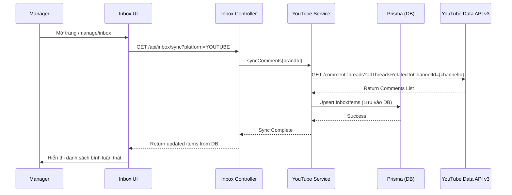
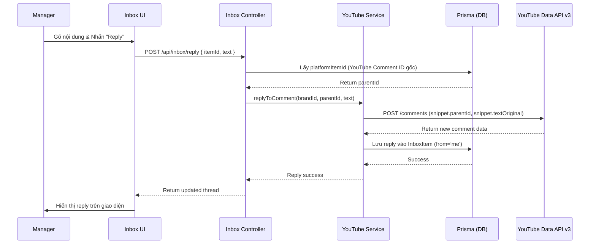

# Kế hoạch Triển khai: YouTube Inbox (Quản lý Tương tác)

## 1. Mục tiêu (Objective)
Triển khai tính năng **Unified Inbox** cho phép Manager quản lý và trả lời bình luận YouTube trực tiếp từ Dashboard, tuân thủ theo nguyên tắc tập trung dữ liệu của Metricool. Thay vì hiển thị dữ liệu giả, Inbox sẽ lấy bình luận thật từ YouTube API và cho phép trả lời (Reply) trực tiếp.

---

## 2. Route & Vị trí triển khai
- **Frontend Route:** `http://localhost:5173/manage/inbox` (Trang Inbox hiện có).
- **Frontend File:** `frontend/src/pages/manage/Inbox.jsx`.
- **Backend API:** Mở rộng các endpoint trong `/api/inbox`.
- **Backend Services:** `inbox.service.js` và `youtube.service.js`.

---

## 3. Cập nhật Cơ sở dữ liệu (Database Schema)
Hệ thống hiện tại đã có schema cho `UnifiedInbox` và `InboxItem` (như trong thiết kế `Metricool_Architecture.puml`).
Tuy nhiên, chúng ta cần kiểm tra và đảm bảo các bảng này đã được `npx prisma db push` chưa. Nếu chưa, ta sẽ định nghĩa chúng trong `schema.prisma`.

*   **Model dự kiến (`UnifiedInbox` & `InboxItem`)**:
    ```prisma
    model UnifiedInbox {
      id          String      @id @default(uuid())
      brandId     String      @unique
      lastSyncAt  DateTime?
      createdAt   DateTime    @default(now())
      updatedAt   DateTime    @updatedAt
      items       InboxItem[]
      brand       Brand       @relation(fields: [brandId], references: [id], onDelete: Cascade)

      @@map("unified_inbox")
    }

    model InboxItem {
      id                String       @id @default(uuid())
      inboxId           String
      relatedPostId     String?      // Video ID cho YouTube
      parentItemId      String?      // Nếu đây là reply
      repliedByUserId   String?
      platform          PlatformType
      type              InboxItemType // COMMENT
      platformItemId    String       @unique // ID bình luận trên YouTube
      authorId          String
      authorName        String
      authorAvatarUrl   String?
      content           String       @db.Text
      status            String       @default("UNREAD") // UNREAD, READ, REPLIED
      platformCreatedAt DateTime     // Thời gian bình luận trên YT
      syncedAt          DateTime     @default(now())

      inbox UnifiedInbox @relation(fields: [inboxId], references: [id], onDelete: Cascade)

      @@index([inboxId, platform])
      @@map("inbox_items")
    }
    ```

---

## 4. Sequence Diagrams (Quy trình hoạt động)

### 4.1. Đồng bộ Bình luận (Sync Comments)


### 4.2. Trả lời Bình luận (Reply to Comment)


---

## 5. Kế hoạch Code Backend
1.  **Cập nhật `schema.prisma`**: Đảm bảo các bảng `UnifiedInbox` và `InboxItem` tồn tại.
2.  **Cập nhật `youtube.service.js`**:
    *   Thêm hàm `fetchChannelComments(brandId)`: Sử dụng Google API `commentThreads.list` để cào bình luận kênh.
    *   Thêm hàm `replyToComment(brandId, parentCommentId, text)`: Sử dụng Google API `comments.insert` để đăng phản hồi.
    *   **LƯU Ý:** Cần thêm scope `https://www.googleapis.com/auth/youtube.force-ssl` để có quyền quản lý và reply bình luận.
3.  **Cập nhật `inbox.service.js` & `inbox.controller.js`**:
    *   Xây dựng API `GET /api/inbox/sync` để kích hoạt cào dữ liệu.
    *   Xây dựng API `POST /api/inbox/reply` để xử lý hành động trả lời.

---

## 6. Kế hoạch Code Frontend
1.  **Cập nhật `Inbox.jsx`**:
    *   Gọi API `sync` khi component mount hoặc khi chuyển sang tab YouTube.
    *   Tích hợp dữ liệu thật từ Backend vào UI thay vì mảng giả lập.
    *   Sửa logic form `Reply composer` để gửi API POST lên Backend.
    *   Hiển thị loading state tinh tế.