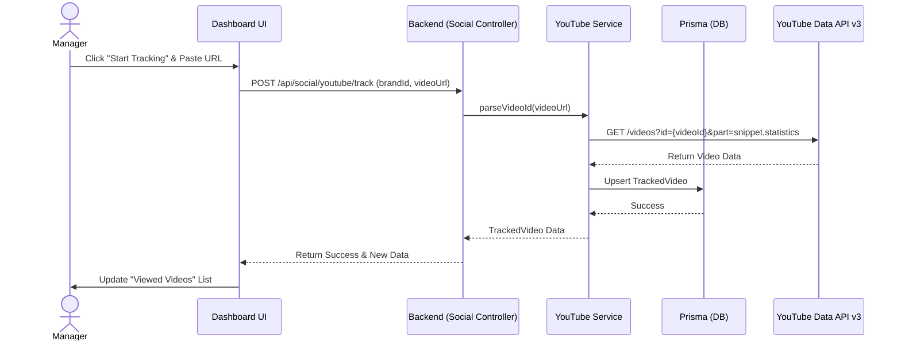
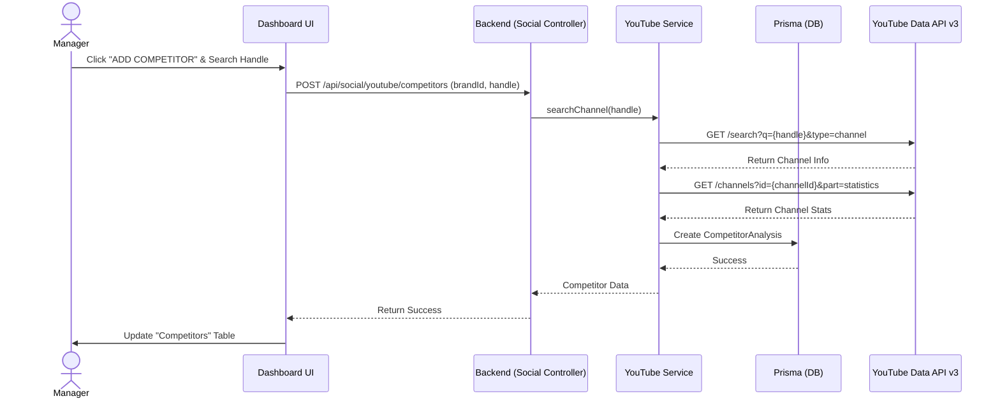

# Kế hoạch Triển khai: Viewed Videos & Competitors (YouTube)

## 1. Mục tiêu (Objective)
Triển khai hai tính năng quan trọng còn thiếu trên YouTube Dashboard:
1. **Viewed Videos (Start Tracking):** Cho phép người dùng nhập URL hoặc ID của một video YouTube bất kỳ để theo dõi hiệu suất chuyên sâu (Views, Likes, Comments) theo thời gian thực.
2. **Competitors (Real Data):** Hoàn thiện tab Đối thủ bằng cách cho phép tìm kiếm, thêm đối thủ và lấy dữ liệu thật (Subscribers, Views, Video Count) từ YouTube API.

---

## 2. Cập nhật Cơ sở dữ liệu (Database Schema)
Chúng ta sẽ cần cập nhật `backend/prisma/schema.prisma` để hỗ trợ tính năng theo dõi video.

*   **Model mới: `TrackedVideo`**
    ```prisma
    model TrackedVideo {
      id              String   @id @default(uuid())
      brandId         String
      platform        PlatformType @default(YOUTUBE)
      videoId         String   // YouTube Video ID
      title           String?
      thumbnailUrl    String?
      channelId       String?
      channelName     String?
      publishedAt     DateTime?
      lastViews       Int      @default(0)
      lastLikes       Int      @default(0)
      lastComments    Int      @default(0)
      isTracking      Boolean  @default(true)
      addedAt         DateTime @default(now())
      lastSyncedAt    DateTime?

      brand Brand @relation(fields: [brandId], references: [id], onDelete: Cascade)

      @@unique([brandId, videoId])
      @@index([brandId])
      @@map("tracked_videos")
    }
    ```
*   (Model `CompetitorAnalysis` đã có sẵn, chỉ cần tận dụng lại).

---

## 3. Sequence Diagrams (Quy trình hoạt động)

### 3.1. Tính năng Viewed Videos (Theo dõi Video)


### 3.2. Tính năng Competitors (Thêm Đối thủ)


---

## 4. Kế hoạch Code Backend (Node.js/Express)
1.  **Cập nhật `youtube.service.js`:**
    *   Thêm hàm `trackVideo(brandId, videoId)`: Gọi YouTube API để lấy thông tin video và lưu vào DB.
    *   Thêm hàm `addCompetitor(brandId, handle)`: Tìm kiếm kênh và lưu số liệu đối thủ.
    *   Thêm hàm `getTrackedVideos(brandId)` và `getCompetitors(brandId)`.
2.  **Cập nhật `social.controller.js` & `social.routes.js`:**
    *   Tạo các endpoint POST/GET tương ứng để Frontend có thể gọi.

---

## 5. Kế hoạch Code Frontend (React/Vite)
1.  **Cập nhật `social.service.js`:**
    *   Thêm các hàm gọi API: `addTrackedVideo`, `getTrackedVideos`, `addCompetitor`, `getCompetitors`.
2.  **Cập nhật `PlatformDashboard.jsx`:**
    *   **Viewed Videos Tab:** 
        *   Tạo nút "Start Tracking".
        *   Khi nhấn, hiện Modal (Dialog) nhập URL.
        *   Hiển thị danh sách Video đã track thay vì Placeholder.
    *   **Competitors Tab:**
        *   Thêm Modal (Dialog) "Add Competitor".
        *   Khi thêm thành công, tải lại danh sách từ Backend thay vì dùng Mock Data.