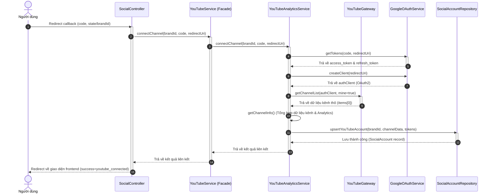
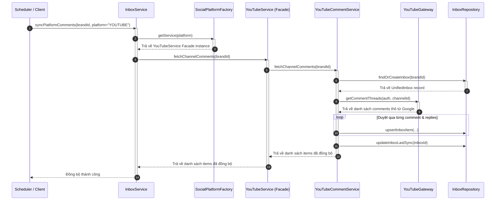

# Kiến Trúc Tích Hợp Mạng Xã Hội (Social Integration Architecture)

Tài liệu này mô tả chi tiết thiết kế kiến trúc hệ thống dịch vụ Social trong dự án **PubliCast**, các Design Patterns được áp dụng để đảm bảo nguyên lý **SOLID**, cấu trúc thư mục phân lớp, và sơ đồ tuần tự (Sequence Diagram) mô tả các luồng hoạt động chính.

---

## 1. Các Mẫu Thiết Kế Áp Dụng (Design Patterns)

Kiến trúc Social được xây dựng dựa trên sự kết hợp của 4 Design Patterns:

* **Strategy Pattern:** Định nghĩa giao diện chung thông qua `BaseSocialService`. Mỗi mạng xã hội (YouTube, Facebook, TikTok) là một Strategy cụ thể kế thừa lớp cơ sở này, cho phép thay thế linh hoạt mà không ảnh hưởng đến lớp gọi (Client).
* **Factory Pattern:** Sử dụng `SocialPlatformFactory` để quản lý các Service platform. Factory này quyết định động Service nào sẽ được khởi tạo dựa trên tham số `platform` (`YOUTUBE`, `FACEBOOK`,...), loại bỏ hoàn toàn các câu lệnh `if-else` cứng nhắc ở Controller hay `InboxService`.
* **Repository Pattern:** Tách biệt hoàn toàn tầng lưu trữ dữ liệu (Prisma ORM) khỏi tầng logic nghiệp vụ (Service Layer). Mọi thao tác ghi/đọc DB được thông qua các repository chuyên biệt (`inbox.repository.js`, `competitor.repository.js`, `tracked-video.repository.js`).
* **Gateway Pattern & Facade Pattern:** 
  * **Gateway:** Tạo lớp `YouTubeGateway` để đóng gói toàn bộ logic gọi Google SDK thô. Giúp giấu đi các chi tiết kết nối API phức tạp của bên thứ ba.
  * **Facade:** File `index.js` trong thư mục `youtube/` đóng vai trò là "mặt tiền", gom 3 sub-services chuyên biệt (`Analytics`, `Video`, `Comment`) thành một thực thể YouTubeService duy nhất để dễ dàng tương tác từ bên ngoài.

---

## 2. Cấu Trúc Thư Mục Phân Phối

Thư mục Social được tổ chức phân lớp theo cấu trúc **Platform-based**:

```text
backend/src/
├── repositories/social/
│   ├── social-account.repository.js  # Quản lý tài khoản mạng xã hội liên kết
│   ├── inbox.repository.js           # Quản lý tin nhắn, bình luận trong hộp thư chung
│   ├── tracked-video.repository.js   # Quản lý video được theo dõi
│   └── competitor.repository.js      # Quản lý phân tích đối thủ cạnh tranh
│
└── services/social/
    ├── base-social.service.js        # Giao diện chung (Base class)
    ├── social-platform.factory.js     # Factory khởi tạo và phân giải service động
    │
    └── youtube/                      # Module chuyên biệt cho YouTube
        ├── index.js                  # Facade kết hợp các sub-services con
        ├── youtube.gateway.js        # Tầng Gateway kết nối Google API SDK
        ├── youtube-analytics.service.js # Nghiệp vụ thông tin kênh & báo cáo số liệu
        ├── youtube-video.service.js  # Nghiệp vụ uploads & theo dõi video
        └── youtube-comment.service.js # Nghiệp vụ đồng bộ bình luận & phản hồi inbox
```

---

## 3. Sơ Đồ Tuần Tự (Sequence Diagrams)

### Luồng 1: Kết Nối Kênh YouTube (OAuth Connect Flow)
Luồng này mô tả quá trình trao đổi mã code OAuth để liên kết tài khoản YouTube của thương hiệu vào hệ thống.



---

### Luồng 2: Đồng Bộ Bình Luận Mạng Xã Hội (Inbox Sync Flow)
Luồng này mô tả cách `InboxService` đồng bộ bình luận từ YouTube về Database chung bằng Factory và Gateway.



---

## 4. Cách Mở Rộng Thêm Nền Tảng Mới (Ví dụ: Facebook)

Khi có yêu cầu tích hợp thêm Facebook, bạn chỉ cần thực hiện 3 bước sau mà không cần thay đổi bất kỳ code nghiệp vụ hiện tại nào ở Controller hay InboxService (Tuân thủ nguyên lý **OCP - Open/Closed Principle**):

1. **Tạo cấu trúc thư mục mới `src/services/social/facebook/`:**
   * `facebook.gateway.js`: Gọi Facebook Graph API SDK.
   * `facebook-comment.service.js`: Nghiệp vụ đồng bộ inbox từ Facebook.
   * `index.js`: Facade kế thừa `BaseSocialService`, gom và chuyển tiếp cuộc gọi.
2. **Đăng ký Service vào Factory (`src/services/social/social-platform.factory.js`):**
   ```javascript
   const facebookService = require('./facebook');
   
   // Trong constructor của SocialPlatformFactory:
   this.services.set(PLATFORMS.FACEBOOK, facebookService);
   ```
3. **Cập nhật hằng số nền tảng:** Đảm bảo `PLATFORMS.FACEBOOK` được định nghĩa trong `utils/constants.js`.
