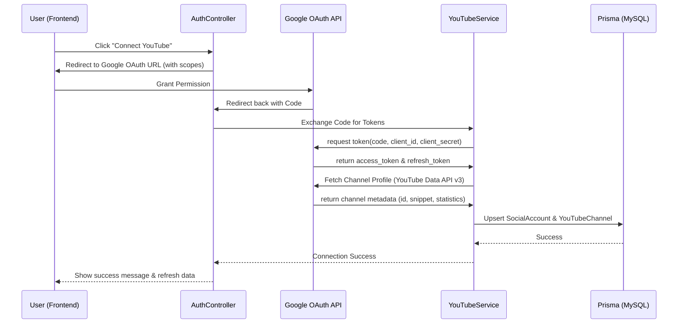

# YouTube Integration Research & Plan

Dựa trên yêu cầu nghiên cứu phần YouTube và thông tin Google OAuth được cung cấp, dưới đây là kết quả phân tích và kế hoạch triển khai.

## 1. Kết quả nghiên cứu hiện tại

| Thành phần | Trạng thái | Ghi chú |
| :--- | :--- | :--- |
| **Frontend UI** | Đã có giao diện | Đã có icon, nút "Connect YouTube" và các bảng thống kê giả lập. |
| **Prisma Schema** | ✅ Hoàn thành | Đã thêm model `YouTubeChannel` và migration thành công. |
| **Backend Auth** | ✅ Hoàn thành | Đã triển khai `GoogleOAuthService` và `YouTubeService`. |
| **Thư viện** | ✅ Hoàn thành | Đã cài đặt `googleapis` và `google-auth-library`. |
| **Routes & API** | ✅ Hoàn thành | Đã có endpoints `/api/social/google/url` và `/api/social/google/callback`. |

## 2. Thiết kế Cơ sở dữ liệu (Prisma)

Cần bổ sung model `YouTubeChannel` vào `schema.prisma` để khớp với tham chiếu Metricool:

```prisma
model YouTubeChannel {
  id                    String  @id @default(uuid())
  socialAccountId       String  @unique
  channelId             String  // ID gốc từ YouTube (UCxxxxxxxx)
  customUrl             String? // @handle
  subscribersCount      Int     @default(0)
  totalVideosCount      Int     @default(0)
  totalViewsCount       Int     @default(0)
  country               String?
  defaultLanguage       String?
  isVerified            Boolean @default(false)
  isMonetized           Boolean @default(false)
  supportsShorts        Boolean @default(true)
  supportsLivestream    Boolean @default(false)
  madeForKids           Boolean @default(false)
  hiddenSubscriberCount Boolean @default(false)

  socialAccount SocialAccount @relation(fields: [socialAccountId], references: [id], onDelete: Cascade)

  @@map("youtube_channels")
}
```

## 3. Sequence Diagram: Kết nối YouTube Channel



## 4. Kế hoạch triển khai (Step-by-Step)

### Bước 1: Setup Môi trường & Database
1. Cập nhật `.env` với `GOOGLE_CLIENT_ID` và `GOOGLE_CLIENT_SECRET`.
2. Cài đặt thư viện: `npm install googleapis google-auth-library`.
3. Cập nhật `schema.prisma` và chạy migration: `npx prisma migrate dev --name add_youtube_channel`.

### Bước 2: Backend Logic
1. **Google Strategy:** Xây dựng class xử lý OAuth flow cho Google.
2. **YouTube Service:** 
    - Hàm lấy thông tin kênh (metadata).
    - Hàm đồng bộ dữ liệu (metrics).
3. **Controller & Route:**
    - `GET /api/auth/google/url`: Lấy URL redirect sang Google.
    - `GET /api/auth/google/callback`: Xử lý code nhận được từ Google.

### Bước 3: Automated Validation
1. Viết Unit Test cho `YouTubeService` (mocking Google API).
2. Viết Integration Test cho luồng lưu trữ vào Database.

---

**Xác nhận:** Tôi có nên bắt đầu triển khai Bước 1 (Cập nhật Schema và cài đặt thư viện) không?
