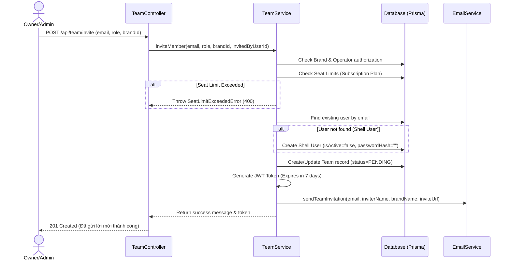
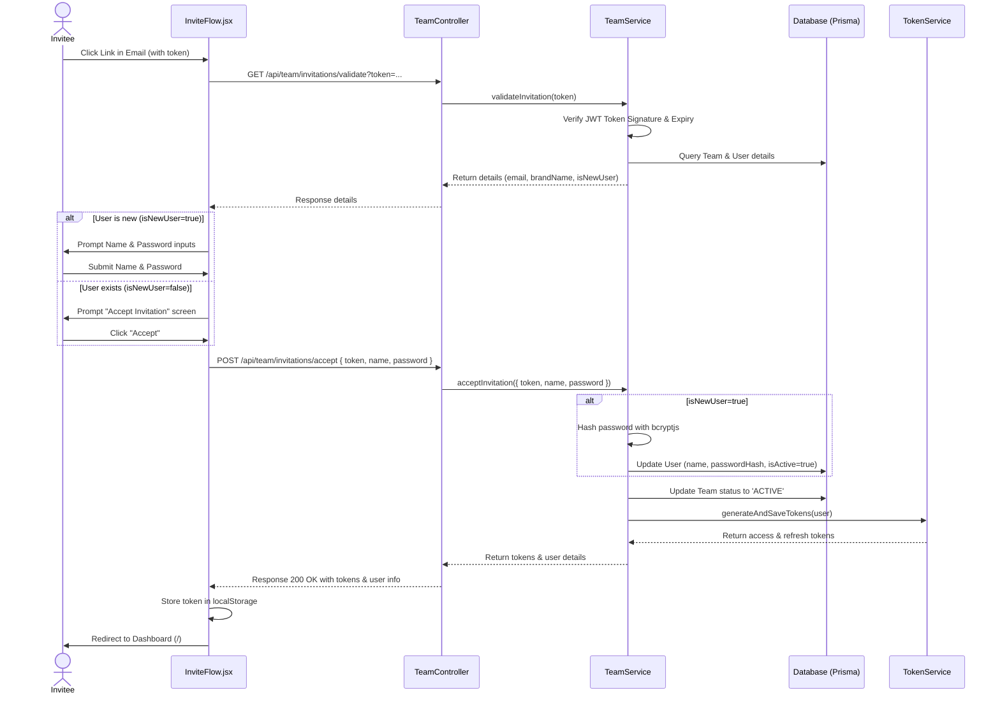

# 🔐 Phân Hệ Team Management - Backend (Quản Lý Đội Ngũ & Phân Quyền)

Tài liệu này mô tả chi tiết kiến trúc thiết kế, cơ chế hoạt động, luồng xử lý và đặc tả API của phân hệ **Team Management** (Quản lý đội ngũ cộng tác viên) trong hệ thống backend PubliCast.

---

## 1. Kiến Trúc & Thiết Kế Hệ Thống (SOLID & Design Patterns)

Phân hệ Team Management được xây dựng dựa trên nguyên tắc **SOLID** và phân lớp rõ ràng nhằm bảo đảm tính dễ bảo trì và khả năng mở rộng trong tương lai:

- **Repository Layer (`TeamRepository`):** Trực tiếp tương tác với Prisma Client, thực hiện các truy vấn dữ liệu thô đối với bảng `Team`, `User` và `Brand`.
- **Service Layer (`TeamService`):** Lớp chứa toàn bộ nghiệp vụ (business logic) của hệ thống. Đảm nhận việc kiểm tra hạn mức seat limit, phân quyền truy cập, tạo tài khoản Shell User, mã hóa và giải mã JWT token mời thành viên, và kích hoạt tài khoản an toàn thông qua giao dịch.
- **Controller Layer (`TeamController`):** Nhận các request từ Router, thực hiện kiểm tra định dạng dữ liệu đầu vào cơ bản (validation), gọi Service nghiệp vụ và trả về response chuẩn hóa dạng JSON.
- **Routing Layer (`team.routes.js`):** Định nghĩa các endpoints của API và phân chia rõ ràng giữa các router công khai (Public) và router cần bảo mật (verifyAuth).

---

## 2. Các Luồng Nghiệp Vụ Chính

### 2.1. Luồng Mời Thành Viên Mới (`inviteMember`)


1. **Kiểm tra quyền hạn:** Chỉ người sở hữu (Owner) hoặc Quản trị viên (Admin) của thương hiệu mới có quyền mời thành viên khác vào thương hiệu đó.
2. **Kiểm tra giới hạn thành viên (Seats Limit):** Hệ thống đếm số thành viên hiện tại của thương hiệu. Nếu vượt quá giới hạn của gói đăng ký (`maxTeamSeats`), hệ thống sẽ từ chối bằng lỗi `400 Bad Request`.
3. **Chiến lược Shell User (Tài khoản vỏ):** Nếu email được mời chưa đăng ký tài khoản, hệ thống sẽ tự động tạo một dòng dữ liệu `User` trống với `passwordHash = ""` và `isActive = false`. Điều này giúp hệ thống quản lý trạng thái của lời mời thông qua ID người dùng một cách nhất quán.
4. **Mã hóa Token:** Sinh mã JWT chứa thông tin `teamId`, `email`, và `brandId` với thời gian hết hạn là 7 ngày.
5. **Gửi Email:** Chuyển link kích hoạt chứa token qua dịch vụ gửi email.

### 2.2. Luồng Chấp Nhận Lời Mời (`acceptInvitation`)


1. **Xác thực Token:** Khi người dùng click vào link trong email, frontend sẽ gọi `GET /api/team/invitations/validate?token=...` để kiểm tra tính hợp lệ và lấy thông tin chi tiết lời mời.
2. **Xử lý kích hoạt tài khoản:** Người dùng nhấn nút chấp nhận lời mời.
   * **Nếu là Shell User (Người dùng mới):** Người dùng nhập Họ tên và Mật khẩu. Backend sẽ băm mật khẩu bằng `bcryptjs` và cập nhật thông tin người dùng lên trạng thái hoạt động (`isActive = true`, `isEmailVerified = true`). Đồng thời tạo bản ghi trong bảng `UserAccount` với provider `LOCAL`.
   * **Nếu là người dùng đã có tài khoản:** Bỏ qua việc băm mật khẩu và cập nhật thông tin cá nhân.
3. **Cập nhật trạng thái thành viên:** Trạng thái trong bảng `Team` chuyển từ `PENDING` sang `ACTIVE`, cập nhật thời điểm đồng ý (`acceptedAt = new Date()`).
4. **Đăng nhập tự động:** Trả về cặp mã JWT `accessToken` và `refreshToken` thông qua `tokenService` để đăng nhập ngay lập tức cho người dùng.

---

## 3. Đặc Tả Danh Sách API (API Specification)

### 3.1. Xác thực thông tin lời mời
- **Endpoint:** `GET /api/team/invitations/validate`
- **Quyền truy cập:** Công khai (Public)
- **Tham số Query:** `token` (JWT Token mời thành viên)
- **Response thành công (200 OK):**
  ```json
  {
    "email": "invitee@gmail.com",
    "brandName": "My Brand",
    "inviterName": "Admin Owner",
    "isNewUser": true
  }
  ```

### 3.2. Chấp nhận lời mời và Kích hoạt tài khoản
- **Endpoint:** `POST /api/team/invitations/accept`
- **Quyền truy cập:** Công khai (Public)
- **Body Request:**
  ```json
  {
    "token": "jwt-token-string",
    "name": "Họ và Tên", // Chỉ truyền nếu isNewUser = true
    "password": "mysecretpassword" // Chỉ truyền nếu isNewUser = true
  }
  ```
- **Response thành công (200 OK):**
  ```json
  {
    "message": "Chấp nhận lời mời thành công",
    "accessToken": "jwt-access-token",
    "refreshToken": "jwt-refresh-token",
    "user": {
      "id": "user-uuid",
      "email": "invitee@gmail.com",
      "name": "Họ và Tên",
      "role": "USER"
    }
  }
  ```

### 3.3. Mời thành viên mới vào thương hiệu
- **Endpoint:** `POST /api/team/invite`
- **Quyền truy cập:** Đã đăng nhập (Owner/Admin)
- **Body Request:**
  ```json
  {
    "email": "collaborator@company.com",
    "role": "Admin", // Admin, Member, Analyst
    "brandId": "brand-uuid"
  }
  ```
- **Response thành công (201 Created):**
  ```json
  {
    "message": "Đã gửi lời mời thành công",
    "team": {
      "id": "team-member-uuid",
      "userId": "user-uuid",
      "name": "collaborator",
      "email": "collaborator@company.com",
      "role": "Admin",
      "status": "pending"
    },
    "token": "jwt-invitation-token"
  }
  ```

### 3.4. Cập nhật quyền hạn thành viên
- **Endpoint:** `PUT /api/team/:id/role`
- **Quyền truy cập:** Đã đăng nhập (Owner/Admin)
- **Body Request:**
  ```json
  {
    "role": "Member" // Admin, Member, Analyst
  }
  ```

### 3.5. Trục xuất thành viên khỏi thương hiệu
- **Endpoint:** `DELETE /api/team/:id`
- **Quyền truy cập:** Đã đăng nhập (Owner/Admin)
