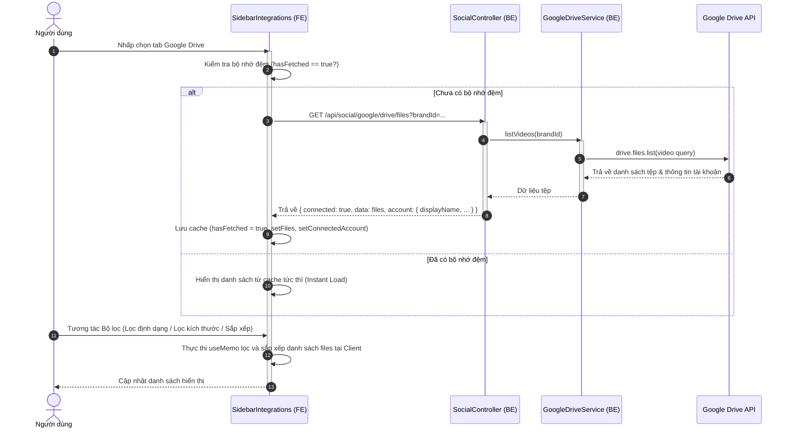
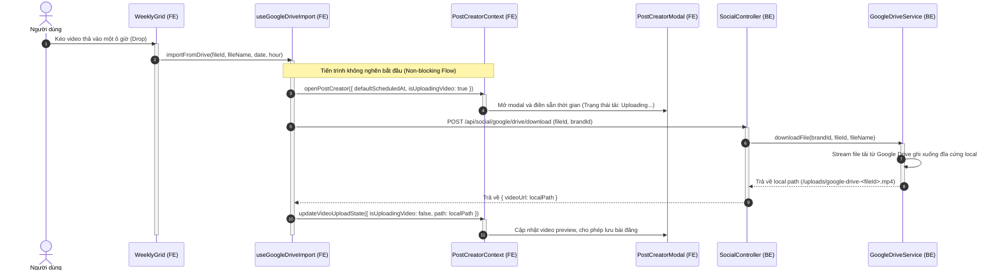

# Hướng dẫn Tích hợp Google Drive & Kéo thả Lên lịch (Google Drive Integration)

Tài liệu này mô tả chi tiết thiết kế kỹ thuật, kiến trúc và luồng xử lý dữ liệu của tính năng **Tích hợp Google Drive** trong dự án **PubliCast**, giúp người dùng duyệt các tệp video từ Google Drive cá nhân và kéo thả trực tiếp vào lịch tuần để lập lịch bài đăng.

---

## 1. Tổng quan Luồng Nghiệp vụ (Overview)

Tính năng Google Drive cung cấp hai giá trị cốt lõi:
1. **Duyệt tệp tin trực quan (Explorer):** Tìm kiếm, lọc theo định dạng (`mp4`, `webm`, `mov`), lọc theo kích thước và sắp xếp các tệp video từ tài khoản Google Drive cá nhân của thương hiệu (Brand).
2. **Kéo thả không nghẽn (Non-blocking Drag-and-Drop):** Cho phép kéo thả video từ thanh bên (sidebar) vào ô lịch tuần. Ngay khi thả tệp:
   - Biểu mẫu tạo bài viết (`PostCreator`) sẽ được mở ra ngay lập tức và tự động điền các thông tin như thời gian lập lịch và tên tệp.
   - Tiến trình tải tệp từ Google Drive về máy chủ PubliCast được thực hiện song song dưới nền (Background Import). Người dùng không cần phải chờ đợi quá trình tải hoàn tất mới có thể điền thông tin bài viết.

---

## 2. Thiết kế Kiến trúc & Tầng Dịch vụ (Architecture)

### Tầng Backend (Express/Prisma)
- **GoogleDriveService (`google-drive.service.js`):** 
  - Sử dụng thư viện `googleapis` để xác thực và giao tiếp với Google Drive API v3.
  - Sử dụng mã truy cập (access token) và mã làm mới (refresh token) được lưu trữ trong bảng `social_accounts` (dùng chung với tài khoản YouTube liên kết của Brand).
- **SocialController & Routes:**
  - `GET /api/social/google/drive/files`: Lấy danh sách video (điều kiện lọc: `mimeType contains 'video/'`) và trả về thông tin tài khoản đang kết nối (ảnh đại diện, tên hiển thị) phục vụ cho giao diện cài đặt.
  - `POST /api/social/google/drive/download`: Nhận `fileId`, thực hiện tải luồng dữ liệu (stream) từ Google API thông qua lệnh `drive.files.get({ fileId, alt: 'media' })`, rồi truyền (pipe) trực tiếp vào một luồng ghi tệp (write stream) cục bộ trên ổ cứng máy chủ.

### Tầng Frontend (React/Context)
- **PostCreatorContext:** Quản lý trạng thái chia sẻ của video (đường dẫn cục bộ, trạng thái đang tải lên, URL xem trước) để đồng bộ hóa ngay lập tức khi thực hiện thao tác kéo thả.
- **useGoogleDriveImport (Hook):** Điều phối tiến trình kết nối API tải về dưới nền, hiển thị trạng thái "Uploading..." trên biểu mẫu tạo bài viết và cập nhật đường dẫn chính xác sau khi hoàn thành.
- **SidebarIntegrations (UI Explorer):** 
  - Giao diện duyệt thư mục giả lập bao gồm các mục: Drive của tôi (My Drive), Được chia sẻ (Shared), Có gắn dấu sao (Starred), Gần đây (Recent).
  - Tích hợp bộ lọc định dạng, kích thước tệp và hỗ trợ sắp xếp theo Tên, Ngày, Dung lượng thông qua Popover.
  - Lưu trạng thái bộ nhớ đệm `hasFetched` để ngăn chặn việc gọi API liên tục gây giật lag khi chuyển đổi qua lại giữa các tab.

---

## 3. Quy trình Xử lý Dữ liệu (Sequence Diagrams)

### Luồng 1: Duyệt Tệp tin & Lọc Tìm kiếm (Files List & Filter)

---

### Luồng 2: Kéo thả và Tải tệp tin dưới nền (Drag-and-Drop Background Import)

---

## 4. Hướng dẫn Cấu hình Quyền (OAuth Configuration)

Để tính năng Google Drive hoạt động, hệ thống yêu cầu các cấu hình sau trên **Google Cloud Console**:

1. **Kích hoạt Google Drive API:** Truy cập vào thư viện API của dự án trên Google Cloud Console và kích hoạt (Enable) dịch vụ **Google Drive API**.
2. **Cập nhật phạm vi quyền (Scopes):** Bổ sung scope `https://www.googleapis.com/auth/drive.readonly` vào cấu hình Google OAuth 2.0 client.
3. **Thực hiện liên kết lại tài khoản:** Các thương hiệu đã liên kết trước đó cần nhấn **Switch Account** hoặc **Disconnect Drive** và thực hiện liên kết lại tài khoản để cấp thêm quyền truy cập tệp tin trên Drive.
