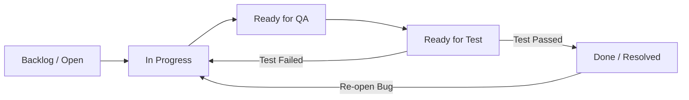

# 📘 HƯỚNG DẪN CẤU HÌNH & SỬ DỤNG JIRA SOFTWARE ĐỂ QUẢN LÝ BUG CHO DỰ ÁN CUỐI KỲ

Tài liệu này hướng dẫn chi tiết cách khởi tạo, cấu hình quy trình (workflow) quản lý lỗi (Bug Tracking), mời thành viên và tích hợp mã nguồn Git vào công cụ **Jira Software (Cloud)** phục vụ cho dự án cuối kỳ của nhóm.

---

## 🚀 PHẦN 1: KHỞI TẠO DỰ ÁN TRÊN JIRA CLOUD (FREE TIER)

Atlassian cung cấp gói **Free** tối đa 10 người dùng với đầy đủ tính năng Agile cốt lõi, rất phù hợp cho dự án môn học.

### Bước 1: Đăng ký tài khoản
1. Truy cập [Jira Software website](https://www.atlassian.com/software/jira).
2. Click **Get it free** -> Chọn **Jira** (hoặc tích hợp thêm Confluence nếu muốn viết tài liệu nhóm).
3. Đăng nhập bằng tài khoản Google của trường học/cá nhân.
4. Nhập tên trang web của bạn (ví dụ: `nhom-publicast.atlassian.net`).

### Bước 2: Tạo dự án mới (Create Project)
1. Trong màn hình chào mừng, chọn **Create project**.
2. **Lựa chọn Template:** Chọn **Scrum** (khuyên dùng để quản lý theo Sprint 2 tuần) hoặc **Kanban** (nếu nhóm muốn làm việc theo luồng liên tục).
3. **Lựa chọn loại Dự án (Project type):**
   * Chọn **Team-managed project** (Dự án do nhóm quản lý): Phù hợp nhất cho sinh viên vì giao diện cấu hình đơn giản, nhanh chóng, không yêu cầu quyền Admin hệ thống phức tạp.
4. Đặt tên Dự án (Project Name): Ví dụ `PubliCast Social Media`.
5. Jira sẽ tự động tạo một Mã định danh (**Key**): Ví dụ `PBC`. Mọi task hoặc bug sẽ có mã là `PBC-1`, `PBC-2`,...

---

## 👥 PHẦN 2: THÊM THÀNH VIÊN VÀ PHÂN QUYỀN TRONG NHÓM (COLLABORATION)

Để cả nhóm cùng làm việc trên một bảng quản lý, Manager cần thêm các thành viên thông qua email.

### Bước 1: Mời thành viên (Invite Users)
1. Từ giao diện chính của dự án, click nút **Project settings** (ở góc dưới menu bên trái) hoặc click biểu tượng bánh răng ở góc trên bên phải -> Chọn **User management**.
2. Chọn **Invite users** (ở góc trên bên phải).
3. Nhập danh sách địa chỉ Email của các thành viên trong nhóm (phân cách bằng dấu phẩy).
4. Click **Invite users**. Jira sẽ gửi một email mời tham gia dự án. Thành viên chỉ cần check mail và click vào link để thiết lập mật khẩu và tham gia.

### Bước 2: Phân vai trò trong Dự án (Project Roles)
Trong dự án **Team-managed**, bạn có thể phân quyền rất dễ dàng:
1. Vào **Project settings** ➔ **Access**.
2. Click **Add people** ở góc phải.
3. Nhập tên hoặc email thành viên và gán một trong các vai trò (**Role**):
   * **Administrator (Manager - Bạn):** Có toàn quyền thay đổi cấu hình dự án, tùy biến workflow, cấu hình bảng.
   * **Member (Developer):** Có quyền tạo task, gán task, chuyển đổi trạng thái task (In Progress, Resolved...) và bình luận.
   * **Viewer:** Chỉ có quyền xem và bình luận (phù hợp nếu muốn mời Giảng viên vào chấm điểm/giám sát).

---

## ⚙️ PHẦN 3: CẤU HÌNH WORKFLOW QUẢN LÝ BUG CHUYÊN NGHIỆP

Mặc định Jira có workflow rất đơn giản (`To Do ➔ In Progress ➔ Done`). Đối với quy trình kiểm thử nghiêm ngặt, Manager cần cấu hình một quy trình quản lý lỗi chuyên nghiệp.

### 1. Quy trình Vòng đời lỗi (Bug Lifecycle Workflow) đề xuất
Chúng tôi thiết kế workflow gồm 6 trạng thái để kiểm soát chất lượng từ lúc phát hiện lỗi đến khi kiểm thử tự động thành công:

*   **Backlog / Open (Mới phát hiện):** Bug được tạo bởi QC/Manager và nằm trong hàng đợi.
*   **In Progress (Đang sửa):** Developer đang tìm nguyên nhân và sửa code.
*   **Ready for QA (Đã sửa - Chờ Review):** Developer đã code xong, đẩy code lên nhánh và chờ Code Review hoặc Merge.
*   **Ready for Test (Chờ Test tự động):** Code đã được tích hợp vào môi trường Staging/Local, chờ chạy bộ test tự động (Selenium).
*   **Done / Resolved (Hoàn thành):** Bug đã được chạy test Selenium thành công (Passed) và đóng lại.

### 2. Cách tùy biến Workflow trên Jira Cloud
1. Vào **Project settings** ➔ **Issue types**.
2. Chọn loại issue là **Bug**.
3. Click nút **Edit workflow** ở góc phải màn hình.
4. Giao diện thiết kế trực quan hiện ra:
   * Bạn click nút **+ Add status** để tạo thêm các trạng thái: `Ready for QA`, `Ready for Test`.
   * Tạo các đường nối (**Transitions**) giữa các trạng thái bằng cách kéo từ nút này sang nút khác.
5. Sau khi chỉnh sửa xong, click **Update workflow** ở góc trên bên phải để áp dụng.

### 3. Cấu hình các trường thông tin lỗi (Custom Fields cho Bug)
Để Developer hiểu rõ lỗi mà không mất thời gian hỏi lại, biểu mẫu khai báo Bug cần có các trường thông tin chuẩn hóa:
1. Cũng trong mục **Project settings** ➔ **Issue types** ➔ Chọn **Bug**.
2. Ở cột bên phải (trường thông tin có sẵn), bạn kéo thả các trường sau vào biểu mẫu ở giữa:
   * **Priority (Độ ưu tiên):** Thứ tự ưu tiên cần sửa (High, Medium, Low).
   * **Environment (Môi trường xảy ra lỗi):** Localhost, Staging, Chrome/Safari, OS (Windows/macOS).
3. Tạo thêm **Custom Fields** (Trường tùy biến) dạng văn bản bằng cách chọn **Short text** hoặc **Paragraph** và đặt tên:
   * **Steps to Reproduce (Các bước tái hiện lỗi):** Hướng dẫn Developer cách điền dữ liệu để gặp lỗi.
   * **Expected Result (Kết quả mong muốn).**
   * **Actual Result (Kết quả thực tế xảy ra lỗi).**
4. Click **Save changes** để lưu cấu hình.

---

## 💻 PHẦN 4: QUY TRÌNH SỬ DỤNG HÀNG NGÀY & TÍCH HỢP GIT/GITHUB

### 1. Tích hợp GitHub vào Jira (Git Integration)
Tích hợp này giúp tự động hóa việc cập nhật trạng thái lỗi dựa trên hành động code của Developer.
1. Trên thanh điều hướng Jira, chọn **Apps** ➔ **Explore more apps**.
2. Tìm kiếm **GitHub for Jira** và click **Get it now** để cài đặt.
3. Làm theo hướng dẫn kết nối với tài khoản GitHub của nhóm và chọn Repository của dự án (`PubliCast`).

### 2. Sử dụng mã định danh Jira trong Git Commit
Khi tích hợp thành công, mỗi khi developer code, họ chỉ cần thêm mã của Ticket (ví dụ: `PBC-123`) vào Commit Message hoặc tên nhánh (Branch Name):
*   **Đặt tên nhánh:** `feature/PBC-123-pricing-strategy` hoặc `bugfix/PBC-145-fix-discount-calc`.
*   **Commit Message:** `[PBC-145] Fix: Sửa lỗi tính toán khuyến mãi coupon khi giỏ hàng rỗng`.
*   **Tự động hóa:** Jira sẽ tự động chèn liên kết commit đó vào trong Ticket `PBC-145`. Manager chỉ cần mở Jira ra là thấy ngay các dòng code nào đã sửa cho bug này mà không cần lên GitHub lục lọi.

### 3. Quy trình làm việc một ngày tiêu biểu (Daily Flow)
*   **Đầu ngày (Daily Standup):** Cả nhóm mở bảng **Jira Board** xem các task đang ở cột nào. Các thành viên cập nhật tiến độ kéo thả task từ `To Do` sang `In Progress`.
*   **Khi phát hiện lỗi:** QC/Manager tạo một Issue loại **Bug**, điền chi tiết *Steps to Reproduce* và *Severity*, gán cho Developer chịu trách nhiệm.
*   **Developer sửa lỗi xong:** Tạo Pull Request trên GitHub có gắn mã ticket. Jira tự động chuyển trạng thái từ `In Progress` sang `Ready for QA`.
*   **Chạy kiểm thử tự động:** Sau khi kiểm duyệt code, chạy test tự động bằng **Selenium** trên môi trường local. Nếu test PASS ➔ Chuyển trạng thái sang `Done`. Nếu test FAIL ➔ Chuyển ngược lại `In Progress` kèm log lỗi.

---

## 📈 PHẦN 5: BÁO CÁO & ĐÁNH GIÁ (REPORTING & METRICS)

Jira cung cấp các công cụ báo cáo mạnh mẽ giúp nhóm tự đánh giá năng suất và đưa số liệu vào báo cáo tốt nghiệp:
1.  **Burndown Chart (Biểu đồ tiến độ):** Thể hiện lượng công việc còn lại trong Sprint. Biểu đồ đi xuống đều đặn chứng minh nhóm đang phân bổ công việc tốt.
2.  **Velocity Chart (Biểu đồ năng suất):** Đo lường lượng Story Points nhóm hoàn thành qua từng Sprint, giúp dự báo thời gian hoàn thành dự án.
3.  **Created vs Resolved Issues Report (Báo cáo lỗi phát sinh vs Lỗi đã sửa):** Giúp Manager đánh giá xem tốc độ phát sinh bug mới có đang vượt quá tốc độ sửa bug của nhóm hay không trước khi phát hành sản phẩm.

---
*Tài liệu này được soạn thảo để hướng dẫn trực tiếp cho Manager (Member 2) thiết lập môi trường cộng tác hiệu quả cho cả nhóm.*
