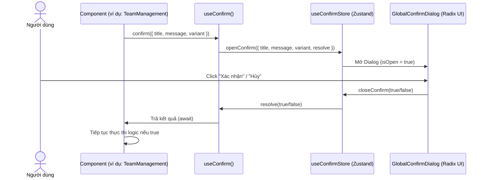
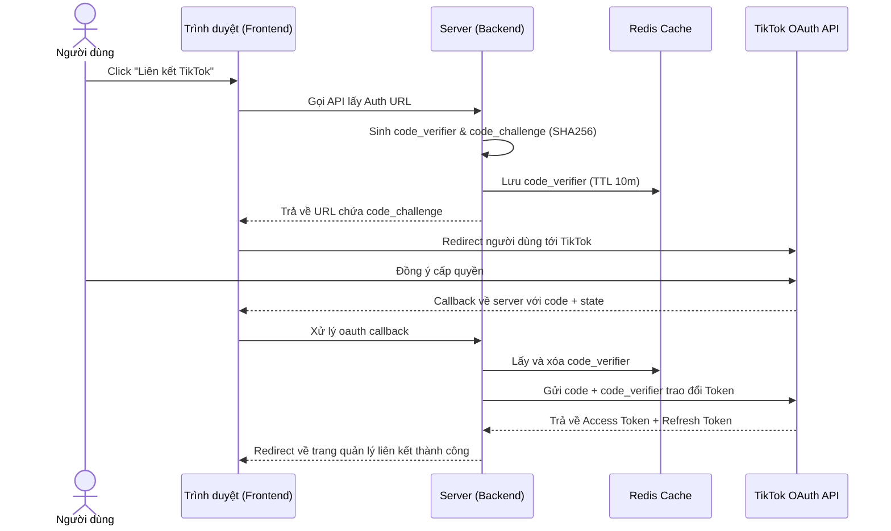

# 📘 Báo cáo Refactor Kiến trúc Frontend & Backend - PubliCast

Báo cáo này tài liệu hóa các thay đổi refactor hệ thống từ Mục 1 đến 4 (cùng giải pháp sửa lỗi bảo mật TikTok PKCE) nhằm đảm bảo tuân thủ nguyên tắc **SOLID**, cải thiện hiệu năng và tối ưu hóa trải nghiệm lập trình viên (Developer Experience).

---

## 📂 Danh mục Refactor & Thiết kế Chi tiết

### 1. Chuẩn hóa Phân giải Media URL (Mục 1)
* **Vấn đề:** Có nhiều file tự động ghép cứng chuỗi fallback URL `http://localhost:3000` hoặc tự kiểm tra điều kiện định dạng file, vi phạm nguyên lý **DRY (Don't Repeat Yourself)** và gây rủi ro lỗi môi trường production.
* **Giải pháp:**
  * Cập nhật tiện ích [url.js](file:///D:/Fullit/projects/PubliCast/frontend/src/utils/url.js) để xử lý bao quát toàn bộ trường hợp URL bao gồm `blob:`, `data:` (Base64) và các giao thức `http/https`.
  * Thay thế toàn bộ các logic lấy backend URL thô bằng hàm `buildMediaUrl(path)` và `buildServerBaseUrl()`.
* **Các file được chuẩn hóa:**
  * `image-editor/utils.js`
  * `useGoogleDriveImport.js`
  * `PlannerToolbar.jsx`
  * `WeeklyGrid.jsx`
  * `AutoListPostCard.jsx`

---

### 2. Cô lập Dữ liệu Fallback Dashboard Analytics (Mục 2)
* **Vấn đề:** Hook `usePlatformDashboard.js` chứa hơn 100 dòng dữ liệu giả lập (mockup) về nhân khẩu học (demographic). Điều này vi phạm nguyên tắc **SRP (Single Responsibility Principle)**, làm phình to file hook nghiệp vụ (gần 650 dòng) và gây khó khăn khi debug.
* **Giải pháp:**
  * Tạo mới file [dashboardFallback.js](file:///D:/Fullit/projects/PubliCast/frontend/src/mocks/dashboardFallback.js) chứa hằng số mock data.
  * Hook nghiệp vụ chỉ tập trung gọi API; nếu API không trả về dữ liệu nhân khẩu học, hook sẽ import và trả về mock data từ file fallback này.

---

### 3. Hệ thống Dialog Xác nhận Bất đồng bộ Toàn cục (Mục 3)
* **Vấn đề:** Việc gọi hộp thoại `window.confirm()` của trình duyệt làm giảm trải nghiệm người dùng (UX) và không nhất quán thiết kế. Tuy nhiên, nếu viết Dialog cục bộ bằng các state `isOpen` sẽ làm bẩn mã nguồn của component.
* **Giải pháp (Áp dụng Facade Pattern & Promise Wrapper):**
  Xây dựng một Dialog xác nhận bất đồng bộ dùng chung cho toàn bộ ứng dụng qua Zustand Store:

* **Cấu trúc Files:**
  * [useConfirmStore.js](file:///D:/Fullit/projects/PubliCast/frontend/src/store/useConfirmStore.js): Quản lý trạng thái Dialog và hàm `resolve` của Promise. Hỗ trợ thay đổi nút Action theo `variant` (ví dụ: `destructive` hiển thị nút màu đỏ).
  * [useConfirm.js](file:///D:/Fullit/projects/PubliCast/frontend/src/hooks/useConfirm.js): Hook cung cấp hàm confirm bất đồng bộ.
  * [GlobalConfirmDialog.jsx](file:///D:/Fullit/projects/PubliCast/frontend/src/components/shared/GlobalConfirmDialog.jsx): Render `AlertDialog` của Radix UI ở Root.
* **Các file được áp dụng (Đạt độ bao phủ 100%):**
  * `BrandSettings.jsx` (Xóa thương hiệu)
  * `TeamManagement.jsx` (Xóa vai trò, xóa thành viên)
  * `Settings.jsx` (Hủy liên kết tài khoản)
  * `AutoListEdit.jsx` (Xóa autolist, xóa post khỏi queue)
  * `CompetitorsTab.jsx` (Xóa đối thủ cạnh tranh)
  * `MediaDetailPanel.jsx` & `BulkActionsBar.jsx` (Xóa file đơn lẻ hoặc hàng loạt)
  * `ListView.jsx` (Xóa post đơn lẻ hoặc hàng loạt)
  * `HistoryView.jsx` (Dọn dẹp thùng rác)
  * `SidebarIntegrations.jsx` (Ngắt kết nối Google Drive)
  * `AdminPricing.jsx` (Hủy kích hoạt gói cước trong Admin)

---

### 4. Tích hợp Cơ chế PKCE cho TikTok OAuth v2 (Sửa lỗi bảo mật)
* **Vấn đề:** TikTok API yêu cầu bảo mật PKCE (Proof Key for Code Exchange) bắt buộc cho OAuth v2, dẫn đến lỗi thiếu `code_challenge` khi ứng dụng PubliCast cố gắng liên kết kênh.
* **Giải pháp:**
  * **Sinh PKCE (Backend):** Sử dụng thư viện `crypto` tích hợp sẵn của Node.js để sinh chuỗi ngẫu nhiên `code_verifier` và băm SHA256 thành `code_challenge` mã hóa Base64URL.
  * **Lưu trữ Trạng thái (Redis Cache):** Lưu `code_verifier` vào Redis với Key `tiktok_oauth_verifier:${brandId}` giới hạn thời gian (TTL) 10 phút.
  * **Xác thực (OAuth Callback):** Khi nhận callback code, lấy `code_verifier` từ Redis để trao đổi Access Token và xóa ngay lập tức khỏi bộ nhớ đệm (Single Use).

* **Files đã cập nhật:**
  * [tiktok.gateway.js](file:///D:/Fullit/projects/PubliCast/backend/src/services/social/tiktok/tiktok.gateway.js)
  * [oauth.controller.js](file:///D:/Fullit/projects/PubliCast/backend/src/controllers/social/oauth.controller.js)
  * [tiktok-analytics.service.js](file:///D:/Fullit/projects/PubliCast/backend/src/services/social/tiktok/tiktok-analytics.service.js)
  * [index.js (tiktok service)](file:///D:/Fullit/projects/PubliCast/backend/src/services/social/tiktok/index.js)
