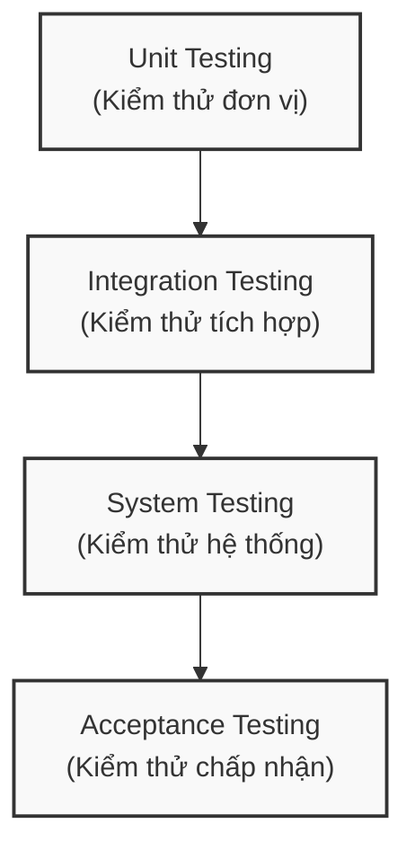
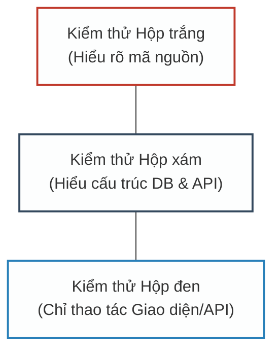
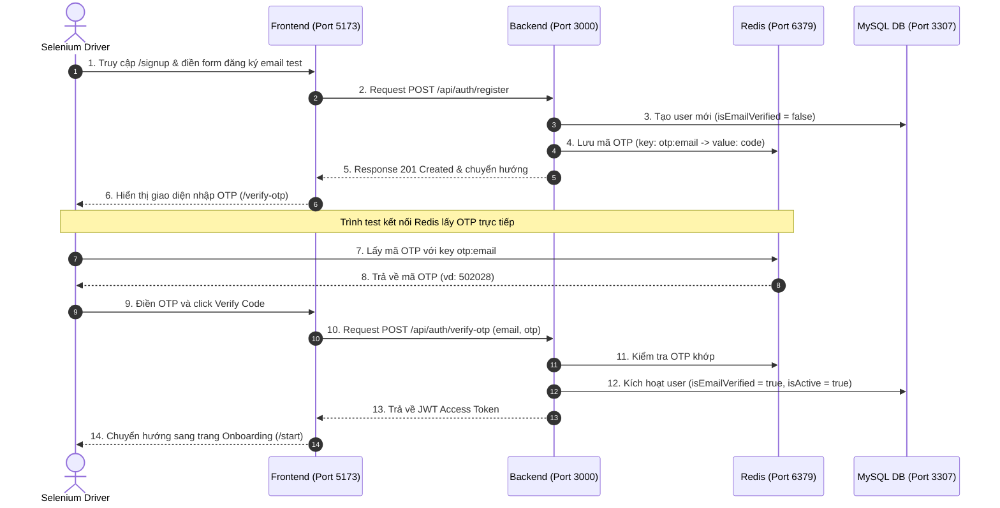

# CHƯƠNG 4. CƠ SỞ LÝ THUYẾT

## 4.1. CÁC MỨC ĐỘ KIỂM THỬ (LEVELS OF TESTING)

Theo tiêu chuẩn kiểm thử phần mềm quốc tế ISTQB, kiểm thử phần mềm được phân chia thành các mức độ kiểm thử khác nhau nhằm phát hiện lỗi ở từng giai đoạn phát triển của hệ thống. Dự án PubliCast áp dụng quy trình kiểm thử từ mức thấp đến mức cao bao gồm: Kiểm thử đơn vị (Unit Testing), Kiểm thử tích hợp (Integration Testing), Kiểm thử hệ thống (System Testing) và Kiểm thử chấp nhận (Acceptance Testing).

### 4.1.1. Kiểm thử đơn vị (Unit Testing)
*   **Cơ sở lý thuyết:**
    *   **Khái niệm:** Là mức độ kiểm thử nhỏ nhất trong quy trình kiểm thử phần mềm, tập trung vào việc xác minh tính đúng đắn của các thành phần mã nguồn độc lập (hàm, phương thức, lớp hoặc module) một cách cô lập.
    *   **Mục tiêu:** Phát hiện các lỗi logic, lỗi tính toán, xử lý sai điều kiện biên ngay trong giai đoạn lập trình.
    *   **Đối tượng:** Các đoạn mã nguồn xử lý logic nghiệp vụ độc lập, chưa kết nối cơ sở dữ liệu hoặc dịch vụ bên ngoài. Kỹ thuật giả lập (Mocking/Stubbing) được sử dụng để cô lập đơn vị cần kiểm thử khỏi các thành phần phụ thuộc (dependencies).
*   **Thực tế triển khai trong hệ thống:**
    *   Nhóm phát triển thực hiện viết mã nguồn kiểm thử tự động cho phần Backend (Node.js/Express) sử dụng framework **Jest**.
    *   Các thành phần dịch vụ (Services) và chiến lược xử lý (Strategies) được cô lập bằng cơ chế Mocking của Jest (`jest.mock`) để giả lập tầng Repository (truy cập cơ sở dữ liệu) và các thư viện bên ngoài.
    *   Các ca kiểm thử đơn vị tập trung vào việc xác thực chiến lược đồng bộ hóa hòm thư (`inbox.strategies.test.js`), phân quyền hệ thống (`system-permissions.test.js`) và tính toán lịch đăng bài tự động (`post-scheduler.test.js`).

### 4.1.2. Kiểm thử tích hợp (Integration Testing)
*   **Cơ sở lý thuyết:**
    *   **Khái niệm:** Là mức độ kiểm thử tập trung vào sự tương tác và giao tiếp giữa các thành phần hoặc module đã được tích hợp với nhau (ví dụ: giao tiếp giữa tầng API với Middleware xác thực, dịch vụ nghiệp vụ và tầng lưu trữ dữ liệu).
    *   **Mục tiêu:** Phát hiện lỗi giao tiếp giữa các thành phần, lỗi toàn vẹn dữ liệu khi truyền nhận qua lại giữa các module, và lỗi cấu hình kết nối cơ sở dữ liệu.
    *   **Đối tượng:** Sự tích hợp giữa các tầng kiến trúc trong hệ thống và sự tương tác giữa hệ thống với các cơ sở dữ liệu bên ngoài.
*   **Thực tế triển khai trong hệ thống:**
    *   Nhóm phát triển sử dụng **Jest** kết hợp với thư viện **Supertest** để giả lập các yêu cầu kết nối HTTP thực tế đến các điểm cuối API (Endpoints).
    *   Quá trình kiểm thử tích hợp thực hiện chạy toàn bộ chu trình từ Router nhận yêu cầu -> Middleware thực hiện xác thực và phân quyền -> Service xử lý nghiệp vụ -> Repository truy vấn trực tiếp cơ sở dữ liệu MySQL thông qua ORM Prisma Client.
    *   Các ca kiểm thử tích hợp chính được triển khai bao gồm luồng xác thực tài khoản (`auth.integration.test.js`), luồng đăng nhập (`login.integration.test.js`) và luồng liên kết tài khoản Google OAuth (`google-linking.integration.test.js`).

### 4.1.3. Kiểm thử hệ thống (System Testing)
*   **Cơ sở lý thuyết:**
    *   **Khái niệm:** Là mức độ kiểm thử toàn bộ hệ thống đã được tích hợp đầy đủ các thành phần (giao diện Frontend, máy chủ Backend, Cơ sở dữ liệu và các bên thứ ba) nhằm đánh giá sự hoạt động của hệ thống đối với các yêu cầu chức năng và phi chức năng đã đặc tả.
    *   **Mục tiêu:** Đảm bảo toàn bộ hệ thống hoạt động mượt mà, đúng luồng nghiệp vụ tổng thể (End-to-End) dưới góc độ của người dùng cuối.
    *   **Đối tượng:** Toàn bộ ứng dụng và hạ tầng triển khai.
*   **Thực tế triển khai trong hệ thống:**
    *   Dự án áp dụng phương pháp kiểm thử hệ thống thủ công (**Manual Testing**) trực tiếp trên giao diện trình duyệt web (Chrome, Firefox) kết hợp kiểm thử hộp đen các luồng dữ liệu API qua **Postman**.
    *   Nhóm kiểm thử thực hiện kiểm thử theo các kịch bản kiểm thử (Test Cases) chi tiết được thiết lập bằng tài liệu Markdown trong thư mục `test_cases/` để kiểm thử hệ thống chức năng quản lý đội ngũ, mời thành viên, tạo vai trò tùy chỉnh (Custom Roles) và phân quyền.
    *   Các kịch bản kiểm thử API cũng được thiết lập trong bộ sưu tập (Collection) của Postman (`postman-collection.json`) để chạy kiểm thử luồng chức năng API của ứng dụng.

### 4.1.4. Kiểm thử chấp nhận (Acceptance Testing)
*   **Cơ sở lý thuyết:**
    *   **Khái niệm:** Là mức độ kiểm thử cuối cùng trước khi bàn giao hệ thống, thường được thực hiện bởi người dùng cuối hoặc đại diện khách hàng (User Acceptance Testing - UAT) nhằm xác nhận hệ thống có đáp ứng các yêu cầu kinh doanh ban đầu và sẵn sàng đưa vào vận hành.
    *   **Mục tiêu:** Xây dựng sự tin cậy đối với hệ thống, đảm bảo tính khả dụng và trải nghiệm người dùng đạt tiêu chuẩn.
*   **Thực tế triển khai trong hệ thống:**
    *   Thực hiện kiểm thử chấp nhận thủ công (Manual UAT) dựa trên tài liệu Đặc tả Use Case và giao diện thiết kế (Mockup). Kiểm thử viên tiến hành thao tác trên môi trường chạy thử nghiệm (Staging/Local) để nghiệm thu tính năng của sản phẩm theo đúng cam kết yêu cầu ban đầu.

---

## 4.2. PHƯƠNG PHÁP KIỂM THỬ (TESTING METHODS)

Phương pháp kiểm thử phân loại dựa trên mức độ tiếp cận cấu trúc mã nguồn bên trong của chương trình. Dự án PubliCast kết hợp linh hoạt ba phương pháp chính: Hộp trắng, Hộp đen và Hộp xám.

### 4.2.1. Phương pháp kiểm thử hộp trắng (White-box Testing)
*   **Cơ sở lý thuyết:**
    *   **Khái niệm:** Là phương pháp thiết kế các ca kiểm thử dựa trên việc phân tích cấu trúc mã nguồn, luồng dữ liệu và logic điều khiển bên trong của chương trình.
    *   **Kỹ thuật thiết kế ca kiểm thử:** Kiểm thử bao phủ câu lệnh (Statement Coverage), kiểm thử bao phủ nhánh điều kiện (Branch/Decision Coverage) và bao phủ đường đi (Path Coverage).
*   **Thực tế triển khai trong hệ thống:**
    *   Được áp dụng khi lập trình viên thực hiện viết mã nguồn **Unit Test** và **Integration Test** bằng **Jest**. Dựa trên việc hiểu rõ cấu trúc logic mã nguồn bên trong của các Service và Controller, lập trình viên thiết lập các giá trị giả lập (Mock/Spy) và xây dựng các ca kiểm thử để kiểm tra đầy đủ các câu lệnh và nhánh rẽ điều kiện trong code.

### 4.2.2. Phương pháp kiểm thử hộp đen (Black-box Testing)
*   **Cơ sở lý thuyết:**
    *   **Khái niệm:** Là phương pháp kiểm thử phần mềm mà không cần quan tâm đến cấu trúc mã nguồn bên trong. Người kiểm thử chỉ tập trung vào chức năng của phần mềm, đưa vào dữ liệu đầu vào (Input) và kiểm tra kết quả đầu ra thực tế (Output) có khớp với kết quả mong đợi hay không.
    *   **Kỹ thuật thiết kế ca kiểm thử:** Phân vùng tương đương (Equivalence Partitioning), phân tích giá trị biên (Boundary Value Analysis), bảng quyết định (Decision Table Testing) và kiểm thử dựa trên kịch bản (Use Case Testing).
*   **Thực tế triển khai trong hệ thống:**
    *   **Kiểm thử giao diện (UI Testing):** Kiểm thử viên thực hiện nhập liệu trực tiếp trên trình duyệt, áp dụng kỹ thuật phân tích giá trị biên và phân vùng tương đương (ví dụ: kiểm tra ô nhập Email khi trống, khi nhập email sai định dạng, khi nhập đúng định dạng trong kịch bản TEAM_001) để xác thực phản hồi của hệ thống.
    *   **Kiểm thử API bằng Postman:** Gửi các request HTTP với body, query params và headers cụ thể thông qua Postman, kiểm tra mã trạng thái HTTP (200, 201, 400, 403, 500) và cấu trúc dữ liệu JSON trả về mà không cần can thiệp vào logic xử lý của Backend.

### 4.2.3. Phương pháp kiểm thử hộp xám (Grey-box Testing)
*   **Cơ sở lý thuyết:**
    *   **Khái niệm:** Là phương pháp kết hợp giữa Hộp đen và Hộp trắng. Người kiểm thử vừa có kiến thức một phần về kiến trúc bên trong (như cấu trúc cơ sở dữ liệu MySQL, cấu trúc bảng và liên kết khóa ngoại), vừa thao tác kiểm thử ở lớp ngoài (giao diện UI hoặc gọi API).
    *   **Mục tiêu:** Xác thực xem các thao tác từ lớp giao diện hoặc API có được xử lý và lưu trữ dữ liệu một cách toàn vẹn và chính xác dưới cơ sở dữ liệu hay không.
*   **Thực tế triển khai trong hệ thống:**
    *   Áp dụng trong **Kiểm thử tích hợp API (Integration Testing)** sử dụng **Jest & Supertest**. Khi kiểm thử luồng đăng ký tài khoản mới, mã nguồn test thực hiện gửi một request HTTP POST (phương pháp hộp đen) đến endpoint `/api/auth/register`, đồng thời sử dụng kết nối Prisma Client truy vấn trực tiếp vào cơ sở dữ liệu MySQL để kiểm tra xem bản ghi người dùng mới có được tạo thành công trong bảng `User` với đầy đủ các thuộc tính và mối quan hệ chính xác hay không (phương pháp hộp trắng/xám).

---

## 4.3. KỸ THUẬT KIỂM THỬ (TESTING TECHNIQUES)

Các kỹ thuật kiểm thử được chia thành hai nhóm chính dựa trên trạng thái hoạt động của mã nguồn hệ thống:

### 4.3.1. Kỹ thuật kiểm thử tĩnh (Static Testing)
*   **Cơ sở lý thuyết:**
    *   **Khái niệm:** Là kỹ thuật kiểm thử không yêu cầu thực thi mã nguồn của phần mềm. Tập trung vào việc rà soát, đánh giá tài liệu, phân tích mã nguồn bằng mắt hoặc sử dụng các công cụ phân tích cú pháp tĩnh để phát hiện lỗi cú pháp, lỗi logic hoặc vi phạm quy chuẩn lập trình từ sớm.
    *   **Ưu điểm:** Tiết kiệm chi phí sửa lỗi, nâng cao chất lượng cấu trúc mã nguồn.
*   **Thực tế triển khai trong hệ thống:**
    *   **Phân tích cú pháp tĩnh (Static Analysis):** Sử dụng công cụ **ESLint** (đã được cấu hình trong dự án) để quét mã nguồn React Frontend và Node.js Backend. Công cụ tự động phát hiện và ngăn chặn các lỗi lập trình phổ biến (như biến chưa sử dụng, import sai đường dẫn, cú pháp không đúng chuẩn) trước khi lưu mã nguồn.
    *   **Đánh giá mã nguồn (Code Review):** Nhóm áp dụng quy trình review chéo mã nguồn trực tiếp trên các Pull Request của GitHub. Quá trình này giúp các thành viên cùng rà soát logic lập trình, đảm bảo mã nguồn tuân thủ nguyên tắc thiết kế SOLID và loại bỏ các lỗi logic tiềm ẩn trước khi merge code vào nhánh chính.

### 4.3.2. Kỹ thuật kiểm thử động (Dynamic Testing)
*   **Cơ sở lý thuyết:**
    *   **Khái niệm:** Là kỹ thuật kiểm thử yêu cầu mã nguồn chương trình phải được biên dịch và chạy thực thi thực tế trên máy tính để kiểm tra tính chính xác, hiệu năng, và hành vi phản hồi của hệ thống với các bộ dữ liệu kiểm thử cụ thể.
*   **Thực tế triển khai trong hệ thống:**
    *   Thực hiện chạy bộ test tự động của Backend bằng lệnh `npm run test` (Jest sẽ chạy thực tế 16 tệp tin test và kiểm tra kết quả trả về của các API/Service).
    *   Chạy ứng dụng Frontend và Backend trên môi trường Staging/Local và tiến hành thao tác click chuột, nhập dữ liệu trên giao diện trình duyệt hoặc gửi request kiểm thử động thông qua Postman để ghi nhận kết quả thực tế của hệ thống.
*   **Kiểm thử tự động giao diện (Sử dụng Selenium WebDriver):**
    *   **Công cụ áp dụng:** Thư viện **Selenium WebDriver** kết hợp với thư viện kết nối **Redis** trên môi trường Node.js. Các kịch bản kiểm thử được tổ chức trong thư mục `test_selenium/`.
    *   **Giải pháp triển khai:** 
        *   Xây dựng kịch bản kiểm thử tự động luồng Đăng nhập (`test_local_login.js`) để tự động điền thông tin và kiểm tra trạng thái đăng nhập trên trình duyệt Chrome.
        *   Xây dựng kịch bản kiểm thử tự động luồng Đăng ký và Xác thực OTP (`test_local_register.js`). Để giải quyết thách thức kiểm thử luồng bảo mật OTP trên môi trường phát triển (Local), nhóm đã áp dụng phương pháp kiểm thử hộp xám bằng cách cho phép script Selenium kết nối trực tiếp đến máy chủ bộ nhớ đệm Redis để truy vấn mã OTP vừa được tạo ra cho email test ngẫu nhiên (không dùng email thật của người dùng để bảo mật thông tin). Kịch bản sau đó tự động điền mã OTP này vào giao diện để xác thực và hoàn tất toàn bộ chu trình đăng ký.
    *   **Sơ đồ Sequence Diagram luồng kiểm thử Đăng ký tự động kết hợp OTP bằng Selenium:**

---

## 4.4. TỔNG HỢP CÁC KỸ THUẬT KIỂM THỬ TRONG DỰ ÁN

Để đảm bảo chất lượng hệ thống phần mềm một cách toàn diện, dự án PubliCast kết hợp các kỹ thuật kiểm thử tĩnh và động, từ thủ công đến tự động hóa. Dưới đây là bảng tổng hợp các kỹ thuật được áp dụng trong dự án:

| STT | Kỹ thuật kiểm thử | Công cụ / Framework | Trạng thái áp dụng | Đối tượng & Phạm vi kiểm thử |
| :--- | :--- | :--- | :--- | :--- |
| **1** | **Kiểm thử Tĩnh (Static Testing)** | | | |
| 1.1 | Phân tích mã nguồn tĩnh (Static Analysis) | ESLint | Đã triển khai | Tự động quét lỗi cú pháp, biến không sử dụng (unused), chuẩn hóa coding style cho cả Frontend (React) và Backend (Node.js). |
| 1.2 | Rà soát mã nguồn (Code Review) | GitHub Pull Request | Đã triển khai | Rà soát chéo mã nguồn giữa các thành viên, kiểm tra việc áp dụng nguyên tắc SOLID, các mẫu thiết kế (Design Patterns) trước khi merge code. |
| **2** | **Kiểm thử Động (Dynamic Testing)** | | | |
| 2.1 | Kiểm thử đơn vị (Unit Testing) | Jest | Đã triển khai | Kiểm thử tự động các hàm xử lý logic biệt lập, thuật toán phân quyền, các class Strategy đồng bộ MXH trong Backend. |
| 2.2 | Kiểm thử tích hợp (Integration Testing) | Jest & Supertest | Đã triển khai | Giả lập request HTTP, kiểm thử tích hợp luồng dữ liệu từ router đến Database (Prisma/MySQL) ở Backend. |
| 2.3 | Kiểm thử API hộp đen | Postman | Đã triển khai | Gửi request HTTP động với payload JSON, xác thực mã lỗi phản hồi (Status Code) và cấu trúc dữ liệu trả về từ API. |
| 2.4 | Kiểm thử hệ thống thủ công (Manual UI Testing) | Trình duyệt (Chrome, Firefox) | Đã triển khai | Thực hiện thủ công các ca kiểm thử giao diện & nghiệp vụ lớn theo danh sách test case dạng Markdown trong thư mục `test_cases/`. |
| 2.5 | Kiểm thử tự động giao diện (Automated UI Testing) | Selenium WebDriver | **Đã áp dụng** | Tự động hóa các kịch bản kiểm thử giao diện (UI) và luồng nghiệp vụ quan trọng (như luồng Đăng nhập trong `test_local_login.js` và Đăng ký + Xác thực OTP trong `test_local_register.js`) trên trình duyệt Chrome thực tế. |

