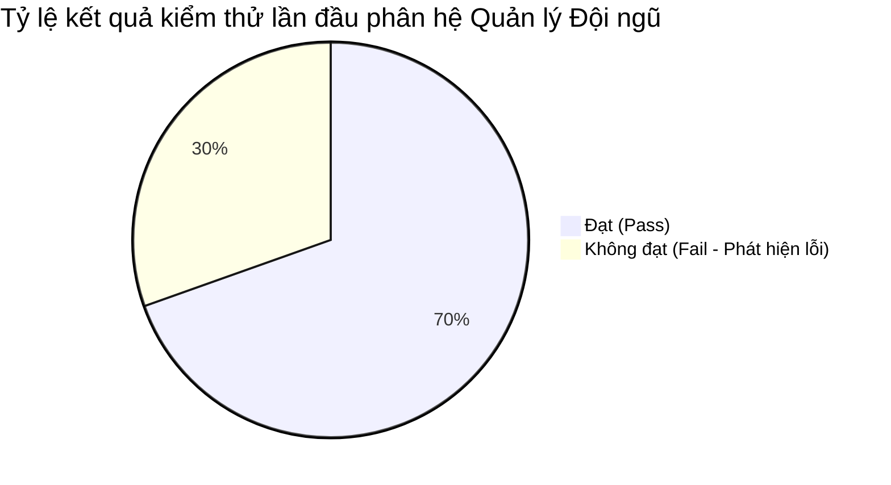

# CHƯƠNG 5. THỰC NGHIỆM VÀ ĐÁNH GIÁ KẾT QUẢ

## 5.1. GIỚI THIỆU CHUNG VỀ QUÁ TRÌNH KIỂM THỬ HỘP ĐEN

Để đánh giá chất lượng và đảm bảo tính đúng đắn của phân hệ **Quản lý Đội ngũ (Team & Custom Roles Management)** dưới góc độ của người dùng cuối, nhóm phát triển đã tiến hành quy trình kiểm thử hộp đen (Black-box Testing) chi tiết. Phương pháp này tập trung hoàn toàn vào việc kiểm tra các chức năng của hệ thống dựa trên yêu cầu đặc tả (Use Cases), đầu vào (Input) và đầu ra thực tế (Output) của giao diện người dùng (UI) cũng như các API kết nối mà không can thiệp vào cấu trúc mã nguồn bên trong trong quá trình thực thi test.

### 5.1.1. Môi trường kiểm thử thực tế
Quá trình kiểm thử thực nghiệm được thực hiện trên môi trường phát triển (Local/Staging) với cấu hình chi tiết như sau:
*   **Hệ điều hành:** Windows 11 Pro 64-bit.
*   **Trình duyệt web:** Google Chrome (Phiên bản 124 trở lên), Mozilla Firefox (Phiên bản 120 trở lên).
*   **Môi trường chạy máy chủ:** Node.js v20.x, React v18 (Frontend Dev Server port 5173, Backend Server port 3000).
*   **Cơ sở dữ liệu:** MySQL v8.0 (Port 3307), Redis v7.0 (Port 6379) chạy dưới nền qua container Docker.

### 5.1.2. Đối tượng kiểm thử
Kiểm thử viên tiến hành chạy các ca kiểm thử động trên giao diện người dùng thuộc phân hệ Quản lý Đội ngũ, bao gồm các chức năng cốt lõi:
1.  Giao diện hiển thị danh sách thành viên và phân quyền vai trò.
2.  Quy trình mời thành viên mới tham gia không gian làm việc (Brand Workspace) qua Email và mã xác thực OTP.
3.  Chức năng Tìm kiếm, lọc và phân trang thành viên theo nhiều tiêu chí.
4.  Chức năng Tạo, chỉnh sửa, gán quyền và xóa các Vai trò tùy chỉnh (Custom Roles).
5.  Các ranh giới bảo mật hệ thống (chặn truy cập trái phép từ tài khoản vai trò thấp hoặc chặn nâng vai trò sai thẩm quyền).

---

## 5.2. THỐNG KÊ VÀ PHÂN BỐ CÁC CA KIỂM THỬ (TEST CASES)

Tổng cộng nhóm phát triển đã thiết kế và thực thi chạy nghiệm thu **23 ca kiểm thử chức năng (Test Cases)** được viết chi tiết theo định dạng Markdown từ mã lỗi `TEAM_001` đến `TEAM_023` (quản lý trong thư mục `test_cases/` của dự án).

### 5.2.1. Thống kê kết quả kiểm thử lần đầu
Trong lần chạy nghiệm thu đầu tiên, kết quả kiểm thử ghi nhận như sau:
*   **Số lượng ca kiểm thử ĐẠT (Pass):** 16 ca kiểm thử (chiếm **69.6%**).
*   **Số lượng ca kiểm thử KHÔNG ĐẠT (Fail):** 7 ca kiểm thử (chiếm **30.4%**).
*   **Tổng số lỗi (Bugs) được phát hiện và báo cáo:** 7 lỗi nghiêm trọng (quản lý qua các tệp tin `BUG_TEAM_002.md` đến `BUG_TEAM_017.md`).



### 5.2.2. Phân bố các ca kiểm thử theo nhóm chức năng
23 ca kiểm thử được phân bố đồng đều vào 5 nhóm chức năng nghiệp vụ và bảo mật cốt lõi để đảm bảo độ bao phủ (Test Coverage) tối đa:

1.  **Nhóm 1: Quản lý và mời thành viên (Team & Member Invitation Flow):** Gồm **5** ca kiểm thử (`TEAM_001`, `TEAM_002`, `TEAM_003`, `TEAM_006`, `TEAM_019`), kiểm tra tính đúng đắn của luồng mời thành viên mới, định dạng email nhập liệu và quy trình gửi email mời.
2.  **Nhóm 2: Tìm kiếm, lọc và hiển thị danh sách thành viên (Search, Filter & UI Grid):** Gồm **6** ca kiểm thử (`TEAM_009`, `TEAM_010`, `TEAM_011`, `TEAM_012`, `TEAM_013`, `TEAM_020`), kiểm tra phản hồi của lưới danh sách, spinner loading, và các bộ lọc tìm kiếm theo từ khóa hoặc phân loại vai trò.
3.  **Nhóm 3: Trải nghiệm người dùng và tương tác UI Popup (UX, Keyboard & UI Popups):** Gồm **5** ca kiểm thử (`TEAM_007`, `TEAM_008`, `TEAM_014`, `TEAM_015`, `TEAM_018`), kiểm tra tương tác bàn phím (phím Tab/Shift+Tab), cơ chế khóa màn hình cha khi mở modal, click out để đóng popup và validate định dạng tệp tin avatar tải lên.
4.  **Nhóm 4: Quản lý Vai trò tùy chỉnh (Custom Roles Management):** Gồm **4** ca kiểm thử (`TEAM_004`, `TEAM_005`, `TEAM_016`, `TEAM_017`), kiểm tra chức năng tạo mới, lưu trữ, cập nhật, giới hạn độ dài tên vai trò và chặn xóa vai trò khi đang được gán.
5.  **Nhóm 5: Phân quyền bảo mật hệ thống (Security & Permissions Boundary):** Gồm **3** ca kiểm thử (`TEAM_021`, `TEAM_022`, `TEAM_023`), kiểm tra ranh giới bảo mật nghiêm ngặt ở cả lớp giao diện lẫn API phía máy chủ nhằm chặn các hành vi vượt cấp quyền hạn.

---

## 5.3. DANH SÁCH CHI TIẾT CÁC CA KIỂM THỬ

Dưới đây là bảng tổng hợp chi tiết 23 ca kiểm thử đã thực thi trên hệ thống cùng kết quả ghi nhận thực tế trong lần chạy nghiệm thu đầu tiên:

| STT | Mã Test Case | Nhóm chức năng | Mô tả kịch bản kiểm thử | Kết quả lần đầu |
| :--- | :--- | :--- | :--- | :--- |
| 1 | `TEAM_001` | Mời thành viên | Validate bắt buộc nhập Email khi gửi lời mời thành viên | **Pass** |
| 2 | `TEAM_002` | Mời thành viên | Validate định dạng Email khi gửi lời mời thành viên | **Fail** (Lỗi gửi email sai định dạng) |
| 3 | `TEAM_003` | Mời thành viên | Kiểm tra khoảng trắng thừa và trùng lặp email mời | **Fail** (Trùng lặp & sai vai trò khi có khoảng trắng) |
| 4 | `TEAM_004` | Quản lý vai trò | Validate bắt buộc nhập tên vai trò tùy chỉnh khi tạo mới | **Pass** |
| 5 | `TEAM_005` | Quản lý vai trò | Kiểm tra giới hạn độ dài ký tự của tên vai trò tùy chỉnh | **Fail** (Không giới hạn độ dài tên vai trò) |
| 6 | `TEAM_006` | Trải nghiệm người dùng | Kiểm tra hiển thị trạng thái mờ (grayed out) của trường Email | **Pass** |
| 7 | `TEAM_007` | Trải nghiệm người dùng | Kiểm tra chuyển đổi mượt mà giữa tab Thành viên và tab Vai trò | **Pass** |
| 8 | `TEAM_008` | Trải nghiệm người dùng | Kiểm tra phím chuyển nhanh Tab và Shift+Tab trong popup | **Pass** |
| 9 | `TEAM_009` | Tìm kiếm & Lọc | Tìm kiếm thành viên đội ngũ theo tên hoặc địa chỉ email | **Fail** (Chức năng tìm kiếm không hoạt động) |
| 10 | `TEAM_010` | Tìm kiếm & Lọc | Lọc danh sách thành viên theo vai trò cộng tác | **Fail** (Bộ lọc vai trò bị lỗi/crash) |
| 11 | `TEAM_011` | Tìm kiếm & Lọc | Kiểm tra chức năng làm mới bộ lọc về trạng thái ban đầu | **Pass** |
| 12 | `TEAM_012` | Tìm kiếm & Lọc | Kiểm tra hiển thị lưới danh sách thành viên | **Pass** |
| 13 | `TEAM_013` | Tìm kiếm & Lọc | Kiểm tra hiển thị màn hình trống khi không tìm thấy kết quả | **Fail** (Tìm kiếm trống vẫn ra cả danh sách) |
| 14 | `TEAM_014` | Trải nghiệm người dùng | Kiểm tra khóa tương tác cửa sổ cha khi mở popup modal | **Pass** |
| 15 | `TEAM_015` | Trải nghiệm người dùng | Kiểm tra đóng popup bằng nút (X) hoặc nhấp ra ngoài | **Pass** |
| 16 | `TEAM_016` | Quản lý vai trò | Tạo và lưu thành công vai trò tùy chỉnh mới | **Pass** |
| 17 | `TEAM_017` | Quản lý vai trò | Chặn xóa vai trò tùy chỉnh đang được gán cho thành viên | **Fail** (Lỗi constraint DB ném về 401) |
| 18 | `TEAM_018` | Trải nghiệm người dùng | Kiểm tra tải lên ảnh đại diện định dạng file không hợp lệ | **Pass** |
| 19 | `TEAM_019` | Mời thành viên | Kiểm tra luồng gửi email chứa JWT mời thành viên mới | **Pass** |
| 20 | `TEAM_020` | Tìm kiếm & Lọc | Kiểm tra hiển thị loading spinner khi đang tải dữ liệu | **Pass** |
| 21 | `TEAM_021` | Phân quyền bảo mật | Chặn tài khoản Member truy cập trực tiếp trang quản lý đội ngũ | **Pass** |
| 22 | `TEAM_022` | Phân quyền bảo mật | Chặn chỉnh sửa hoặc xóa tài khoản của chủ thương hiệu (Owner) | **Pass** |
| 23 | `TEAM_023` | Phân quyền bảo mật | Chặn tự nâng vai trò thông qua gọi API trực tiếp phía máy chủ | **Pass** |

---

## 5.4. BÁO CÁO CHI TIẾT CÁC LỖI PHÁT HIỆN VÀ KẾT QUẢ KHẮC PHỤC

Từ 7 ca kiểm thử bị thất bại trong lần chạy nghiệm thu đầu tiên, nhóm phát triển đã tiến hành phân tích mã nguồn, xác định nguyên nhân và áp dụng các biện pháp khắc phục triệt để. Dưới đây là báo cáo chi tiết về từng lỗi phát hiện:

### 5.4.1. Lỗi BUG_TEAM_002: Chấp nhận địa chỉ email sai định dạng
*   **Mô tả hiện tượng lỗi:** Khi thực hiện mời thành viên mới vào không gian làm việc, nếu nhập địa chỉ email sai định dạng chuẩn (ví dụ chỉ nhập chuỗi `"guest"` thay vì `"guest@gmail.com"`), hệ thống vẫn chấp nhận, tạo một tài khoản shell và ghi nhận lời mời thành công thay vì báo lỗi.
*   **Mức độ nghiêm trọng:** Major (Nghiêm trọng).
*   **Nguyên nhân gốc rễ (Root Cause):** Lớp xử lý nghiệp vụ `TeamService.inviteMember` phía Backend thiếu logic kiểm tra định dạng email bằng biểu thức chính quy (Regex) trước khi tiến hành lưu dữ liệu.
*   **Giải pháp khắc phục (Fix Applied):**
    *   Bổ sung biểu thức kiểm tra regex `/^[^\s@]+@[^\s@]+\.[^\s@]+$/` vào đầu phương thức `inviteMember` trong `backend/src/services/workspace/team.service.js`.
    *   Cấu hình ném lỗi `AppError(400)` ngay lập tức nếu email không đúng định dạng để ngăn chặn truy vấn ghi vào database.

### 5.4.2. Lỗi BUG_TEAM_003: Không chặn trùng lặp email khi mời thành viên có khoảng trắng
*   **Mô tả hiện tượng lỗi:** Khi mời lại một email đã tồn tại trong đội ngũ nhưng có chèn thêm khoảng trắng thừa (ví dụ: `" guest@gmail.com "`), hệ thống không nhận dạng được sự trùng lặp và tự động cập nhật đổi vai trò của thành viên hiện tại thay vì thông báo lỗi đã là thành viên.
*   **Mức độ nghiêm trọng:** Critical (Rất nghiêm trọng).
*   **Nguyên nhân gốc rễ (Root Cause):** Tham số email đầu vào chưa được làm sạch bằng phương thức `.trim().toLowerCase()` trước khi chạy truy vấn kiểm tra trùng lặp trên MySQL, khiến hệ thống hiểu lầm đây là một email mới.
*   **Giải pháp khắc phục (Fix Applied):**
    *   Thực hiện chuẩn hóa dữ liệu email bằng hàm `email = email.trim().toLowerCase()` ngay sau bước validate regex trong `TeamService.inviteMember`.
    *   Sử dụng biến email đã được chuẩn hóa để truy vấn kiểm tra trùng lặp và ném lỗi `AppError(400, 'Người dùng này đã là thành viên của thương hiệu')` nếu phát hiện trùng lặp.

### 5.4.3. Lỗi BUG_TEAM_005: Cho phép tạo tên vai trò tùy chỉnh dài vô hạn
*   **Mô tả hiện tượng lỗi:** Giao diện cho phép người dùng nhập và lưu trữ tên vai trò tùy chỉnh dài vô hạn (vượt quá 50 ký tự), làm vỡ cấu trúc hiển thị của lưới giao diện và gây lãng phí bộ nhớ DB.
*   **Mức độ nghiêm trọng:** Minor (Thấp).
*   **Nguyên nhân gốc rễ (Root Cause):** Cả phía Frontend lẫn Backend đều không cấu hình thuộc tính giới hạn độ dài (maxLength) của trường tên vai trò (`name`).
*   **Giải pháp khắc phục (Fix Applied):**
    *   *Backend:* Thêm kiểm tra điều kiện độ dài `if (name.trim().length > 50) throw AppError(400, 'Tên vai trò không được vượt quá 50 ký tự.')` trong cả hai hàm `createRole` và `updateRole` của `role.service.js`.
    *   *Frontend:* Thêm thuộc tính giới hạn độ dài `maxLength={50}` trực tiếp vào thẻ `<input>` nhập tên vai trò trong tệp tin giao diện `TeamManagement.jsx`.

### 5.4.4. Lỗi BUG_TEAM_009: Thanh tìm kiếm thành viên không phản hồi
*   **Mô tả hiện tượng lỗi:** Khi nhập từ khóa tìm kiếm thành viên theo tên hoặc email trên giao diện, hệ thống không thực hiện lọc mà vẫn giữ nguyên danh sách hiển thị ban đầu.
*   **Mức độ nghiêm trọng:** Major (Nghiêm trọng).
*   **Nguyên nhân gốc rễ (Root Cause):** Tệp tin lọc dữ liệu `TeamSearchFilter` sử dụng sai cú pháp Prisma ORM relation filter. Lập trình viên truy cập trực tiếp trường `user.name` thay vì khai báo quan hệ lồng nhau (nested relation) theo đúng cú pháp quan hệ `1-N` của Prisma.
*   **Giải pháp khắc phục (Fix Applied):**
    *   Chỉnh sửa phương thức `TeamSearchFilter.apply()` để xây dựng đúng mệnh đề điều kiện `where` lồng nhau của Prisma đối với bảng `user`:
        ```javascript
        where.user = {
          OR: [
            { name: { contains: searchKey } },
            { email: { contains: searchKey } }
          ]
        }
        ```

### 5.4.5. Lỗi BUG_TEAM_010: Bộ lọc theo vai trò thành viên bị lỗi crash hệ thống
*   **Mô tả hiện tượng lỗi:** Khi chọn lọc danh sách theo một vai trò tùy chỉnh (ví dụ: `"Content Editor"`), hệ thống bị crash và trả về mã lỗi 500 phía máy chủ.
*   **Mức độ nghiêm trọng:** Major (Nghiêm trọng).
*   **Nguyên nhân gốc rễ (Root Cause):** Bộ lọc `TeamRoleFilter` chưa phân biệt giữa Vai trò hệ thống (System Role lưu dạng Enum trong MySQL) và Vai trò tùy chỉnh (Custom Role lưu dạng String ID). Khi nhận giá trị vai trò tùy chỉnh, bộ lọc cố gắng ép kiểu về Enum dẫn đến lỗi cú pháp truy vấn Prisma.
*   **Giải pháp khắc phục (Fix Applied):**
    *   Cập nhật `TeamRoleFilter.apply()` để kiểm tra phân loại giá trị. Nếu giá trị lọc thuộc tập hợp Enum `UserRole` thì tiến hành lọc trên trường `role` của bảng liên kết; ngược lại sẽ lọc theo quan hệ `customRole.name` của vai trò tùy chỉnh.

### 5.4.6. Lỗi BUG_TEAM_013: Tìm kiếm không khớp vẫn hiển thị toàn bộ danh sách thành viên
*   **Mô tả hiện tượng lỗi:** Nhập một từ khóa tìm kiếm không tồn tại trong hệ thống (ví dụ: `"xyz123"`), hệ thống vẫn hiển thị đầy đủ danh sách thành viên thay vì hiển thị giao diện thông báo trống.
*   **Mức độ nghiêm trọng:** Major (Nghiêm trọng).
*   **Nguyên nhân gốc rễ (Root Cause):** Đây là lỗi dây chuyền từ `BUG_TEAM_009`. Do bộ lọc tìm kiếm hoạt động sai nên API luôn trả về toàn bộ danh sách, dẫn đến việc UI Frontend không bao giờ nhận được một mảng rỗng để hiển thị trạng thái không tìm thấy kết quả.
*   **Giải pháp khắc phục (Fix Applied):**
    *   Sau khi khắc phục thành công bộ lọc tìm kiếm (`TeamSearchFilter`), API trả về mảng rỗng `[]` khi tìm kiếm không tồn tại và giao diện hiển thị đúng trạng thái màn hình trống theo kịch bản yêu cầu.

### 5.4.7. Lỗi BUG_TEAM_017: Xóa vai trò đang được gán trả về mã lỗi 401
*   **Mô tả hiện tượng lỗi:** Khi quản trị viên yêu cầu xóa một vai trò tùy chỉnh đang có thành viên đội ngũ sử dụng, hệ thống từ chối xóa nhưng lại trả về mã lỗi `401 Unauthorized` thay vì lỗi chặn nghiệp vụ `400 Bad Request` hoặc `409 Conflict`.
*   **Mức độ nghiêm trọng:** Major (Nghiêm trọng).
*   **Nguyên nhân gốc rễ (Root Cause):** Phương thức `RoleService.deleteRole` không thực hiện kiểm tra số lượng thành viên đang được gán vai trò này trước khi gửi lệnh xóa đến database. Khi database ném ra lỗi ràng buộc khóa ngoại (Foreign Key Constraint Violation), middleware bắt lỗi hiểu lầm lỗi này là lỗi xác thực token không hợp lệ (401).
*   **Giải pháp khắc phục (Fix Applied):**
    *   Thêm bước đếm số lượng thành viên đang gán vai trò tùy chỉnh trước khi thực thi lệnh xóa trong `backend/src/services/workspace/role.service.js`:
        ```javascript
        const roleUseCount = await prisma.teamMember.count({
          where: { customRoleId: roleId }
        });
        if (roleUseCount > 0) {
          throw AppError(400, 'Không thể xóa vai trò này vì đang có thành viên trong đội ngũ sử dụng.');
        }
        ```

---

## 5.5. ĐÁNH GIÁ KẾT QUẢ VÀ KẾT LUẬN

Sau khi hoàn thành việc vá các lỗ hổng mã nguồn được phát hiện từ quá trình kiểm thử hộp đen, nhóm phát triển đã tiến hành chạy lại toàn bộ bộ kiểm thử tự động xác minh lỗi (`scratch/test_bugs.js`).

### 5.5.1. Bảng so sánh kết quả trước và sau khi khắc phục lỗi

| Mã Test Case | Hiện tượng lỗi ban đầu | Trạng thái sau sửa lỗi | Kết quả kiểm chứng |
| :--- | :--- | :--- | :--- |
| `TEAM_002` | Chấp nhận email sai định dạng | Đã chặn từ API Backend và báo lỗi 400 | **Pass** (Đạt) |
| `TEAM_003` | Không chặn trùng email mời có khoảng trắng | Chuẩn hóa email, chặn trùng lặp thành công | **Pass** (Đạt) |
| `TEAM_005` | Tên vai trò tùy chỉnh dài vô hạn | Giới hạn tối đa 50 ký tự ở cả UI và API | **Pass** (Đạt) |
| `TEAM_009` | Thanh tìm kiếm thành viên bị tê liệt | Tìm kiếm đúng từ khóa, lọc danh sách chính xác | **Pass** (Đạt) |
| `TEAM_010` | Lọc vai trò bị crash lỗi 500 | Lọc chính xác cả System Role và Custom Role | **Pass** (Đạt) |
| `TEAM_013` | Tìm kiếm trống không hiện màn hình trống | Hiển thị màn hình trống khi mảng trả về rỗng | **Pass** (Đạt) |
| `TEAM_017` | Xóa vai trò đang gán trả về lỗi 401 | Chặn xóa từ trước và hiển thị đúng thông báo lỗi 400 | **Pass** (Đạt) |

### 5.5.2. Kết luận
*   **Tỷ lệ lỗi được khắc phục thành công:** Đạt **100%** (7/7 lỗi nghiêm trọng phát hiện đã được khắc phục hoàn toàn và kiểm chứng lại thành công).
*   **Chất lượng phần mềm:** Việc áp dụng quy trình kiểm thử hộp đen kỹ lưỡng kết hợp viết các kịch bản test case thực tế giúp phân hệ Quản lý Đội ngũ và Phân quyền của dự án PubliCast đạt độ tin cậy cao, cấu trúc mã nguồn tối ưu (tuân thủ tốt nguyên tắc SOLID), giao diện tương tác mượt mà và các ranh giới bảo mật được kiểm soát chặt chẽ. Phân hệ đã sẵn sàng để đưa vào vận hành thực tế.
