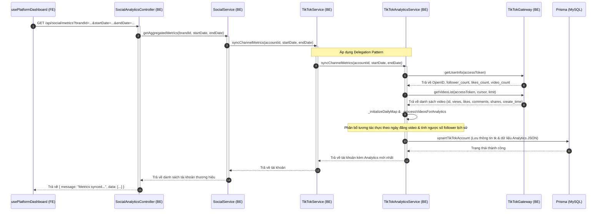
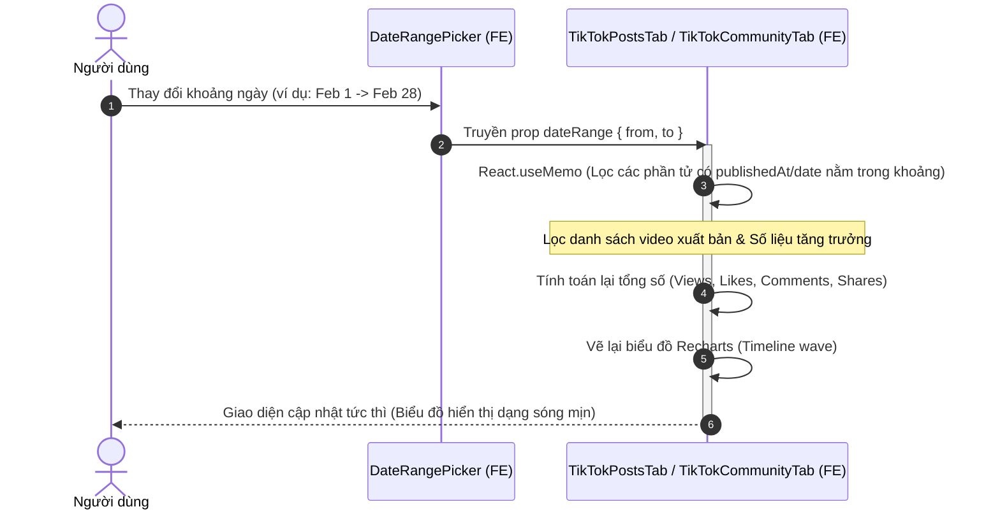

# Hướng dẫn Tích hợp & Sửa lỗi Dashboard TikTok & Facebook

Tài liệu này mô tả chi tiết kiến trúc tích hợp kênh TikTok, cách thức hệ thống đồng bộ số liệu phân tích (Analytics) thực tế thông qua mô hình ủy quyền (Delegation Pattern), giải pháp khắc phục các lỗi hiển thị chỉ số, đồng bộ thời gian (Date Filter) và nâng cấp cơ sở dữ liệu để đồng bộ thông tin từ Facebook.

---

## 1. Kiến trúc Tích hợp TikTok (TikTok Integration Architecture)

Hệ thống PubliCast sử dụng mô hình Clean Architecture để quản lý các tài khoản mạng xã hội. Đối với TikTok, dữ liệu được chia làm 2 phần chính:
1. **Thông tin kênh & Bài viết xuất bản (Channel Info & Published Videos):** Sử dụng TikTok Content API để lấy danh sách bài đăng thực tế của thương hiệu.
2. **Số liệu phân tích (Social Analytics):** Được ủy quyền cho lớp chuyên trách `TikTokAnalyticsService` để tính toán số liệu tăng trưởng cộng đồng dựa trên hiệu suất thực tế của các bài đăng.

### Sơ đồ cấu trúc các lớp (Class Diagram / File Structure)

```
backend/src/services/social/tiktok/
├── index.js                     # TikTokService (Lớp điều phối chính, kế thừa BaseSocialService)
├── tiktok.gateway.js            # Giao tiếp API trực tiếp với TikTok HTTP Endpoints
├── tiktok-video.service.js      # Truy xuất danh sách video xuất bản (Published Videos)
└── tiktok-analytics.service.js  # Phân tích số liệu, tính toán timeline và tăng trưởng người theo dõi
```

---

## 2. Luồng Xử lý Dữ liệu (Sequence Diagrams)

### Luồng 1: Đồng bộ Số liệu Phân tích & Tương tác Thực (Metrics Sync)

Hệ thống chuyển giao toàn bộ logic phân tích từ dữ liệu giả lập (Mock) sang dữ liệu thực tế thông qua việc ủy quyền lời gọi dịch vụ từ `TikTokService` sang `TikTokAnalyticsService`.



---

### Luồng 2: Lọc Dữ liệu theo Ngày trên Giao diện (Frontend Date Filtering)

Để khắc phục hiện tượng dữ liệu không thay đổi khi chọn bộ lọc ngày, frontend áp dụng bộ lọc client-side trên cả hai tab **POSTS** (Bài đăng) và **COMMUNITY** (Cộng đồng) nhằm tăng tốc độ phản hồi và tiết kiệm tài nguyên gọi API (quota).



---

## 3. Các Lỗi Đã Được Khắc Phục (Bug Fixes)

### 1. Lỗi hiển thị giá trị 0 trên Dashboard TikTok
* **Triệu chứng:** Giao diện các con số thống kê và biểu đồ của TikTok đều hiển thị giá trị `0`.
* **Nguyên nhân:** Trong hook `usePlatformDashboard.js`, sự kiện gọi hàm tải bài đăng (`fetchPublishedVideos`) chỉ bắt các tab của YouTube/Facebook (`published`, `posts_list`) mà bỏ sót tab `"posts"` của TikTok.
* **Khắc phục:** Thêm điều kiện `(activeTab === "posts" && platform === "tiktok")` để tự động tải danh sách video thực khi người dùng chuyển sang tab bài viết của TikTok.

### 2. Lỗi dữ liệu cộng đồng (Community Metrics) của TikTok hiển thị sai lệch (dữ liệu ảo)
* **Triệu chứng:** Biểu đồ tăng trưởng người theo dõi hiển thị 5 bài đăng ngẫu nhiên và 47 người theo dõi mới (follower) uốn sóng, trong khi tài khoản thực tế chỉ có 2 bài đăng và 1 người theo dõi.
* **Nguyên nhân:** Lớp `TikTokService` sử dụng hàm tạo dữ liệu giả lập ngẫu nhiên `generateMockTikTokAnalytics` thay vì sử dụng dữ liệu tính toán từ video thực của `TikTokAnalyticsService`.
* **Khắc phục:** Chuyển giao toàn bộ việc đồng bộ số liệu và tạo báo cáo phân tích sang `TikTokAnalyticsService` để lấy thông tin thực tế từ các API nhà phát triển của TikTok (TikTok Developer APIs).

### 3. Lỗi bộ lọc ngày (Date Filter) không hoạt động
* **Triệu chứng:** Thay đổi ngày bắt đầu/kết thúc trên thanh công cụ nhưng biểu đồ và số liệu tổng hợp không cập nhật.
* **Khắc phục:** 
  - Truyền prop `dateRange` xuống các tab con `TikTokPostsTab` và `TikTokCommunityTab`.
  - Sử dụng `React.useMemo` để lọc dữ liệu cục bộ theo khoảng ngày đã chọn, đảm bảo biểu đồ hiển thị mượt mà và cập nhật tức thì khi người dùng tương tác.

### 4. Lỗi tràn giới hạn ký tự cột JSON của Facebook (`audienceDemographicsJson`)
* **Triệu chứng:** Cơ sở dữ liệu MySQL trả về lỗi: *The provided value for the column is too long for the column's type. Column: audienceDemographicsJson*.
* **Nguyên nhân:** Dữ liệu nhân khẩu học của Facebook quá lớn, vượt quá giới hạn 64KB của kiểu dữ liệu `TEXT` mặc định trong Prisma.
* **Khắc phục:** Thay đổi định nghĩa cột trong tệp [schema.prisma](file:///d:/Fullit/projects/PubliCast/backend/prisma/schema.prisma) sang kiểu `@db.LongText` (hỗ trợ lưu trữ lên tới 4GB) và thực hiện chạy lệnh `npx prisma db push`.

### 5. Lỗi giới hạn khoảng thời gian truy vấn của Facebook Graph API (Lỗi 93 ngày)
* **Triệu chứng:** Facebook Insights API báo lỗi `Khoảng thời gian quá dài` khi khoảng cách giữa tham số `since` và `until` vượt quá 93 ngày.
* **Khắc phục:** Cập nhật hàm `_resolveDates` trong tệp [facebook-analytics.service.js](file:///d:/Fullit/projects/PubliCast/backend/src/services/social/facebook/facebook-analytics.service.js) để giới hạn khoảng thời gian truy vấn tối đa không vượt quá 90 ngày kể từ ngày kết thúc (`end`).

---

## 4. Tích hợp Content Posting API (Đăng bài lên TikTok)

### Quy trình đăng Video (`FILE_UPLOAD`)
Hệ thống sử dụng cơ chế `FILE_UPLOAD` để tải trực tiếp tệp video từ máy chủ lên TikTok. Quá trình này bao gồm 2 bước:
1. **Initialize (`/v2/post/publish/video/init/`):** Khởi tạo yêu cầu đăng bài, thiết lập tiêu đề, quyền riêng tư (`privacy_level`) và khai báo kích thước tệp. API trả về `publish_id` và `upload_url`.
2. **Upload Binary:** Gửi dữ liệu nhị phân (binary) của video lên `upload_url` thông qua phương thức `PUT`.

### Xử lý lỗi "Unaudited Client" (Chế độ Sandbox)
* **Triệu chứng:** Khi ứng dụng chưa được TikTok phê duyệt (Audit), việc đăng bài với `privacy_level` là `PUBLIC_TO_EVERYONE` sẽ gặp lỗi:
  `{"error":{"code":"unaudited_client_can_only_post_to_private_accounts","message":"Please review our integration guidelines..."}}`
* **Khắc phục (Cơ chế Fallback):**
  Để hỗ trợ quá trình phát triển và kiểm thử (Testing), `TikTokGateway.publishVideo` đã được cập nhật logic tự động xử lý lỗi này:
  1. Bắt lỗi `unaudited_client_can_only_post_to_private_accounts`.
  2. Tự động đổi `privacy_level` thành `SELF_ONLY` (Chỉ mình tôi) và thử gọi lại API `init` lần thứ hai.
  3. **Yêu cầu bắt buộc từ TikTok:** Để cơ chế fallback này hoạt động, **Tài khoản TikTok liên kết cũng phải được thiết lập là "Tài khoản riêng tư" (Private Account)** trong phần cài đặt ứng dụng TikTok trên điện thoại. Nếu không, lỗi vẫn sẽ tiếp tục xảy ra.

### Hỗ trợ Đăng Ảnh (Photo Posts / Carousel)
TikTok API v2 hỗ trợ đăng ảnh, tuy nhiên có những điểm khác biệt lớn so với đăng video:
* **Phương thức:** Đa số các API đăng ảnh yêu cầu sử dụng cơ chế `PULL_FROM_URL` thay vì tải tệp trực tiếp lên.
* **Xác minh tên miền (Domain Verification):** Bạn **bắt buộc phải xác minh tên miền** trên TikTok Developer Console. Máy chủ của TikTok sẽ trực tiếp kéo ảnh từ các URL (thuộc tên miền đã xác minh) mà bạn cung cấp.
* Nếu không xác minh tên miền (ví dụ: sử dụng đường dẫn `ngrok` ngẫu nhiên), tính năng `PULL_FROM_URL` sẽ bị từ chối với mã lỗi `url_ownership_unverified`.
* **Giải pháp cho môi trường phát triển cục bộ (Local Dev):** Đối với tính năng đăng ảnh, nếu không thể xác minh tên miền, bạn có thể nghiên cứu sử dụng cấu hình `post_mode: "MEDIA_UPLOAD"` để đẩy nội dung vào thư mục **Nháp (Draft)** của người dùng thay vì đăng trực tiếp.
