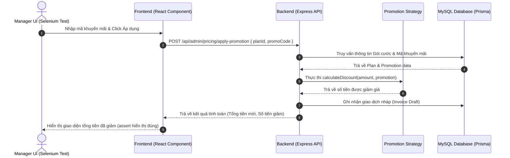

# 📑 BÁO CÁO NGHIÊN CỨU & ĐỀ XUẤT CÔNG CỤ QUẢN LÝ BUG, KIỂM THỬ VÀ LỘ TRÌNH DỰ ÁN PUBLICAST

Tài liệu này được biên soạn nhằm phân tích, đánh giá và lựa chọn các công cụ quản lý lỗi (Bug Tracking), công cụ kiểm thử tự động (Testing Tools) phù hợp nhất với dự án **PubliCast** (Nền tảng B2B SaaS quản lý và lập lịch xuất bản MXH). Đồng thời, đề xuất phương án phát triển và tích hợp kiểm thử cho các phân hệ cốt lõi của **Manager (Member 2)**: *Pricing, Promotion, Statistics (Analytics), và Subscription* (trong ngữ cảnh SaaS hiện tại).

---

## 🔍 PHẦN 1: NGHIÊN CỨU & LỰA CHỌN CÔNG CỤ QUẢN LÝ BUG (BUG TRACKING)

Để đảm bảo quy trình **Agile/Scrum** kết hợp với triết lý **Surgical Engineering** (chính xác, ít tác động phụ) diễn ra trơn tru, việc lựa chọn công cụ quản lý Bug và Task là tối quan trọng. Dưới đây là bảng so sánh các công cụ phổ biến:

### 1. Bảng so sánh các công cụ quản lý Bug

| Tiêu chí | Jira Software (Atlassian) | ClickUp | Bugzilla (Mozilla) | Trello | Redmine |
| :--- | :--- | :--- | :--- | :--- | :--- |
| **Loại hình** | SaaS (Cloud) / Data Center | SaaS (Cloud) | Open-source (Self-hosted) | SaaS (Cloud) | Open-source (Self-hosted) |
| **Mô hình hỗ trợ** | Scrum, Kanban, LeSS | Kanban, Gantt, List, Mindmap | Trực quan hóa danh sách Bug đơn thuần | Kanban Board đơn giản | Gantt, Wiki, Agile (Plugin) |
| **Tùy biến Quy trình (Workflow)** | Rất mạnh (Tự thiết kế State transition, Validator, Post-functions) | Khá mạnh (Trạng thái tùy biến theo List) | Trung bình (Chỉ xoay quanh trạng thái Bug) | Yếu (Chỉ di chuyển qua các cột) | Khá mạnh (Cấu hình quyền và trạng thái phức tạp) |
| **Khả năng Tích hợp Git (GitHub/GitLab)** | Rất sâu (Liên kết Commit, Branch, Pull Request trực tiếp vào Issue qua ID) | Tốt (Liên kết qua ID task) | Kém (Yêu cầu Webhook phức tạp) | Cơ bản (Power-Ups GitHub) | Khá tốt (Thông qua commit message hook) |
| **Tính năng Bug Tracking chuyên sâu** | Rất tốt (Custom fields cho Severity, Priority, Environment, Steps to Reproduce) | Tốt (Sử dụng Custom Fields và Templates) | Xuất sắc (Thiết kế thuần túy cho quản lý lỗi) | Yếu (Không có trường thông tin mặc định cho Bug) | Tốt (Có tracker riêng cho Bug/Feature) |
| **Báo cáo & Metric** | Rất mạnh (Burndown, Velocity, Control Chart, Cumulative Flow) | Khá tốt (Dashboard tiện ích) | Cơ bản (Biểu đồ cột, xuất CSV) | Rất cơ bản | Cơ bản |
| **Độ dễ sử dụng** | Phức tạp (Cần thời gian làm quen và cấu hình) | Dễ tiếp cận (Giao diện hiện đại, trực quan) | Khó sử dụng (Giao diện cổ điển, UX kém) | Cực kỳ dễ (Kéo thả trực quan) | Trung bình (UX kiểu cũ) |
| **Chi phí** | Miễn phí tối đa 10 người dùng (Đầy đủ tính năng Agile cốt lõi) | Miễn phí tính năng cơ bản, giới hạn dung lượng lưu trữ | Miễn phí hoàn toàn | Miễn phí tính năng cơ bản | Miễn phí hoàn toàn (Tốn chi phí vận hành máy chủ) |

### 2. Lựa chọn Duy nhất cho Bug Tracking: Jira Software
**Lựa chọn chính thức: Jira Software (Cloud)** làm công cụ quản lý bug duy nhất cho dự án cuối kỳ.

> [!NOTE]
> **Lý do lựa chọn Jira:**
> 1. **Tuân thủ quy trình Agile/Scrum:** Jira hỗ trợ quản lý Product Backlog, Sprint Planning, Burndown Chart cực kỳ chuẩn chỉ, giúp Manager (Member 2) dễ dàng theo dõi tiến độ của các thành viên.
> 2. **Tích hợp Git chặt chẽ:** Khi dev tạo nhánh `feature/PBC-123-pricing-strategy` và commit, Jira sẽ tự động link code với Task tương ứng. Giúp Manager kiểm soát chất lượng code và thực hiện "Audit" dễ dàng.
> 3. **Workflow rõ ràng cho Bug:** Manager có thể cấu hình workflow quản lý lỗi nghiêm ngặt:
>    `To Do (Bug Reported) ➔ In Progress ➔ Ready for Test ➔ QA Verifying ➔ Done (Resolved) / Reopened`.

---

## 🧪 PHẦN 2: NGHIÊN CỨU & LỰA CHỌN CÔNG CỤ KIỂM THỬ (TESTING TOOLS)

Quy trình phát triển yêu cầu bắt buộc kết thúc bằng **Automated Validation** nhằm đảm bảo tính ổn định và tránh lỗi hồi quy (Regression). Dưới đây là phân tích các công cụ kiểm thử:

### 1. Phân tích các công cụ kiểm thử phổ biến

*   **Postman & Bruno (Kiểm thử API):**
    *   *Mục đích:* Kiểm thử và tự động hóa API (Functional, Integration), lập tài liệu API.
    *   *So sánh chi tiết:*
        *   **Postman:** Phổ biến nhất nhưng ngày càng nặng, bắt buộc đăng nhập đám mây để đồng bộ và giới hạn tính năng cộng tác nhóm miễn phí.
        *   **Bruno:** Công cụ API Client mã nguồn mở thay thế Postman vượt trội về tính **Git-friendly** (lưu trữ bộ sưu tập API dưới dạng file văn bản `.bru` phẳng trực tiếp trong codebase). Không yêu cầu đám mây, tránh xung đột khi git merge, có Bruno CLI (`bru run`) chạy tự động hóa CI/CD siêu nhẹ.
    *   *Nhược điểm:* Cả hai đều không giải quyết được bài toán kiểm thử giao diện người dùng (UI/UX).
*   **Selenium:**
    *   *Mục đích:* Kiểm thử tự động giao diện Web (E2E Testing).
    *   *Ưu điểm:* Là chuẩn công nghiệp lâu đời, hỗ trợ nhiều ngôn ngữ (Java, JavaScript, Python), chạy được trên mọi trình duyệt. Phù hợp hoàn hảo với yêu cầu của giảng viên về việc tự động hóa kiểm thử giao diện.
    *   *Nhược điểm:* Tốc độ chạy khá chậm, code kiểm thử dễ bị "flaky" (kết quả không ổn định do độ trễ mạng/giao diện) nếu không xử lý cơ chế Wait tốt.
*   **Cucumber:**
    *   *Mục đích:* Kiểm thử theo hướng hành vi (BDD - Behavior-Driven Development).
    *   *Ưu điểm:* Viết kịch bản bằng ngôn ngữ tự nhiên (Gherkin: `Given - When - Then`), giúp Manager và Developer hiểu chung một yêu cầu.
    *   *Nhược điểm:* Tốn công viết thêm lớp ánh xạ (Step Definitions) giữa Gherkin và code test (Selenium).
*   **Katalon Studio:**
    *   *Mục đích:* Công cụ kiểm thử All-in-one (Low-code/No-code).
    *   *Ưu điểm:* Dễ dùng cho người mới, tích hợp sẵn Selenium và Appium bên dưới, có tính năng Record & Playback.
    *   *Nhược điểm:* Bản miễn phí bị giới hạn nhiều tính năng nâng cao, bản quyền đắt, công cụ khá nặng.
*   **Appium & Robotium:**
    *   *Mục đích:* Kiểm thử ứng dụng di động (Android/iOS).
    *   *Đánh giá:* **Không phù hợp** vì dự án hiện tại PubliCast là Web Application (React + Node.js).
*   **QuickTest Pro (QTP / UFT):**
    *   *Mục đích:* Công cụ kiểm thử giao diện thương mại của Micro Focus.
    *   *Đánh giá:* Quá lỗi thời, sử dụng VBScript, chi phí bản quyền cực kỳ đắt đỏ, không phù hợp với các dự án Web hiện đại.

### 2. Lựa chọn Duy nhất cho Testing: Selenium WebDriver

**Lựa chọn chính thức: Selenium WebDriver** làm công cụ kiểm thử tự động chính thức duy nhất (ngoài Postman bị loại trừ theo yêu cầu).

> [!IMPORTANT]
> **Lý do lựa chọn Selenium:**
> 1. **Kiểm thử giao diện tự động (E2E):** Khả năng đóng vai trò tác nhân người dùng để mở trình duyệt, điền thông tin và tương tác với các component React của PubliCast (ví dụ: tạo bài viết, thiết lập giá, xem thống kê).
> 2. **Tuân thủ quy trình bắt buộc:** Đáp ứng đúng yêu cầu đầu ra của giảng viên và quy trình phát triển `Feature-by-Feature (MockMvc + Selenium)`.
> 
> *Lưu ý:* Các công cụ kiểm thử unit/integration nội bộ như **Jest + Supertest** (đã tích hợp trong backend) sẽ tiếp tục được sử dụng làm công cụ bổ trợ cho nhà phát triển ở mức code, nhưng **Selenium** là công cụ kiểm thử tự động giao diện chính thức được đăng ký và sử dụng để bàn giao cho dự án.

---

## 🛠️ PHẦN 3: ĐỌC HIỂU DỰ ÁN & ĐỀ XUẤT PHÁT TRIỂN MODULES CỦA MANAGER

### 1. Đánh giá Kiến trúc Hiện tại của PubliCast
Dự án được xây dựng rất bài bản theo hướng **Clean Architecture** và tuân thủ chặt chẽ nguyên tắc **SOLID**:
*   **Single Responsibility Principle (SRP):** Tách biệt rõ ràng giữa `Controllers` (nhận request/validate), `Services` (xử lý nghiệp vụ), và `Repositories` (truy xuất DB thông qua Prisma).
*   **Open-Closed Principle (OCP) thông qua Design Patterns:**
    *   *Strategy Pattern:* Thể hiện rất rõ ở `InboxService` với các class `YoutubeCommentSyncStrategy`, `FacebookCommentSyncStrategy`... Khi muốn tích hợp thêm nền tảng mới (ví dụ: TikTok), chỉ cần viết thêm một Strategy mới kế thừa mà không cần sửa code cũ của `InboxService`.
    *   *Pipeline Pattern:* Áp dụng trong việc lọc dữ liệu tìm kiếm (`QueryPipeline` kết hợp với các bộ lọc như `InboxSearchFilter`, `InboxPlatformFilter`...). Giúp dễ dàng thêm/bớt điều kiện lọc mà không làm phình to câu lệnh điều kiện `if-else`.
    *   *Factory Pattern:* `socialPlatformFactory.getService(platform)` giúp khởi tạo động đối tượng kết nối API tương ứng với từng mạng xã hội.

### 2. Định hướng Phát triển Các Phân hệ của Manager (Member 2)
Theo quy định, bạn (Manager) tập trung vào các phân hệ cốt lõi: **Pricing (Gói cước), Promotion (Khuyến mãi), Statistics (Thống kê & Báo cáo), và Subscription (Đăng ký gói dịch vụ)**.

Dưới đây là thiết kế kiến trúc đề xuất cho các module này dựa trên các Design Pattern tối ưu:

#### A. Phân hệ Pricing & Promotion (Áp dụng Strategy + Facade Pattern)
*   **Ngữ cảnh:** Hệ thống cần tính toán số tiền thanh toán của người dùng dựa trên gói cước (`Plan`), các dịch vụ mua thêm (`Addon`), và áp dụng các chương trình khuyến mãi khác nhau (Khuyến mãi theo phần trăm, giảm tiền trực tiếp).
*   **Thiết kế Strategy Pattern:** Định nghĩa một Interface `DiscountStrategy` cho việc tính toán giảm giá.
    ```javascript
    // Interface mô phỏng (Không magic string)
    class DiscountStrategy {
      calculateDiscount(totalAmount, promotionDetails) {
        throw new Error("Method calculateDiscount must be implemented");
      }
    }
    
    class PercentageDiscountStrategy extends DiscountStrategy {
      calculateDiscount(totalAmount, promotionDetails) {
        return totalAmount * (promotionDetails.value / 100);
      }
    }
    
    class FixedAmountDiscountStrategy extends DiscountStrategy {
      calculateDiscount(totalAmount, promotionDetails) {
        return Math.min(totalAmount, promotionDetails.value);
      }
    }
    ```
*   **Thiết kế Facade Pattern:** Tạo lớp `CheckoutFacade` để gom nhóm các bước phức tạp: kiểm tra tồn kho/giới hạn gói cước ➔ áp dụng mã khuyến mãi (qua Strategy) ➔ tạo hóa đơn ➔ trừ tiền/thanh toán.

#### B. Phân hệ Subscription & Pricing (Áp dụng Facade Pattern)
*   **Ngữ cảnh:** Đăng ký và gia hạn gói cước liên quan đến nhiều thao tác: kiểm tra quota của Brand hiện tại, tạo phiên giao dịch, cập nhật Subscription, tính toán lại PlanLimit, gửi email xác nhận.
*   **Thiết kế:** Tạo lớp `SubscriptionFacade` gom nhóm các logic nghiệp vụ phức tạp này để controller chỉ cần gọi một phương thức duy nhất.
    ```javascript
    class SubscriptionFacade {
      async createSubscription(brandId, planId, billingCycle) {
        const plan = await prisma.plan.findUnique({ where: { id: planId } });
        await subscriptionService.validateQuota(brandId, plan);
        const subscription = await subscriptionService.create(brandId, plan, billingCycle);
        await planLimitService.recalculate(brandId, plan);
        await emailService.sendInvoice(brandId, subscription);
        return subscription;
      }
    }
    ```

#### C. Phân hệ Statistics (Thống kê)
*   **Backend:** Viết các API tổng hợp dữ liệu (Aggregation Queries) sử dụng Prisma GroupBy để thống kê doanh thu theo thời gian, số lượng đăng ký gói cước hoạt động.
*   **Frontend:** Sử dụng thư viện **Recharts** (đã có trong `package.json` của frontend) để vẽ các biểu đồ trực quan (Biểu đồ đường thể hiện doanh thu, Biểu đồ cột thể hiện số lượng bài đăng, Biểu đồ tròn thể hiện tỷ lệ các nền tảng kết nối).

---

## 📅 LỘ TRÌNH TRIỂN KHAI CHI TIẾT (FEATURE-BY-FEATURE WORKFLOW)

Để đảm bảo chất lượng ngoại khoa (Surgical Engineering), mỗi tính năng trong các module trên cần được phát triển theo đúng 5 bước:

### Kịch bản minh họa: Phát triển tính năng "Áp dụng mã Khuyến mãi khi nâng cấp Gói cước"



1.  **Bước 1: Thiết kế Sequence Diagram (SD) & Sơ đồ lớp:** Vẽ sơ đồ tương tác giữa UI, API, Promotion Strategy, và cơ sở dữ liệu trước khi viết code.
2.  **Bước 2: Cài đặt Backend:** 
    *   Tạo API route `/api/admin/pricing/apply-promotion`.
    *   Áp dụng các Strategy tương ứng không dùng magic string (Sử dụng Constants cho các loại khuyến mãi).
    *   Viết test tích hợp backend bằng **Jest + Supertest** (giả lập request API và kiểm tra HTTP status, dữ liệu JSON trả về).
3.  **Bước 3: Tích hợp Giao diện (Frontend UI):**
    *   Tạo component nhập mã khuyến mãi tại trang Pricing của React.
    *   Xử lý trạng thái Loading và hiển thị lỗi thân thiện (ví dụ: "Mã khuyến mãi đã hết hạn").
4.  **Bước 4: Kiểm thử tự động E2E (Selenium):**
    *   Viết script Selenium tự động thực hiện: Mở trang Pricing ➔ Chọn gói Pro ➔ Nhập mã `PROMO50` ➔ Click áp dụng ➔ Kiểm tra xem tổng giá trị thanh toán có giảm 50% hay không.
5.  **Bước 5: Commit & Đồng bộ:** Tạo git commit có cấu trúc rõ ràng và đẩy lên GitHub để Manager dễ dàng kiểm soát qua Jira.

---
*Báo cáo đề xuất này đóng vai trò làm khung hướng dẫn kỹ thuật cho dự án cuối kỳ của nhóm. Sự kết hợp giữa Jira, Postman, Jest và Selenium sẽ tạo nên một quy trình phát triển chuyên nghiệp, đáp ứng tuyệt đối các tiêu chuẩn kỹ thuật đề ra.*
