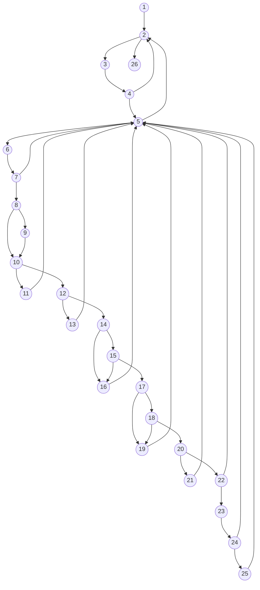

Bài tập: Kiểm thử hộp trắng
Chức năng và Mục đích của đoạn code
Hàm _processInsights(insights, dailyMap) trong FacebookAnalyticsService đảm nhận vai trò trích xuất và biến đổi dữ liệu báo cáo (insights) từ Facebook API để đưa vào cấu trúc dữ liệu theo ngày (dailyMap), đồng thời cập nhật các chỉ số tương tác, người theo dõi, và lượt xem.

1. Xác định các node và vẽ đồ thị dòng điều khiển (cơ bản)

|   _processInsights(insights, dailyMap) {
    let hasInsightsData = false; [1]
    for (const item of insights) { [2]
      const name = item.name; [3]
      if (item.values) { [4]
        for (const val of item.values) { [5]
          const d = new Date(val.end_time); [6]
          d.setTime(d.getTime() - 24 * 60 * 60 * 1000);
          const dateStr = d.toISOString().split('T')[0];
          
          if (dailyMap[dateStr]) { [7]
            if (val.value > 0) [8] hasInsightsData = true; [9]
            if (name === ANALYTICS.METRICS.FACEBOOK.VIEWS) { [10]
              dailyMap[dateStr].pageVisits = val.value || 0; [11]
            } else if (name === ANALYTICS.METRICS.FACEBOOK.IMPRESSIONS) { [12]
              dailyMap[dateStr].views = val.value || 0; [13]
            } else if (name === ANALYTICS.METRICS.FACEBOOK.FOLLOWS [14] || name === 'page_fan_adds_unique' [15]) { 
              dailyMap[dateStr].acquired = (dailyMap[dateStr].acquired || 0) + (val.value || 0); [16]
            } else if (name === 'page_daily_unfollows_unique' [17] || name === 'page_fan_removes_unique' [18]) { 
              dailyMap[dateStr].lost = (dailyMap[dateStr].lost || 0) + (val.value || 0); [19]
            } else if (name === ANALYTICS.METRICS.FACEBOOK.ACTIONS) { [20]
              dailyMap[dateStr].totalClicks = val.value || 0; [21]
            } else if (name === ANALYTICS.METRICS.FACEBOOK.ENGAGEMENTS) { [22]
              dailyMap[dateStr].engagements = val.value || 0; [23]
              if (!dailyMap[dateStr].totalClicks) [24] dailyMap[dateStr].totalClicks = val.value || 0; [25]
            }
          }
        }
      }
    }
    return hasInsightsData; [26]
  } |
| --- |

**Đồ thị dòng điều khiển (Control Flow Graph):**

2. Tính số test case ít nhất có thể bao phủ 100% các nhánh
Đồ thị dòng điều khiển có 14 nút quyết định nhị phân:
Nút [2]: vòng lặp item of insights
Nút [4]: item.values
Nút [5]: vòng lặp val of item.values
Nút [7]: dailyMap[dateStr]
Nút [8]: val.value > 0
Nút [10]: name === ANALYTICS.METRICS.FACEBOOK.VIEWS
Nút [12]: name === ANALYTICS.METRICS.FACEBOOK.IMPRESSIONS
Nút [14]: name === ANALYTICS.METRICS.FACEBOOK.FOLLOWS
Nút [15]: name === 'page_fan_adds_unique'
Nút [17]: name === 'page_daily_unfollows_unique'
Nút [18]: name === 'page_fan_removes_unique'
Nút [20]: name === ANALYTICS.METRICS.FACEBOOK.ACTIONS
Nút [22]: name === ANALYTICS.METRICS.FACEBOOK.ENGAGEMENTS
Nút [24]: !dailyMap[dateStr].totalClicks

Tính độ phức tạp Cyclomatic của đồ thị theo số nút quyết định:
V(G) = 14 + 1 = 15
Vậy có ít nhất là 15 test case để bao phủ 100% các nhánh.

3. Cho ví dụ bộ test case đối với mỗi nhánh
Test case cho đường 1: 1 -> 2 -> 26
Scenario: Không có dữ liệu insights trả về.
Value(insights): []
Kết quả kỳ vọng: Trả về false, không cập nhật map.

Test case cho đường 2: 1 -> 2 -> 3 -> 4 -> 2 -> 26
Scenario: Có item nhưng thiếu trường values.
Value(insights): [{ name: 'views', values: null }]
Kết quả kỳ vọng: Bỏ qua vòng lặp values.

Test case cho đường 3: 1 -> 2 -> 3 -> 4 -> 5 -> 2 -> 26
Scenario: Có trường values nhưng là mảng rỗng.
Value(insights): [{ name: 'views', values: [] }]
Kết quả kỳ vọng: Bỏ qua thân vòng lặp trong.

Test case cho đường 4: 1 -> 2 -> 3 -> 4 -> 5 -> 6 -> 7 -> 5 -> 2 -> 26
Scenario: Dữ liệu thuộc về ngày nằm ngoài khoảng dailyMap.
Value(val): Có end_time mà dateStr không nằm trong dailyMap.
Kết quả kỳ vọng: Bỏ qua không gán vào map.

Test case cho đường 5: 1 -> 2 -> 3 -> 4 -> 5 -> 6 -> 7 -> 8 -> 10 -> 12 -> 14 -> 15 -> 17 -> 18 -> 20 -> 22 -> 5 -> 2 -> 26
Scenario: Số liệu <= 0 và không thuộc metric nào cụ thể.
Value(val): value = 0, name = 'unknown_metric', nằm trong dailyMap.
Kết quả kỳ vọng: Các biến không bị sửa đổi.

Test case cho đường 6: 1 -> 2 -> 3 -> 4 -> 5 -> 6 -> 7 -> 8 -> 9 -> 10 -> 11 -> 5 -> 2 -> 26
Scenario: Metric thuộc loại VIEWS và có giá trị > 0.
Value: name = 'page_views_total', value = 10
Kết quả kỳ vọng: Cập nhật dailyMap[dateStr].pageVisits.

Test case cho đường 7: 1 -> 2 -> 3 -> 4 -> 5 -> 6 -> 7 -> 8 -> 10 -> 12 -> 13 -> 5 -> 2 -> 26
Scenario: Metric thuộc loại IMPRESSIONS và có giá trị <= 0.
Value: name = 'page_impressions', value = 0
Kết quả kỳ vọng: Cập nhật dailyMap[dateStr].views = 0.

Test case cho đường 8: 1 -> 2 -> 3 -> 4 -> 5 -> 6 -> 7 -> 8 -> 10 -> 12 -> 14 -> 16 -> 5 -> 2 -> 26
Scenario: Metric thuộc loại FOLLOWS (condition 1 của OR).
Value: name = 'page_follows', value = 2
Kết quả kỳ vọng: Cộng thêm vào dailyMap[dateStr].acquired.

Test case cho đường 9: 1 -> 2 -> 3 -> 4 -> 5 -> 6 -> 7 -> 8 -> 10 -> 12 -> 14 -> 15 -> 16 -> 5 -> 2 -> 26
Scenario: Metric là 'page_fan_adds_unique' (condition 2 của OR).
Value: name = 'page_fan_adds_unique', value = 3
Kết quả kỳ vọng: Cộng thêm vào dailyMap[dateStr].acquired.

Test case cho đường 10: 1 -> 2 -> 3 -> 4 -> 5 -> 6 -> 7 -> 8 -> 10 -> 12 -> 14 -> 15 -> 17 -> 19 -> 5 -> 2 -> 26
Scenario: Metric là 'page_daily_unfollows_unique' (condition 1 của OR).
Value: name = 'page_daily_unfollows_unique', value = 1
Kết quả kỳ vọng: Cộng thêm vào dailyMap[dateStr].lost.

Test case cho đường 11: 1 -> 2 -> 3 -> 4 -> 5 -> 6 -> 7 -> 8 -> 10 -> 12 -> 14 -> 15 -> 17 -> 18 -> 19 -> 5 -> 2 -> 26
Scenario: Metric là 'page_fan_removes_unique' (condition 2 của OR).
Value: name = 'page_fan_removes_unique', value = 1
Kết quả kỳ vọng: Cộng thêm vào dailyMap[dateStr].lost.

Test case cho đường 12: 1 -> 2 -> 3 -> 4 -> 5 -> 6 -> 7 -> 8 -> 10 -> 12 -> 14 -> 15 -> 17 -> 18 -> 20 -> 21 -> 5 -> 2 -> 26
Scenario: Metric là ACTIONS.
Value: name = 'page_total_actions', value = 20
Kết quả kỳ vọng: Cập nhật dailyMap[dateStr].totalClicks.

Test case cho đường 13: 1 -> 2 -> 3 -> 4 -> 5 -> 6 -> 7 -> 8 -> 10 -> 12 -> 14 -> 15 -> 17 -> 18 -> 20 -> 22 -> 23 -> 24 -> 25 -> 5 -> 2 -> 26
Scenario: Metric là ENGAGEMENTS và totalClicks đang bị trống.
Value: name = 'page_engaged_users', totalClicks chưa được set.
Kết quả kỳ vọng: Cập nhật cả engagements và totalClicks.

Test case cho đường 14: 1 -> 2 -> 3 -> 4 -> 5 -> 6 -> 7 -> 8 -> 10 -> 12 -> 14 -> 15 -> 17 -> 18 -> 20 -> 22 -> 23 -> 24 -> 5 -> 2 -> 26
Scenario: Metric là ENGAGEMENTS nhưng totalClicks đã tồn tại.
Value: name = 'page_engaged_users', totalClicks = 10.
Kết quả kỳ vọng: Cập nhật engagements nhưng không ghi đè totalClicks.

Test case cho đường 15: 1 -> 2 -> 3 -> 4 -> 5 -> 6 -> 7 -> 8 -> 9 -> 10 -> 12 -> 14 -> 15 -> 17 -> 18 -> 20 -> 22 -> 5 -> 2 -> 26
Scenario: Số liệu > 0 và không thuộc metric nào cụ thể.
Value(val): value = 5, name = 'unknown_metric', nằm trong dailyMap.
Kết quả kỳ vọng: hasInsightsData = true, các biến số khác không bị sửa.

Vẽ lại đồ thị và kiểm thử đời sống của từng biến xem có bất thường không

| Kịch bản \ Biến | insights | dailyMap | hasInsightsData | item | name | val | d | dateStr |
| --- | --- | --- | --- | --- | --- | --- | --- | --- |
| 1 | ~duk | ~duk | ~duk | ~k | ~k | ~k | ~k | ~k |
| 2 | ~duk | ~duk | ~duk | ~duk | ~duk | ~k | ~k | ~k |
| 3 | ~duk | ~duk | ~duk | ~duk | ~duk | ~k | ~k | ~k |
| 4 | ~duk | ~duuk | ~duk | ~duk | ~duuk | ~duk | ~duk | ~duk |
| 5 | ~duk | ~duuk | ~duuk | ~duk | ~duuk | ~duk | ~duk | ~duk |
| Kết luận | Bình thường | Bình thường | Bình thường | Bình thường | Bình thường | Bình thường | Bình thường | Bình thường |
