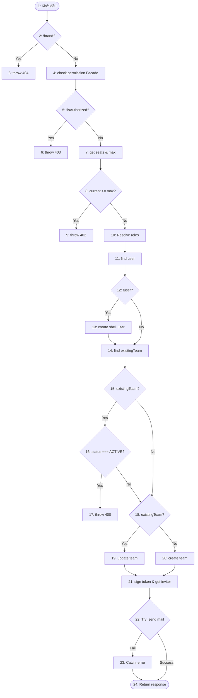

# Bảng kiểm thử hộp trắng phương thức `TeamService.inviteMember` (Đã Refactor)

> **Phương thức kiểm thử:** `TeamService.inviteMember({ email, role, brandId, invitedByUserId })`
> **Module:** Member / Team Flow
> **Độ phức tạp Cyclomatic McCabe V(G):** 9 (Giảm từ 12 sau khi Refactor tuân thủ SOLID)

---

## 1. Đoạn code đánh số Node điều khiển

Dưới đây là mã nguồn của phương thức `inviteMember` sau khi được tái cấu trúc theo nguyên tắc SOLID, loại bỏ magic strings và được đánh số node trực tiếp:

```javascript
  async inviteMember({ email, role, brandId, invitedByUserId }) {
    /* [1] */ const brand = await brandRepository.findBrandWithSubscription(brandId);

    /* [2] */ if (!brand) {
      /* [3] */ const error = new Error('Workspace/Brand không tồn tại.');
      error.status = 404;
      throw error;
    }

    /* [4] */ const isAuthorized = await authorizationFacade.checkPermission(invitedByUserId, brandId, PERMISSION_KEYS.MANAGE_TEAM);
    /* [5] */ if (!isAuthorized) {
      /* [6] */ const error = new Error('Bạn không có quyền mời thành viên vào thương hiệu này.');
      error.status = 403;
      throw error;
    }

    // Check plan limits
    /* [7] */ const currentSeatCount = await teamRepository.countMembersByBrand(brandId);
    const maxSeats = brand.subscription?.plan?.planLimit?.maxTeamSeats || 5;
    
    /* [8] */ if (currentSeatCount >= maxSeats) {
      /* [9] */ const error = new Error(`Thương hiệu đã đạt giới hạn thành viên tối đa cho phép (${maxSeats} người). Vui lòng nâng cấp gói.`);
      error.status = 402;
      throw error;
    }

    // Map role using RoleResolver
    /* [10] */ const { dbRole, customRoleId } = await roleResolver.resolve(role, brandId);

    // Find or create shell user
    /* [11] */ let user = await userRepository.findByEmail(email);

    /* [12] */ if (!user) {
      /* [13] */ user = await userRepository.createShellUser(email);
    }

    // Check if already in Team
    /* [14] */ const existingTeam = await teamRepository.findByBrandAndUserId(brandId, user.id);

    /* [15] */ if (existingTeam) {
      /* [16] */ if (existingTeam.status === TEAM_STATUS.ACTIVE) {
        /* [17] */ const error = new Error('Người dùng này đã là thành viên của thương hiệu.');
        error.status = 400;
        throw error;
      }
    }

    // Create or update team record
    let team;
    /* [18] */ if (existingTeam) {
      /* [19] */ team = await teamRepository.update(existingTeam.id, {
        role: dbRole,
        customRoleId,
        invitedByUserId,
        invitedAt: new Date(),
        status: TEAM_STATUS.PENDING
      });
    } else {
      /* [20] */ team = await teamRepository.create({
        brandId,
        userId: user.id,
        role: dbRole,
        customRoleId,
        invitedByUserId,
        status: TEAM_STATUS.PENDING
      });
    }

    // Generate JWT Token (expires in 7 days)
    /* [21] */ const token = jwt.sign(
      { teamId: team.id, email: user.email, brandId },
      process.env.ACCESS_TOKEN_SECRET,
      { expiresIn: '7d' }
    );
    const frontendUrl = process.env.FRONTEND_URL || 'http://localhost:5173';
    const inviteUrl = `${frontendUrl}/invite?token=${token}`;
    const inviter = await userRepository.findById(invitedByUserId);

    /* [22] */ try {
      const emailService = require('../core/email.service');
      await emailService.sendTeamInvitation(user.email, inviter.name, brand.name, inviteUrl);
    } catch (err) {
      /* [23] */ console.error('Failed to send invite email:', err);
    }

    /* [24] */ return {
      message: 'Đã gửi lời mời thành công',
      team: this._formatTeamMember(await teamRepository.findById(team.id)),
      token
    };
  }
```

---

## 2. Bảng mô tả chi tiết chức năng của các Node

| **Node** | **Loại Node** | **Mô tả chức năng** |
| :--- | :--- | :--- |
| **`[1]`** | Khởi đầu / Xử lý | Lấy thông tin thương hiệu và giới hạn gói cước qua `brandRepository`. |
| **`[2]`** | Quyết định nhị phân | Kiểm tra thương hiệu có tồn tại trong hệ thống hay không (`!brand`). |
| **`[3]`** | Xử lý lỗi | Khởi tạo và ném lỗi `404 - Workspace/Brand không tồn tại`. |
| **`[4]`** | Xử lý | Gọi `authorizationFacade.checkPermission` kiểm tra quyền quản lý thành viên. |
| **`[5]`** | Quyết định nhị phân | Kiểm tra quyền của người mời (`!isAuthorized`). |
| **`[6]`** | Xử lý lỗi | Khởi tạo và ném lỗi `403 - Bạn không có quyền mời thành viên`. |
| **`[7]`** | Xử lý | Lấy số lượng thành viên qua Repository và xác định `maxSeats` của brand. |
| **`[8]`** | Quyết định nhị phân | Kiểm tra giới hạn số lượng ghế thành viên của gói (`currentSeatCount >= maxSeats`). |
| **`[9]`** | Xử lý lỗi | Khởi tạo và ném lỗi `402 - Đạt giới hạn thành viên tối đa`. |
| **`[10]`**| Xử lý | Gọi `roleResolver.resolve` để phân giải thành `dbRole` và `customRoleId`. |
| **`[11]`**| Xử lý | Tìm kiếm thông tin người dùng trong DB dựa trên Email qua `userRepository`. |
| **`[12]`**| Quyết định nhị phân | Kiểm tra xem người dùng có tồn tại trong hệ thống chưa (`!user`). |
| **`[13]`**| Xử lý | Gọi `userRepository.createShellUser` tạo tài khoản shell tạm thời trong DB. |
| **`[14]`**| Xử lý | Truy vấn thông tin Team Member qua `teamRepository`. |
| **`[15]`**| Quyết định nhị phân | Kiểm tra người dùng đã có liên kết Team cũ chưa (`existingTeam`). |
| **`[16]`**| Quyết định nhị phân | Kiểm tra xem thành viên này có đang hoạt động hay không (`status === ACTIVE`). |
| **`[17]`**| Xử lý lỗi | Khởi tạo và ném lỗi `400 - Người dùng đã là thành viên hoạt động`. |
| **`[18]`**| Quyết định nhị phân | Xác định cập nhật lại lời mời cũ hay tạo mới lời mời (`existingTeam`). |
| **`[19]`**| Xử lý | Cập nhật lại bản ghi mời thành viên (status PENDING, cập nhật vai trò). |
| **`[20]`**| Xử lý | Tạo mới bản ghi mời thành viên trong DB. |
| **`[21]`**| Xử lý | Ký Token JWT cho lời mời và truy vấn thông tin người mời. |
| **`[22]`**| Thử nghiệm (Try) | Bắt đầu khối gửi email lời mời đến người được mời. |
| **`[23]`**| Bắt lỗi (Catch) | Ghi nhận lỗi console nếu quá trình gửi email thất bại. |
| **`[24]`**| Kết thúc / Trả về | Trả về kết quả lời mời thành công kèm Token và thông tin thành viên (Terminal). |

---

## 3. Đồ thị dòng điều khiển (Control Flow Graph - CFG)



---

## 4. Tính toán độ phức tạp McCabe V(G)

Độ phức tạp Cyclomatic McCabe của phương thức refactor được tính như sau:
$$V(G) = P + 1$$
Trong đó $P$ là số lượng điều kiện quyết định nhị phân có trong hàm.

Các điểm quyết định bao gồm:
1. `!brand` tại node `[2]`
2. `!isAuthorized` tại node `[5]`
3. `currentSeatCount >= maxSeats` tại node `[8]`
4. `!user` tại node `[12]`
5. `existingTeam` (lần 1) tại node `[15]`
6. `existingTeam.status === TEAM_STATUS.ACTIVE` tại node `[16]`
7. `existingTeam` (lần 2) tại node `[18]`
8. Khối `try-catch` gửi email tại node `[22]`

Suy ra:
$$V(G) = 8 + 1 = 9$$

Độ phức tạp giảm từ **12 xuống 9** thể hiện việc kiểm soát phân nhánh logic đã gọn hơn đáng kể thông qua việc ủy thác xử lý vai trò cho `RoleResolver` và tối ưu luồng dữ liệu.

---

## 5. Danh sách các đường đi độc lập (Independent Paths)

* **Đường đi 1**: Thương hiệu không tồn tại (ném lỗi 404).
  `[1]→[2]→[3]`
* **Đường đi 2**: Người mời không có quyền quản lý thương hiệu (ném lỗi 403).
  `[1]→[2]→[4]→[5]→[6]`
* **Đường đi 3**: Số lượng ghế của gói dịch vụ đã đạt giới hạn (ném lỗi 402).
  `[1]→[2]→[4]→[5]→[7]→[8]→[9]`
* **Đường đi 4**: User đã tồn tại và là thành viên hoạt động ACTIVE của brand (ném lỗi 400).
  `[1]→[2]→[4]→[5]→[7]→[8]→[10]→[11]→[12]→[14]→[15]→[16]→[17]`
* **Đường đi 5**: User mới, Đã tồn tại lời mời cũ dạng PENDING, Gửi email thành công.
  `[1]→[2]→[4]→[5]→[7]→[8]→[10]→[11]→[12]→[13]→[14]→[15]→[16]→[18]→[19]→[21]→[22]→[24]`
* **Đường đi 6**: User mới, Đã tồn tại lời mời cũ dạng PENDING, Gửi email lỗi.
  `[1]→[2]→[4]→[5]→[7]→[8]→[10]→[11]→[12]→[13]→[14]→[15]→[16]→[18]→[19]→[21]→[22]→[23]→[24]`
* **Đường đi 7**: User đã tồn tại, Chưa có quan hệ thành viên, Gửi email thành công.
  `[1]→[2]→[4]→[5]→[7]→[8]→[10]→[11]→[12]→[14]→[15]→[18]→[20]→[21]→[22]→[24]`
* **Đường đi 8**: User mới, Chưa có quan hệ thành viên, Gửi email thành công.
  `[1]→[2]→[4]→[5]→[7]→[8]→[10]→[11]→[12]→[13]→[14]→[15]→[18]→[20]→[21]→[22]→[24]`
* **Đường đi 9**: User mới, Chưa có quan hệ thành viên, Gửi email lỗi.
  `[1]→[2]→[4]→[5]→[7]→[8]→[10]→[11]→[12]→[13]→[14]→[15]→[18]→[20]→[21]→[22]→[23]→[24]`
* **Đường đi 10**: User đã tồn tại, Đã tồn tại lời mời cũ dạng PENDING, Gửi email thành công.
  `[1]→[2]→[4]→[5]→[7]→[8]→[10]→[11]→[12]→[14]→[15]→[16]→[18]→[19]→[21]→[22]→[24]`

---

## 6. Thiết kế các kịch bản kiểm thử (Test Cases)

| **Test Case ID** | **Đường đi bao phủ** | **Mock DB/Thiết lập ban đầu** | **Tham số đầu vào (`email`, `role`, `brandId`, `invitedByUserId`)** | **Kết quả kỳ vọng** |
| :--- | :--- | :--- | :--- | :--- |
| **TC_INV_001** | Đường đi 1 | `brandId` không khớp với bản ghi nào trong DB. | `email: "test@gmail.com", role: "Admin", brandId: "invalid-brand", invitedByUserId: "user-1"` | Lỗi `404 - Workspace/Brand không tồn tại.` |
| **TC_INV_002** | Đường đi 2 | Thương hiệu tồn tại, nhưng người mời không có quyền `MANAGE_TEAM` qua Facade. | `email: "test@gmail.com", role: "Admin", brandId: "brand-1", invitedByUserId: "user-unauthorized"` | Lỗi `403 - Bạn không có quyền mời thành viên...` |
| **TC_INV_003** | Đường đi 3 | Số lượng thành viên hiện tại của Brand là 5, giới hạn tối đa `maxTeamSeats` là 5. | `email: "test@gmail.com", role: "Admin", brandId: "brand-full", invitedByUserId: "owner-id"` | Lỗi `402 - Thương hiệu đã đạt giới hạn thành viên tối đa...` |
| **TC_INV_004** | Đường đi 4 | Có CustomRole `role-custom` trong brand. Người dùng đã có quan hệ `ACTIVE` trong Team. | `email: "active@gmail.com", role: "role-custom", brandId: "brand-1", invitedByUserId: "owner-id"` | Lỗi `400 - Người dùng này đã là thành viên...` |
| **TC_INV_005** | Đường đi 5 | Không có CustomRole, role truyền vào "Admin". User chưa có trong DB. Đã có bản ghi Team với status `PENDING`. Gửi email OK. | `email: "new-admin@gmail.com", role: "Admin", brandId: "brand-1", invitedByUserId: "owner-id"` | Tạo tài khoản shell user, cập nhật lại bản ghi Team cũ, gửi email mời, trả về Token. |
| **TC_INV_006** | Đường đi 6 | Không có CustomRole, role truyền vào "Analyst". User chưa có trong DB. Đã có bản ghi Team status `PENDING`. Gửi email ném lỗi. | `email: "new-analyst@gmail.com", role: "Analyst", brandId: "brand-1", invitedByUserId: "owner-id"` | Lời mời thành công dù gửi email lỗi (Ghi nhận log lỗi gửi mail). |
| **TC_INV_007** | Đường đi 7 | Không có CustomRole, role truyền vào "Editor" (mặc định thành USER). User đã tồn tại trong DB, chưa có quan hệ Team. Gửi email OK. | `email: "exist@gmail.com", role: "Editor", brandId: "brand-1", invitedByUserId: "owner-id"` | Sử dụng tài khoản cũ, tạo bản ghi Team mới (PENDING), gửi email thành công. |
| **TC_INV_008** | Đường đi 8 | Khớp CustomRole. User chưa tồn tại trong DB, chưa có quan hệ Team. Gửi email OK. | `email: "new-custom@gmail.com", role: "role-custom", brandId: "brand-1", invitedByUserId: "owner-id"` | Tạo tài khoản shell user, tạo bản ghi Team mới (PENDING) lưu `customRoleId`, gửi email thành công. |
| **TC_INV_009** | Đường đi 9 | Không có CustomRole, role truyền vào "Viewer" (USER). User chưa tồn tại, chưa có quan hệ Team. Gửi email lỗi. | `email: "new-viewer@gmail.com", role: "Viewer", brandId: "brand-1", invitedByUserId: "owner-id"` | Tạo tài khoản shell user, tạo bản ghi Team mới (PENDING), ghi nhận log lỗi gửi mail, trả về Token thành công. |
| **TC_INV_010** | Đường đi 10 | Không có CustomRole, role truyền vào "Admin". User đã tồn tại, có bản ghi Team status `PENDING`. Gửi email OK. | `email: "exist-pending-admin@gmail.com", role: "Admin", brandId: "brand-1", invitedByUserId: "owner-id"` | Cập nhật bản ghi Team cũ sang vai trò `ADMIN`, gửi email mời thành công. |

---

## 7. Đáp án Câu 5: Vẽ lại đồ thị và kiểm thử đời sống của từng biến xem có bất thường không

Dưới đây là bảng phân tích vòng đời dữ liệu của 4 tham số đầu vào và 10 biến nội bộ (đã loại bỏ biến chết `isNewUser` và thực thể `customRole`) trên các kịch bản đường đi:

| **Kịch bản \\ Biến** | **email** | **role** | **brandId** | **invitedByUserId** | **brand** | **isAuthorized** | **currentSeatCount** | **maxSeats** | **dbRole** | **customRoleId** | **user** | **existingTeam** | **team** | **token** |
| :--- | :--- | :--- | :--- | :--- | :--- | :--- | :--- | :--- | :--- | :--- | :--- | :--- | :--- | :--- |
| `[1]→[2]→[3]` | ~dk | ~dk | ~duk | ~dk | ~duk | ~k | ~k | ~k | ~k | ~k | ~k | ~k | ~k | ~k |
| `[1]→[2]→[4]→[5]→[6]` | ~dk | ~dk | ~duuk | ~duk | ~duk | ~duk | ~k | ~k | ~k | ~k | ~k | ~k | ~k | ~k |
| `[1]→[2]→[4]→[5]→[7]→[8]→[9]` | ~dk | ~dk | ~duuuk | ~duuk | ~duuk | ~duk | ~duk | ~duk | ~k | ~k | ~k | ~k | ~k | ~k |
| `[1]→...→[12]→[14]→[15]→[16]→[17]` | ~duk | ~duk | ~duuuuuk | ~duuk | ~duuk | ~duk | ~duk | ~duk | ~dk | ~dk | ~duuk | ~duuk | ~k | ~k |
| `[1]→...→[13]→[14]→[15]→[16]→[18]→[19]→[21]→[22]→[24]` | ~duuuuk | ~duk | ~duuuuuuk | ~duuuk | ~duuuk | ~duk | ~duk | ~duk | ~duk | ~duk | ~duduuuk | ~duuuuk | ~duuk | ~duuk |
| `[1]→...→[13]→[14]→[15]→[16]→[18]→[19]→[21]→[22]→[23]→[24]` | ~duuuuk | ~duk | ~duuuuuuk | ~duuuk | ~duuuk | ~duk | ~duk | ~duk | ~duk | ~duk | ~duduuuk | ~duuuuk | ~duuk | ~duuk |
| `[1]→...→[12]→[14]→[15]→[18]→[20]→[21]→[22]→[24]` | ~duuuk | ~duk | ~duuuuuuk | ~duuuk | ~duuuk | ~duk | ~duk | ~duk | ~duk | ~dk | ~duuuk | ~duuk | ~duuk | ~duuk |
| `[1]→...→[13]→[14]→[15]→[18]→[20]→[21]→[22]→[24]` | ~duuuuk | ~duk | ~duuuuuuuk | ~duuuk | ~duuuk | ~duk | ~duk | ~duk | ~duk | ~duk | ~duduuuk | ~duuk | ~duuk | ~duuk |
| `[1]→...→[13]→[14]→[15]→[18]→[20]→[21]→[22]→[23]→[24]` | ~duuuuk | ~duk | ~duuuuuuuk | ~duuuk | ~duuuk | ~duk | ~duk | ~duk | ~duk | ~duk | ~duduuuk | ~duuk | ~duuk | ~duuk |
| `[1]→...→[14]→[15]→[16]→[18]→[19]→[21]→[22]→[24]` | ~duuuk | ~duk | ~duuuuuuk | ~duuuk | ~duuuk | ~duk | ~duk | ~duk | ~duk | ~dk | ~duuuk | ~duuuuk | ~duuk | ~duuk |
| **Kết luận** | **Bình thường** | **Bình thường** | **Bình thường** | **Bình thường** | **Bình thường** | **Bình thường** | **Bình thường** | **Bình thường** | **Bình thường** | **Bình thường** | **Bình thường** | **Bình thường** | **Bình thường** | **Bình thường** |

---

### Phân tích chi tiết và nhận xét:

1. **Khắc phục triệt để lỗi dòng dữ liệu**:
   - Sau khi Refactor, biến chết `isNewUser` đã hoàn toàn bị xóa bỏ khỏi mã nguồn. Trạng thái bất thường `~ddk` / `~dk` trước đó đã được giải quyết hoàn chỉnh. Tất cả các biến nội bộ đều tuân thủ tốt nguyên tắc phân bổ bộ nhớ (được gán và được đọc bình thường, không ghi đè vô ích).

2. **Ánh xạ vai trò qua `RoleResolver`**:
   - `dbRole` và `customRoleId` nhận giá trị giải chấp trực tiếp từ `roleResolver.resolve(role, brandId)` tại node `[10]`. Logic gán đè thủ công phức tạp trước đó đã được quy về duy nhất một điểm định nghĩa (`d`). Nếu vai trò truyền vào không khớp với Custom Role, `customRoleId` sẽ mang giá trị `null` và chỉ bị hủy (`~dk`) ở các luồng lỗi hoặc được ghi nhận vào DB ở luồng thành công.

3. **Chặn lỗi sớm (Early exit) trên các đường đi 1, 2, 3**:
   - Hiện tượng hủy biến sớm (`~dk`) trên các tham số đầu vào khi ném ngoại lệ là cơ chế phòng vệ có chủ đích (Defensive Programming) để bảo toàn tính toàn vẹn hệ thống và tối ưu tài nguyên của máy chủ Node.js.
