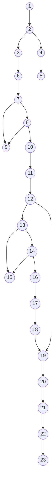

Bài tập: Kiểm thử hộp trắng
Chức năng và Mục đích của đoạn code
Hàm acceptInvitation({ token, name, password }) trong TeamService đảm nhiệm việc xử lý quá trình người dùng chấp nhận lời mời tham gia một không gian làm việc (Workspace/Brand). Hàm kiểm tra tính hợp lệ của JWT token (chứa thông tin lời mời), kiểm tra trạng thái lời mời, và kích hoạt tài khoản nếu đây là một người dùng mới (chưa có mật khẩu). Cuối cùng, hàm sẽ cập nhật trạng thái thành viên thành ACTIVE và trả về token đăng nhập.

1. Xác định các node và vẽ đồ thị dòng điều khiển (cơ bản)

| async acceptInvitation({ token, name, password }) {
    let decoded; [1]
    try { [2]
      decoded = jwt.verify(token, process.env.ACCESS_TOKEN_SECRET); [3]
    } catch (err) { [4]
      throw new Error('Token lời mời không hợp lệ hoặc đã hết hạn.'); [5]
    }

    const team = await teamRepository.findById(decoded.teamId); [6]
    
    // Tách riêng các điều kiện short-circuit để đánh giá độc lập
    if (!team) { [7]
      throw new Error('Lời mời không tồn tại hoặc đã được xử lý.'); [9]
    }
    if (team.status !== 'PENDING') { [8]
      throw new Error('Lời mời không tồn tại hoặc đã được xử lý.'); [9]
    }

    const user = team.user; [10]
    const isNewUser = !user.passwordHash; [11]

    if (isNewUser) { [12]
      if (!name) { [13]
        throw new Error('Vui lòng điền đầy đủ họ tên và mật khẩu.'); [15]
      }
      if (!password) { [14]
        throw new Error('Vui lòng điền đầy đủ họ tên và mật khẩu.'); [15]
      }

      const bcrypt = require('bcryptjs'); [16]
      const passwordHash = await bcrypt.hash(password, 10); [17]

      await prisma.user.update({ ... }); [18]
    }

    await prisma.team.update({ ... }); [19]

    const tokenService = require('../auth/token.service'); [20]
    const updatedUser = await prisma.user.findUnique({ ... }); [21]
    const tokens = await tokenService.generateAndSaveTokens(updatedUser); [22]

    return { ... }; [23]
  } |
| --- |

**Đồ thị dòng điều khiển (Control Flow Graph):**

2. Tính số test case ít nhất có thể bao phủ 100% các nhánh
Đồ thị dòng điều khiển có 6 nút quyết định:
Nút [2]: Bắt lỗi Try-Catch ẩn (nếu lỗi sẽ nhảy sang 4, nếu không lỗi đi thẳng từ 3 -> 6)
Nút [7]: !team
Nút [8]: team.status !== 'PENDING'
Nút [12]: isNewUser
Nút [13]: !name
Nút [14]: !password

Tính độ phức tạp Cyclomatic của đồ thị theo số nút quyết định:
V(G) = 6 + 1 = 7
Vậy có ít nhất là 7 test case để bao phủ 100% các nhánh.

3. Cho ví dụ bộ test case đối với mỗi nhánh
Test case cho đường 1: 1 -> 2 -> 4 -> 5
Scenario: Token lời mời truyền vào không hợp lệ hoặc đã hết hạn.
Value: token = 'invalid_jwt'
Kết quả kỳ vọng: Bị block ở catch, ném lỗi 'Token lời mời không hợp lệ hoặc đã hết hạn'.

Test case cho đường 2: 1 -> 2 -> 3 -> 6 -> 7 -> 9
Scenario: Token hợp lệ nhưng không tìm thấy dữ liệu team trong cơ sở dữ liệu.
Value: token = 'valid_jwt', teamRepository.findById trả về null.
Kết quả kỳ vọng: Ném lỗi 'Lời mời không tồn tại hoặc đã được xử lý'.

Test case cho đường 3: 1 -> 2 -> 3 -> 6 -> 7 -> 8 -> 9
Scenario: Lời mời tồn tại trong cơ sở dữ liệu nhưng trạng thái không phải PENDING.
Value: token = 'valid_jwt', team.status = 'ACTIVE'.
Kết quả kỳ vọng: Ném lỗi 'Lời mời không tồn tại hoặc đã được xử lý'.

Test case cho đường 4: 1 -> 2 -> 3 -> 6 -> 7 -> 8 -> 10 -> 11 -> 12 -> 19 -> 20 -> 21 -> 22 -> 23
Scenario: Lời mời hợp lệ, người dùng ĐÃ có mật khẩu (tài khoản đã kích hoạt từ trước).
Value: user.passwordHash = 'hashed_pass' (=> isNewUser = false).
Kết quả kỳ vọng: Bỏ qua khối update khởi tạo user, cập nhật trực tiếp trạng thái Team thành ACTIVE và sinh token mới thành công.

Test case cho đường 5: 1 -> 2 -> 3 -> 6 -> 7 -> 8 -> 10 -> 11 -> 12 -> 13 -> 15
Scenario: Lời mời hợp lệ, người dùng mới chưa có mật khẩu, nhưng bỏ trống họ tên (name).
Value: isNewUser = true, name = null.
Kết quả kỳ vọng: Ném lỗi 'Vui lòng điền đầy đủ họ tên và mật khẩu'.

Test case cho đường 6: 1 -> 2 -> 3 -> 6 -> 7 -> 8 -> 10 -> 11 -> 12 -> 13 -> 14 -> 15
Scenario: Lời mời hợp lệ, người dùng mới chưa có mật khẩu, có điền họ tên nhưng bỏ trống mật khẩu.
Value: isNewUser = true, name = 'John Doe', password = null.
Kết quả kỳ vọng: Ném lỗi 'Vui lòng điền đầy đủ họ tên và mật khẩu'.

Test case cho đường 7: 1 -> 2 -> 3 -> 6 -> 7 -> 8 -> 10 -> 11 -> 12 -> 13 -> 14 -> 16 -> 17 -> 18 -> 19 -> 20 -> 21 -> 22 -> 23
Scenario: Lời mời hợp lệ, người dùng mới điền đầy đủ thông tin name và password.
Value: isNewUser = true, name = 'John Doe', password = 'secure_password'.
Kết quả kỳ vọng: Cập nhật thông tin user, kích hoạt tài khoản, cập nhật mật khẩu, chuyển trạng thái team thành ACTIVE và trả về tokens.

Vẽ lại đồ thị và kiểm thử đời sống của từng biến xem có bất thường không

| Kịch bản \ Biến | decoded | err | team | user | isNewUser | passwordHash | tokens |
| --- | --- | --- | --- | --- | --- | --- | --- |
| 1 | ~duuk | ~duk | ~k | ~k | ~k | ~k | ~k |
| 2 | ~duk | ~k | ~duk | ~k | ~k | ~k | ~k |
| 3 | ~duk | ~k | ~duuk | ~k | ~k | ~k | ~k |
| 4 | ~duk | ~k | ~duuk | ~duk | ~duk | ~k | ~duk |
| 7 | ~duk | ~k | ~duuk | ~duk | ~duk | ~duk | ~duk |
| Kết luận | Bình thường | Bình thường | Bình thường | Bình thường | Bình thường | Bình thường | Bình thường |
