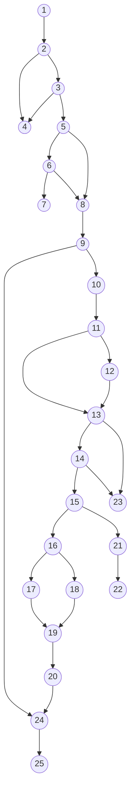

Bài tập: Kiểm thử hộp trắng
Chức năng và Mục đích của đoạn code
Hàm syncChannelMetrics(socialAccountId, startDate, endDate) trong TikTokAnalyticsService làm nhiệm vụ đồng bộ dữ liệu báo cáo mới nhất của người dùng trên nền tảng TikTok. Hàm kiểm tra token, tự động làm mới (refresh token) nếu token cũ bị hết hạn và gửi lưu về cơ sở dữ liệu.

1. Xác định các node và vẽ đồ thị dòng điều khiển (cơ bản)

| async syncChannelMetrics(socialAccountId, startDate, endDate) {
  let account = await socialAccountRepository.findById(socialAccountId); [1]
  
  if (!account [2] || account.platform !== PLATFORMS.TIKTOK [3]) {
    throw new Error('Social account not found or is not a TikTok account'); [4]
  }

  if (account.accessToken [5] && account.accessToken.startsWith('mock-') [6]) {
    const channelInfo = this._getMockChannelInfo(account.accessToken);
    const analyticsData = this._getMockAnalyticsReport(startDate, endDate, channelInfo.followersCount);
    const accountData = { ...channelInfo, analytics: analyticsData };
    return socialAccountRepository.upsertTikTokAccount(account.brandId, accountData, { ... }); [7]
  }

  account = await this.getOrRefreshAccount(account); [8]
  let userInfo;

  try {
    userInfo = await tiktokGateway.getUserInfo(account.accessToken); [9]
  } catch (error) { [10]
    const isTokenError = error.status === 401 [11] || error.code === 'access_token_invalid'; [12]
    
    if (isTokenError [13] && account.refreshToken [14]) {
      try {
        const refreshed = await tiktokGateway.refreshAccessToken(account.refreshToken); [15]
        const accessToken = refreshed.access_token;
        const refreshToken = refreshed.refresh_token || account.refreshToken;
        const expiryDate = refreshed.expires_in [16] ? Date.now() + (refreshed.expires_in * 1000) [17] : null; [18]

        account = await socialAccountRepository.updateTokens(account.id, { ... }); [19]
        userInfo = await tiktokGateway.getUserInfo(account.accessToken); [20]
      } catch (refreshError) { [21]
        throw error; [22]
      }
    } else {
      throw error; [23]
    }
  }

  const analyticsData = await this.getAnalyticsReport({ accessToken: account.accessToken }, startDate, endDate, userInfo.follower_count); [24]
  const accountData = { ... };
  return socialAccountRepository.upsertTikTokAccount(account.brandId, accountData, { ... }); [25]
} |
| --- |

**Đồ thị dòng điều khiển (Control Flow Graph):**

2. Tính số test case ít nhất có thể bao phủ 100% các nhánh
Đồ thị dòng điều khiển có 11 nút quyết định:
Nút [2]: !account
Nút [3]: account.platform !== PLATFORMS.TIKTOK
Nút [5]: account.accessToken
Nút [6]: account.accessToken.startsWith('mock-')
Nút [10]: catch(error)
Nút [11]: error.status === 401
Nút [12]: error.code === 'access_token_invalid'
Nút [13]: isTokenError
Nút [14]: account.refreshToken
Nút [16]: refreshed.expires_in
Nút [21]: catch(refreshError)

Tính độ phức tạp Cyclomatic của đồ thị theo số nút quyết định:
V(G) = 11 + 1 = 12
Vậy có ít nhất là 12 test case để bao phủ 100% các nhánh.

3. Cho ví dụ bộ test case đối với mỗi nhánh
Test case cho đường 1: 1 -> 2 -> 4
Scenario: Không tìm thấy tài khoản (account null).
Value(socialAccountId): ID không có trong DB.
Kết quả kỳ vọng: Throw Error 'Social account not found...'.

Test case cho đường 2: 1 -> 2 -> 3 -> 4
Scenario: Tìm thấy tài khoản nhưng khác platform.
Value(socialAccountId): ID của tài khoản Facebook.
Kết quả kỳ vọng: Throw Error 'Social account not found or is not a TikTok account'.

Test case cho đường 3: 1 -> 2 -> 3 -> 5 -> 6 -> 7
Scenario: Tài khoản TikTok đang dùng mock token.
Value(account): accessToken = 'mock-1234'
Kết quả kỳ vọng: Trả về thành công dữ liệu upsert mock.

Test case cho đường 4: 1 -> 2 -> 3 -> 5 -> 8 -> 9 -> 24 -> 25
Scenario: Tài khoản hợp lệ, không phải mock token, call getUserInfo thành công không lỗi.
Value(account): accessToken = 'real-token', getUserInfo success.
Kết quả kỳ vọng: Sync analytics report thành công.

Test case cho đường 5: 1 -> 2 -> 3 -> 5 -> 8 -> 9 -> 10 -> 11 -> 13 -> 23
Scenario: Lỗi khi call getUserInfo nhưng không phải 401.
Value: api ném ra error.status = 500
Kết quả kỳ vọng: Văng luôn error cũ ra.

Test case cho đường 6: 1 -> 2 -> 3 -> 5 -> 8 -> 9 -> 10 -> 11 -> 12 -> 13 -> 23
Scenario: Lỗi trạng thái không phải 401 và không phải access_token_invalid.
Value: api ném ra error.status = 400, error.code = 'other'
Kết quả kỳ vọng: Văng luôn error cũ ra (không thử refresh).

Test case cho đường 7: 1 -> 2 -> 3 -> 5 -> 8 -> 9 -> 10 -> 11 -> 13 -> 14 -> 23
Scenario: Token lỗi chuẩn 401 nhưng không có refresh token.
Value: isTokenError = true, refreshToken = null
Kết quả kỳ vọng: Ném ra lỗi cũ (không có quyền hạn).

Test case cho đường 8: 1 -> 2 -> 3 -> 5 -> 8 -> 9 -> 10 -> 11 -> 13 -> 14 -> 15 -> 16 -> 18 -> 19 -> 20 -> 24 -> 25
Scenario: Refresh token thành công, không có biến expires_in trả về.
Value: API refresh trả về expires_in = null
Kết quả kỳ vọng: Token mới lưu vào DB, gọi lại api getUserInfo thành công.

Test case cho đường 9: 1 -> 2 -> 3 -> 5 -> 8 -> 9 -> 10 -> 11 -> 13 -> 14 -> 15 -> 16 -> 17 -> 18 -> 19 -> 20 -> 24 -> 25
Scenario: Refresh token thành công, có biến expires_in trả về đàng hoàng.
Value: API refresh trả về expires_in = 3600
Kết quả kỳ vọng: expiryDate được tính lại, token lưu DB và hoàn tất.

Test case cho đường 10: 1 -> 2 -> 3 -> 5 -> 8 -> 9 -> 10 -> 11 -> 13 -> 14 -> 15 -> 21 -> 22
Scenario: Gọi hàm Refresh token nhưng API bị sập hoặc trả lỗi.
Value: gateway refreshAccessToken throw Error
Kết quả kỳ vọng: Throw lại chính cái error ban đầu của getUserInfo.

Test case cho đường 11: 1 -> 2 -> 3 -> 5 -> 8 -> 9 -> 24 -> 25
Scenario: accessToken rỗng hoặc falsy.
Value: accessToken = null
Kết quả kỳ vọng: Bỏ qua kiểm tra mock, xuống bước getOrRefreshAccount.

Test case cho đường 12: 1 -> 2 -> 3 -> 5 -> 6 -> 8 -> 9 -> 24 -> 25
Scenario: accessToken có giá trị nhưng không bắt đầu bằng mock.
Value: accessToken = 'real-token'
Kết quả kỳ vọng: Bỏ qua khối mock, xuống getOrRefreshAccount.

Vẽ lại đồ thị và kiểm thử đời sống của từng biến xem có bất thường không

| Kịch bản \ Biến | account | userInfo | error | isTokenError | refreshed | accessToken | refreshToken | expiryDate | refreshError | analyticsData | accountData |
| --- | --- | --- | --- | --- | --- | --- | --- | --- | --- | --- | --- |
| 1 | ~duk | ~k | ~k | ~k | ~k | ~k | ~k | ~k | ~k | ~k | ~k |
| 2 | ~duuk | ~k | ~k | ~k | ~k | ~k | ~k | ~k | ~k | ~k | ~k |
| 3 | ~duuuk | ~k | ~k | ~k | ~k | ~duk | ~k | ~k | ~k | ~k | ~duk |
| 4 | ~duuuk | ~duk | ~k | ~k | ~k | ~k | ~k | ~k | ~k | ~duk | ~duk |
| 5 | ~duuuk | ~k | ~duk | ~duk | ~k | ~k | ~k | ~k | ~k | ~k | ~k |
| 6 | ~duuuk | ~k | ~duk | ~duuk | ~k | ~k | ~k | ~k | ~k | ~k | ~k |
| 7 | ~duuuk | ~k | ~duk | ~duk | ~k | ~k | ~k | ~k | ~k | ~k | ~k |
| 8 | ~duuuuk | ~duk | ~duk | ~duk | ~duk | ~duk | ~duk | ~duk | ~k | ~duk | ~duk |
| 9 | ~duuuuk | ~duk | ~duk | ~duk | ~duk | ~duk | ~duk | ~duk | ~k | ~duk | ~duk |
| 10 | ~duuuk | ~k | ~duk | ~duk | ~k | ~k | ~k | ~k | ~duk | ~k | ~k |
| 11 | ~duuuk | ~duk | ~k | ~k | ~k | ~k | ~k | ~k | ~k | ~duk | ~duk |
| 12 | ~duuuk | ~duk | ~k | ~k | ~k | ~k | ~k | ~k | ~k | ~duk | ~duk |
| Kết luận | Bình thường | Bình thường | Bình thường | Bình thường | Bình thường | Bình thường | Bình thường | Bình thường | Bình thường | Bình thường | Bình thường |
