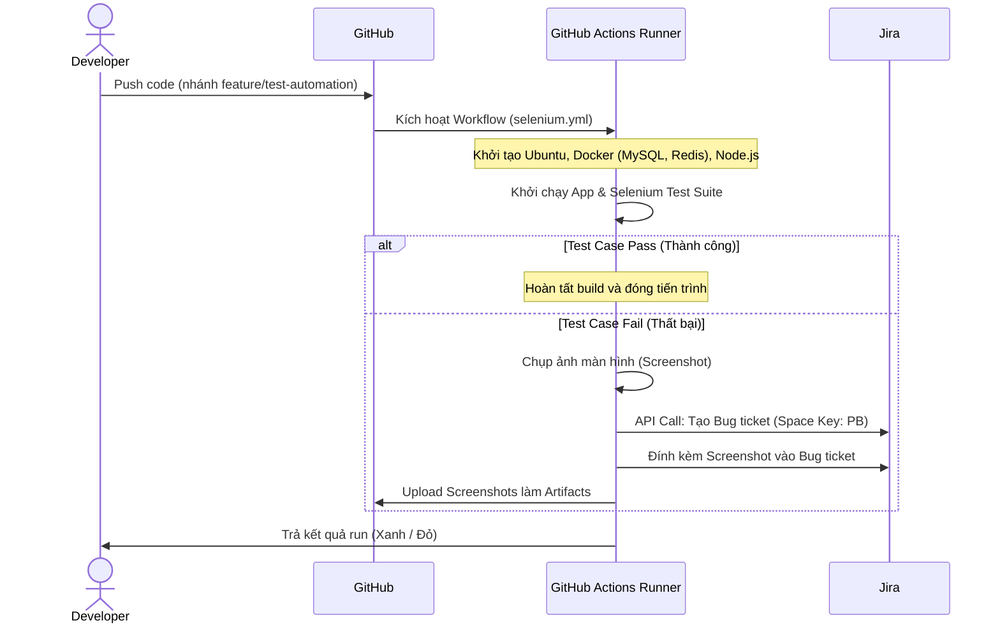

# Hướng Dẫn Quy Trình Thiết Lập Hệ Thống Tự Động Hóa QA (Selenium & Jira & GitHub Actions)

Tài liệu này tổng hợp chi tiết các bước đã thực hiện để xây dựng hệ thống kiểm thử tự động (QA Automation) cho dự án **PubliCast**, tích hợp công cụ báo cáo lỗi tự động lên **Jira** và chạy CI/CD trên **GitHub Actions**.

---

## 🛠️ Quy Trình Tổng Quan Từ A - Z

---

## 📋 Các Bước Chi Tiết Đã Thực Hiện

### Bước 1: Tạo Script Tích Hợp Jira Helper (`jira_helper.js`)
* **Tác vụ**: Tạo file script [jira_helper.js](file:///D:/Fullit/projects/PubliCast/test_selenium/jira_helper.js) để gọi trực tiếp tới Jira REST API bằng `axios` và `form-data`.
* **Tính năng**:
  1. Kiểm tra cấu hình kết nối thông qua các biến môi trường (`JIRA_BASE_URL`, `JIRA_USER_EMAIL`, `JIRA_API_TOKEN`).
  2. Tạo mới một ticket loại **Bug** thuộc Project Jira (Space Key: `PB`).
  3. Đính kèm tệp tin ảnh chụp màn hình (`screenshotPath`) trực tiếp lên ticket Bug vừa tạo.

### Bước 2: Tích Hợp Xử Lý Lỗi vào Selenium Test Suite (`test_auth_suite.js`)
* **Tác vụ**: Cấu hình và bổ sung hàm bắt lỗi trong [test_auth_suite.js](file:///D:/Fullit/projects/PubliCast/test_selenium/test_auth_suite.js).
* **Tính năng**:
  1. Định nghĩa hàm `handleTestFailure` để bắt exception khi một kịch bản Selenium bị lỗi.
  2. Thực hiện chụp màn hình và lưu cục bộ tại thư mục `test_cases/auth/screenshots`.
  3. Gọi hàm `reportBugToJira` từ `jira_helper.js` để tự động hóa việc đưa báo cáo lỗi lên Jira.
  4. Cập nhật cơ chế chạy Chrome Driver hỗ trợ **Headless Mode** khi phát hiện môi trường chạy là CI (`process.env.CI`) nhằm tương thích hoàn toàn với GitHub Actions Runner.

### Bước 3: Thiết Lập GitHub Actions Workflow (`selenium.yml`)
* **Tác vụ**: Tạo file cấu hình CI/CD tại [.github/workflows/selenium.yml](file:///D:/Fullit/projects/PubliCast/.github/workflows/selenium.yml).
* **Luồng chạy tự động**:
  1. Sử dụng các dịch vụ Docker Container chạy ngầm gồm **MySQL 8.0** (cổng 3307) và **Redis** để giả lập cơ sở dữ liệu ảo.
  2. Cài đặt các gói phụ thuộc (Dependencies) cho Backend, Frontend và Selenium.
  3. Đọc dữ liệu từ GitHub Secret có tên `ENV_FILE` để tự động khởi tạo file `.env` chạy cho Backend, đồng thời tự động ghi đè các tham số kết nối DB và Redis ảo trên runner.
  4. Cài đặt trình duyệt Google Chrome và ChromeDriver trên Ubuntu Runner.
  5. Chạy các lệnh kiểm thử tự động thông qua `npm run test:auth-suite`.
  6. Trong trường hợp bất kỳ bước kiểm thử nào thất bại (`if: failure()`), hệ thống tự động đóng gói toàn bộ ảnh chụp màn hình trong thư mục `test_cases/auth/screenshots/` và tải lên làm **Artifact** của GitHub Actions để tải về dễ dàng.

### Bước 4: Kiểm Thử Với Lỗi Giả Lập & Khắc Phục Lỗi Cấu Hình
1. **Kiểm thử lỗi giả lập**: Thêm các dòng code ép lỗi `throw new Error` để kiểm tra luồng báo cáo Jira hoạt động chính xác.
2. **Khắc phục lỗi xác thực**: Tăng độ dài các JWT secret keys (`ACCESS_TOKEN_SECRET`, `REFRESH_TOKEN_SECRET`) lên trên 32 ký tự theo đúng yêu cầu kiểm định định dạng của dự án.
3. **Khắc phục lỗi chạy Chrome**: Bật chế độ Headless (`--headless=new`, `--no-sandbox`, `--disable-dev-shm-usage`) để chạy trình duyệt không cần giao diện đồ họa.
4. **Dọn dẹp code**: Xóa toàn bộ mã nguồn cố ý ép lỗi để đưa hệ thống kiểm thử về trạng thái hoạt động thực tế (chạy thành công - Xanh lá).

---

## 🔑 Hướng Dẫn Cấu Hình Secret Trên GitHub
Để hệ thống báo cáo Jira và file `.env` hoạt động chính xác trên GitHub Actions, bạn cần cấu hình các Secrets sau trong repo GitHub (**Settings** -> **Secrets and variables** -> **Actions**):

| Tên Secret | Mô tả | Định dạng ví dụ |
| :--- | :--- | :--- |
| `ENV_FILE` | Nội dung file `.env` local của dự án (Lưu ý: các JWT secret phải dài từ 32 ký tự trở lên) | `DATABASE_URL=... \n JWT_SECRET=...` |
| `JIRA_BASE_URL` | Đường dẫn API Jira của bạn | `https://your-domain.atlassian.net` |
| `JIRA_USER_EMAIL` | Email đăng nhập vào Jira | `admin@yourcompany.com` |
| `JIRA_API_TOKEN` | Token API tạo từ cài đặt bảo mật Jira của bạn | `ATATT3xFfGF0...` |

---

*Tài liệu được tạo tự động để lưu trữ trong dự án.*
