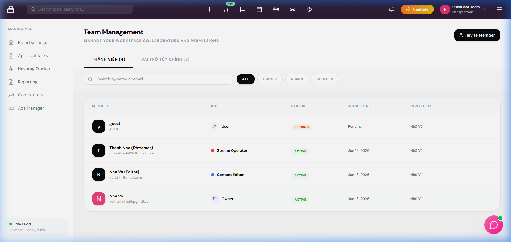

# BUG REPORT - TEAM_002

| ID number        | BUG_TEAM_002                                                                                                  |
| ---------------- | ------------------------------------------------------------------------------------------------------------- |
| Name             | TEAM - Lời mời thành viên với email sai định dạng được hệ thống chấp nhận và gửi đi                            |
| Reporter         | Antigravity                                                                                                   |
| Submit Date      | 16/06/2026                                                                                                    |
| Summary          | Khi gửi lời mời tham gia thương hiệu với email không đúng định dạng (ví dụ: "guest"), hệ thống vẫn tạo shell user và gửi đi thành công thay vì báo lỗi validation. |
| URL              | http://localhost:5173/manage/team                                                                             |
| Screenshot       |                                                                                                              |
| Platform         | Windows                                                                                                       |
| Operating System | Windows 11                                                                                                    |
| Browser          | Chrome / Firefox                                                                                              |
| Severity         | Major                                                                                                         |
| Assigned to      | Antigravity                                                                                                   |
| Priority         | High                                                                                                          |

**Description**

Khi thực hiện mời thành viên mới vào thương hiệu tại trang quản lý đội ngũ, nếu nhập địa chỉ email sai định dạng chuẩn (ví dụ chỉ nhập "guest" thay vì "guest@gmail.com"), hệ thống không thực hiện kiểm tra tính hợp lệ của định dạng email mà tiếp tục tạo tài khoản shell và ghi nhận lời mời thành công.

**Steps to reproduce**

1. Mở trình duyệt, truy cập trang quản lý đội ngũ: `http://localhost:5173/manage/team`
2. Nhấp vào nút "Invite Member" để mở modal mời thành viên.
3. Tại ô nhập email, nhập giá trị sai định dạng: `guest`
4. Chọn vai trò (ví dụ: Member) và nhấp nút "Gửi lời mời tham gia".

**Expected result**

Hệ thống phải chặn thao tác gửi, hiển thị thông báo lỗi trực quan ngay tại modal hoặc toast báo lỗi: "Định dạng email không hợp lệ."

**Actual result**

Hệ thống chấp nhận yêu cầu, hiển thị toast thành công "Đã gửi lời mời thành công!" và tạo một tài khoản shell user với email "guest" trong cơ sở dữ liệu.

**Notes**

Lỗi xảy ra do thiếu logic validation định dạng email bằng Regex trong backend service trước khi gọi repository để lưu trữ.

---

## ✅ RESOLVED

| Resolved Date | 16/06/2026 |
|---|---|
| Fixed By | Antigravity |
| Fix Version | hotfix/team-validation |

**Root Cause:** `TeamService.inviteMember` không có bước kiểm tra định dạng email bằng regex trước khi tạo shell user.

**Fix Applied:**
- Thêm regex validation `/^[^\s@]+@[^\s@]+\.[^\s@]+$/` vào đầu method `inviteMember` trong `backend/src/services/workspace/team.service.js`.
- Ném `AppError(400)` nếu email không hợp lệ trước khi thực hiện bất kỳ DB query nào.

**Verified By:** `scratch/test_bugs.js` Test [1] → ✅ PASS
