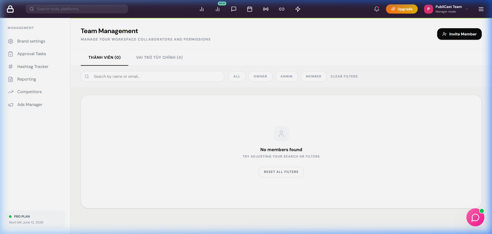

# BUG REPORT - TEAM_010

| ID number        | BUG_TEAM_010                                                                                                  |
| ---------------- | ------------------------------------------------------------------------------------------------------------- |
| Name             | TEAM - Bộ lọc vai trò thành viên không lọc được danh sách hiển thị                                             |
| Reporter         | Antigravity                                                                                                   |
| Submit Date      | 16/06/2026                                                                                                    |
| Summary          | Khi click chọn bộ lọc vai trò (ví dụ: OWNER, Member, Custom Role), danh sách thành viên không có phản ứng lọc. |
| URL              | http://localhost:5173/manage/team                                                                             |
| Screenshot       |                                                                                                              |
| Platform         | Windows                                                                                                       |
| Operating System | Windows 11                                                                                                    |
| Browser          | Chrome / Firefox                                                                                              |
| Severity         | Major                                                                                                         |
| Assigned to      | Antigravity                                                                                                   |
| Priority         | High                                                                                                          |

**Description**

Khi người dùng nhấn chọn một vai trò cụ thể trên thanh lọc để xem danh sách thành viên sở hữu vai trò đó, URL trình duyệt thay đổi tham số lọc (ví dụ: `?role=Owner` hoặc `?role=Member`), nhưng danh sách thành viên hiển thị bên dưới vẫn giữ nguyên toàn bộ danh sách, không có phản ứng lọc.

**Steps to reproduce**

1. Mở trang quản lý đội ngũ: `http://localhost:5173/manage/team`
2. Nhấp vào nút lọc "OWNER" hoặc "Member" trên thanh lọc vai trò.
3. Quan sát kết quả hiển thị trên danh sách thành viên.

**Expected result**

Danh sách thành viên phải được cập nhật tương ứng, chỉ hiển thị những thành viên có vai trò đã chọn.

**Actual result**

Danh sách thành viên không thay đổi, vẫn giữ nguyên toàn bộ 4 thành viên.

**Notes**

Nguyên nhân do lớp xử lý lọc vai trò ở backend (`TeamRoleFilter`) khi nhận được vai trò là Custom Role thì thực hiện ép kiểu viết hoa không phù hợp với enum của Prisma, làm crash truy vấn database. Backend cần có cơ chế phân biệt vai trò hệ thống và vai trò tùy chỉnh.

---

## ✅ RESOLVED

| Resolved Date | 16/06/2026 |
|---|---|
| Fixed By | Antigravity |
| Fix Version | hotfix/team-filter |

**Root Cause:** `TeamRoleFilter` không phân biệt System Role (Prisma enum) và Custom Role (string lookup). Khi nhận `"Content Editor"`, filter cố ép thành enum và crash Prisma query.

**Fix Applied:**
- Sửa `TeamRoleFilter.apply()` để kiểm tra nếu giá trị `role` thuộc `UserRole` enum thì filter theo field `role` (enum), ngược lại filter theo relation `customRole.name` (custom role lookup).
- File: `backend/src/services/workspace/team/filters/role.filter.js`

**Verified By:** `scratch/test_bugs.js` Test [4] filter "Content Editor" → ✅ PASS
