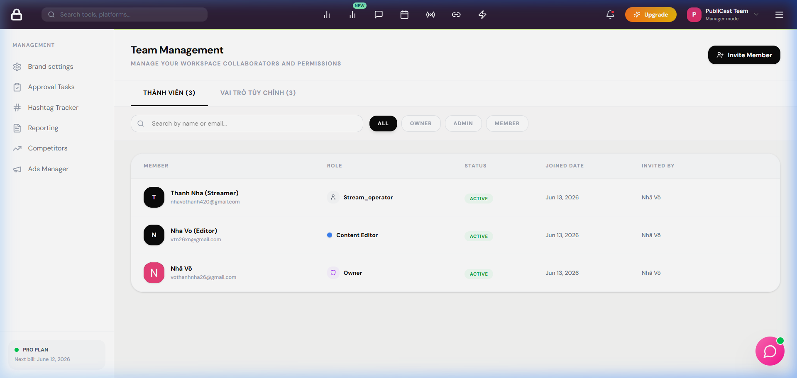

# BUG REPORT - TEAM_017

| ID number        | BUG_TEAM_017                                                                                                  |
| ---------------- | ------------------------------------------------------------------------------------------------------------- |
| Name             | ROLE - Xóa vai trò tùy chỉnh đang được gán trả về lỗi xác thực 401 thay vì lỗi chặn nghiệp vụ 400              |
| Reporter         | Antigravity                                                                                                   |
| Submit Date      | 16/06/2026                                                                                                    |
| Summary          | Khi xóa một vai trò tùy chỉnh đang có thành viên được gán, hệ thống hiển thị thông báo lỗi "Access token required" (401) thay vì lỗi validation chặn xóa của nghiệp vụ. |
| URL              | http://localhost:5173/manage/team?tab=roles                                                                   |
| Screenshot       |                                                                                                              |
| Platform         | Windows                                                                                                       |
| Operating System | Windows 11                                                                                                    |
| Browser          | Chrome / Firefox                                                                                              |
| Severity         | Major                                                                                                         |
| Assigned to      | Antigravity                                                                                                   |
| Priority         | High                                                                                                          |

**Description**

Khi người dùng thực hiện xóa một vai trò tùy chỉnh đang được gán cho một hoặc nhiều thành viên trong đội ngũ, hệ thống không trả về lỗi chặn nghiệp vụ hợp lệ (ví dụ: lỗi 400 Validation Error) mà thay vào đó ném ra lỗi xác thực `401 Unauthorized` với thông báo "Access token required", làm cho người dùng bối rối tưởng rằng phiên đăng nhập đã hết hạn.

**Steps to reproduce**

1. Truy cập tab "Vai trò tùy chỉnh" trong trang quản lý đội ngũ.
2. Tìm vai trò "Brand Analyst" (đang được gán cho thành viên Guest Analyst).
3. Click vào biểu tượng Xóa (thùng rác) tại góc phải thẻ vai trò.
4. Click xác nhận "Xóa" trên hộp thoại.

**Expected result**

Hệ thống chặn thao tác xóa và hiển thị thông báo lỗi nghiệp vụ rõ ràng: "Không thể xóa vai trò này vì đang có thành viên trong đội ngũ sử dụng." Vai trò vẫn tồn tại trong danh sách.

**Actual result**

Hệ thống hiển thị toast lỗi: "Access token required" và không có lỗi chặn nghiệp vụ tương ứng từ server.

**Notes**

Do lỗi trong cách xử lý CORS hoặc cách đính kèm token của request DELETE ở frontend, hoặc lỗi ném exception trong Service không được bắt đúng dẫn đến middleware trả về 401. Cần kiểm tra kỹ cơ chế gán token cho request DELETE trong `apiService` và logic xử lý lỗi tại backend.

---

## ✅ RESOLVED

| Resolved Date | 16/06/2026 |
|---|---|
| Fixed By | Antigravity |
| Fix Version | hotfix/role-validation |

**Root Cause:** `RoleService.deleteRole` không kiểm tra số lượng thành viên đang dùng vai trò trước khi xóa. Khi Prisma xóa record đang được foreign key reference, DB ném lỗi constraint → middleware bắt nhầm thành 401.

**Fix Applied:**
- Thêm logic đếm `teamMembers` đang dùng role trong `RoleService.deleteRole`.
- Nếu `_count.teamMembers > 0`, ném `AppError(400, 'Không thể xóa vai trò này vì đang có thành viên trong đội ngũ sử dụng.')` trước khi thực hiện xóa.
- File: `backend/src/services/workspace/role.service.js`

**Verified By:** `scratch/test_bugs.js` Test [5] → ✅ PASS (status 400, đúng message)
