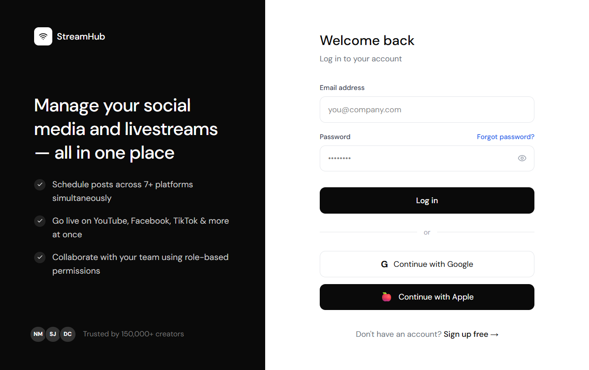

# BUG REPORT - POST_UI_029

| ID number        | BUG_POST_UI_029                                                                                               |
| ---------------- | ------------------------------------------------------------------------------------------------------------- |
| Name             | MEDIA - Backend crash toàn bộ tiến trình khi người dùng tải lên tệp video YouTube không hợp lệ                 |
| Reporter         | Antigravity                                                                                                   |
| Submit Date      | 28/06/2026                                                                                                    |
| Summary          | Khi người dùng tải lên (upload) tệp video có định dạng không hợp lệ hoặc bị lỗi (corrupted) cho bài đăng YouTube và nhấn nút Lưu (Submit), backend không bắt được biệt lệ (Unhandled Exception), dẫn đến crash toàn bộ tiến trình Node.js, làm vô hiệu hóa và mất phiên đăng nhập (JWT token) của tất cả người dùng khác trên hệ thống. |
| URL              | http://localhost:5173/planner/calendar (Gặp lỗi crash tại API backend `/api/posts` hoặc `/api/media/upload`)    |
| Screenshot       |                                                              |
| Platform         | Windows / Linux / macOS                                                                                       |
| Operating System | Windows 11                                                                                                    |
| Browser          | Chrome / Edge / Firefox                                                                                       |
| Severity         | Critical / Blocker                                                                                            |
| Assigned to      | Backend Team                                                                                                  |
| Priority         | High                                                                                                          |

**Description**

Khi thực hiện đăng video lên YouTube thông qua Post Creator, nếu tệp tin được truyền lên không phải là một video hợp lệ (ví dụ: tệp tin stub 24 bytes rỗng), backend xử lý ném ra lỗi `"Unsupported video format or file"` nhưng không có khối lệnh `try/catch` thích hợp để bắt lại hoặc không truyền lỗi qua `next(err)` của Express. Do đó, biệt lệ này thoát ra ngoài ứng dụng (Uncaught Exception) làm cho tiến trình Node.js bị dừng đột ngột (`app crashed - waiting for file changes before starting`).

Khi backend crash và tự khởi động lại (qua nodemon hoặc pm2 mà không bảo toàn session/refresh key trong memory), tất cả session của các người dùng khác đang kết nối đến hệ thống đều bị hủy bỏ ngay lập tức, dẫn đến việc trình duyệt tự động chuyển hướng về trang Đăng nhập (`/login`).

**Steps to reproduce**

1. Đăng nhập vào PubliCast, đi tới trang **Content Planner → Calendar**.
2. Click chọn nút **"Create post"** để hiển thị modal tạo bài đăng.
3. Chọn tài khoản và chọn nền tảng **YouTube**.
4. Soạn thảo văn bản và nhấp vào biểu tượng đính kèm Media.
5. Chọn tải lên một tệp tin `.mp4` không hợp lệ (ví dụ: tạo tệp stub kích thước vài bytes không có định dạng nén video hợp lệ).
6. Chọn tùy chọn xuất bản bài đăng dưới dạng **Draft** (Nháp).
7. Nhấn nút **Save** hoặc **Submit** để gửi yêu cầu lưu bài đăng.
8. Quan sát console/log của backend và giao diện người dùng.

**Expected result**

- Backend bắt được lỗi định dạng file của thư viện xử lý video (ví dụ: ffmpeg/fluent-ffmpeg hoặc multer).
- Trả về mã phản hồi HTTP **400 Bad Request** kèm thông báo lỗi rõ ràng dạng: `{ "message": "Unsupported video format or file" }`.
- Giao diện hiển thị thông báo toast báo lỗi cho người dùng.
- Tiến trình server backend tiếp tục hoạt động bình thường, không gây ảnh hưởng đến session của các người dùng khác.

**Actual result**

- Tiến trình backend bị dừng đột ngột (crash hoàn toàn).
- Log server:
  ```bash
  [nodemon] app crashed - waiting for file changes before starting...
  {"message":"Unsupported video format or file","name":"Error","http_code":400}
  ```
- Người dùng đang tương tác trên giao diện bị mất kết nối và tự động đăng xuất về trang Đăng nhập.

**Notes**

- Lỗi xuất hiện từ sự thiếu sót trong việc xử lý Exception trong Controller xuất bản hoặc Middleware Upload của Backend (không bọc try-catch hoặc truyền error qua middleware trung gian).
- File ảnh minh chứng phiên làm việc bị redirect về trang đăng nhập được lưu tại: `test_cases/media_post/screenshots/error_TC_POST_11.png`.

---

## 🆕 OPEN

| Status Date | 28/06/2026 |
|---|---|
| Status | **OPEN** |
| Verified By | Antigravity (Kiểm thử tự động bằng Selenium E2E - TC_POST_11 thất bại ở bước điều hướng do mất session) |
