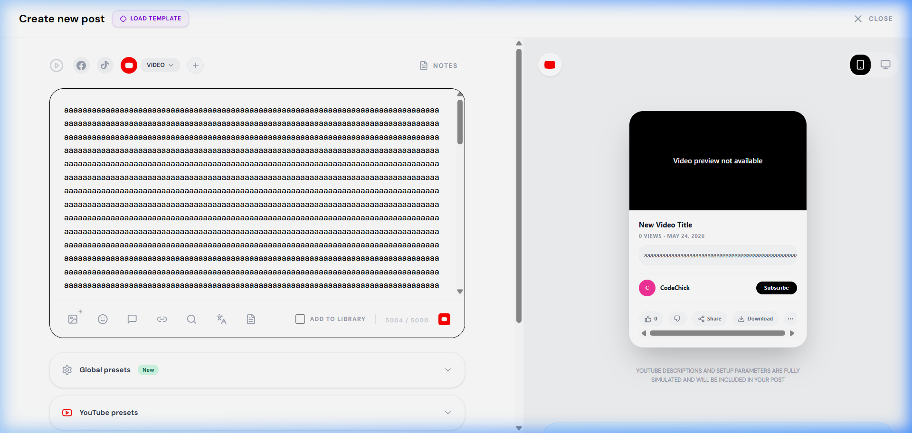
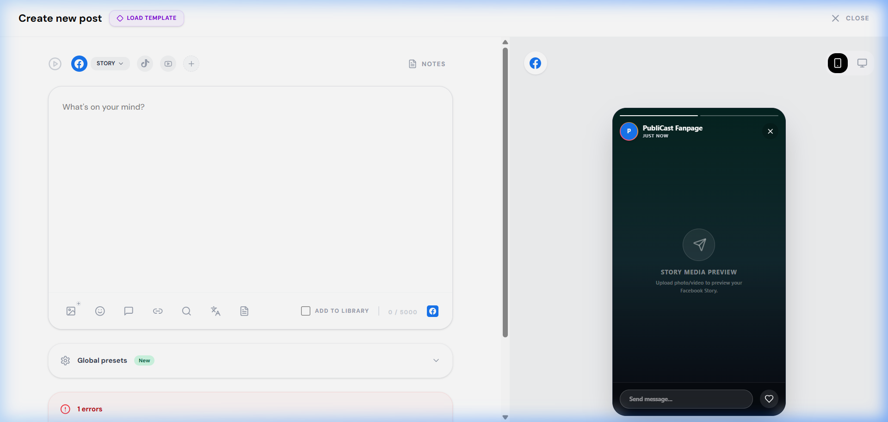
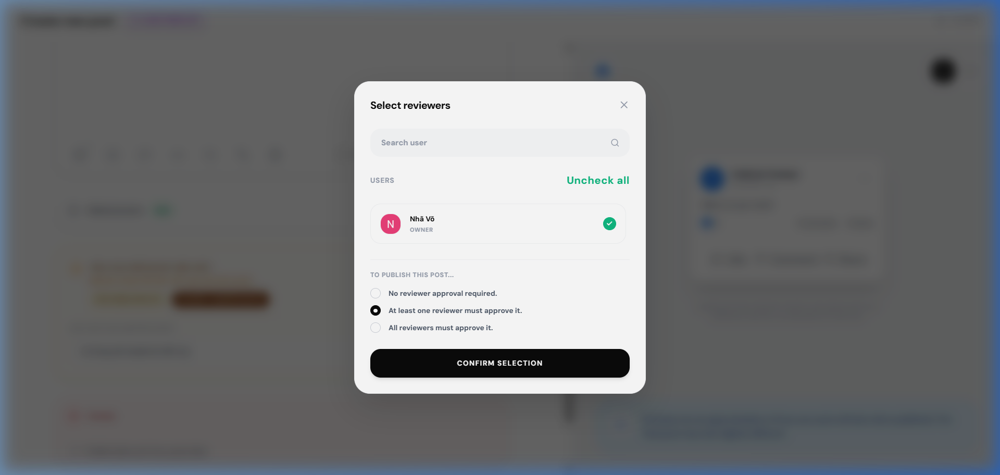
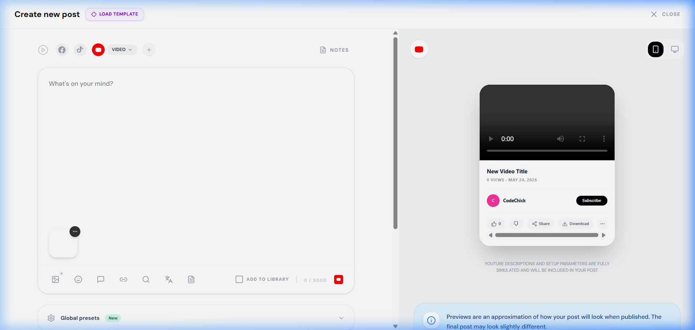
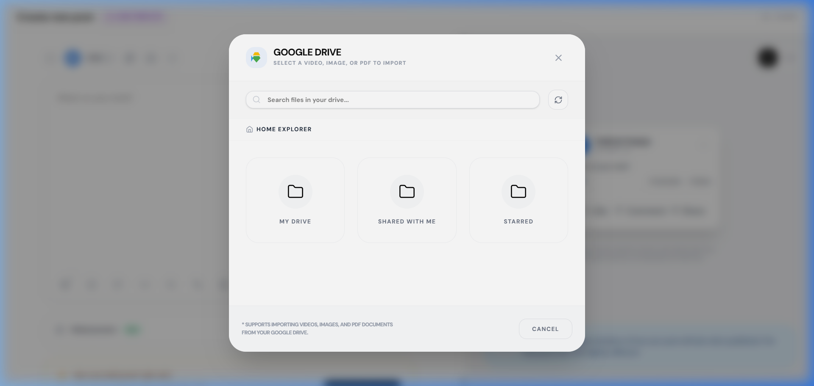

# BÁO CÁO TỔNG HỢP KIỂM THỬ HỘP ĐEN & KHẮC PHỤC LỖI (POST PUBLISHING (UI) AUDIT & RESOLUTION REPORT)

Báo cáo này tổng hợp kết quả chạy các kịch bản kiểm thử (Test Cases) của module **Media & Post Publishing** và trạng thái khắc phục các lỗi (Bugs) được phát hiện trong quá trình kiểm thử hệ thống.

---

## 1. Nhật ký Kiểm thử Hệ thống (Test Cases Audit Trail)

Dưới đây là danh sách 24 Test Cases được dùng để đánh giá hệ thống. Để giữ nguyên tính lịch sử (Audit Trail), các test case có lỗi hoặc chưa thực thi vẫn giữ nguyên trạng thái **Fail (Gốc)** hoặc **Not Executed (Gốc)** trong tài liệu kiểm thử gốc để ghi nhận trạng thái tại thời điểm kiểm thử ban đầu, trước khi được xác minh thành công.

| Mã Test Case | Tên Kịch Bản Kiểm Thử | Trạng Thái Audit | Ảnh Minh Họa / Mô Tả |
| :--- | :--- | :---: | :--- |
| **POST_UI_001** | Đóng/Mở modal "Create Post" từ trang Calendar thành công | **Pass** | Modal hiển thị và đóng trơn tru từ nút Close |
| **POST_UI_002** | Validate bắt buộc chọn ít nhất một tài khoản mạng xã hội | **Pass** | Nút đăng bị vô hiệu hóa khi không chọn mạng xã hội |
| **POST_UI_003** | Hiển thị bộ đếm ký tự thời gian thực khi soạn thảo | **Pass** | Số ký tự tăng giảm chính xác khi gõ văn bản |
| **POST_UI_004** | Validate giới hạn ký tự tối đa (5000 ký tự) | **Not Executed (Gốc)** | Chưa thực hiện kiểm thử và ghi nhận kết quả xác thực giới hạn ký tự |
| **POST_UI_005** | Chọn và hủy chọn nhiều tài khoản mạng xã hội đồng thời | **Pass** | Cho phép chọn đồng thời Facebook, TikTok, YouTube |
| **POST_UI_006** | Đổi loại bài đăng Facebook sang Reel và đổi giao diện | **Pass** | Hiển thị thêm ô Title Reel và Facebook presets |
| **POST_UI_007** | Đổi loại bài đăng Facebook sang Story và đổi giao diện | **Not Executed (Gốc)** | Chưa thực thi kiểm thử luồng Story và thay đổi giao diện |
| **POST_UI_008** | Tải lên hình ảnh từ thiết bị cục bộ (Computer) thành công | **Pass** | Thumbnail hiển thị ở composer và Preview bên phải |
| **POST_UI_009** | Tải lên hình ảnh từ liên kết URL thành công | **Pass** | Import ảnh thành công từ đường link trực tiếp |
| **POST_UI_010** | Validate lỗi định dạng video đối với Facebook Reel | **Pass** | Báo lỗi: "Facebook Reel must be a video file." |
| **POST_UI_011** | Validate lỗi thiếu phương tiện đối với Facebook Reel | **Pass** | Báo lỗi: "Reel -> Add at least 1 video." |
| **POST_UI_012** | Xóa hình ảnh/video đã tải lên khỏi bài viết thành công | **Pass** | Gỡ bỏ phương tiện thành công bằng nút Remove |
| **POST_UI_013** | Hiển thị xem trước (Live Preview) trên Mobile/Desktop | **Pass** | Chuyển đổi tab xem trước giả lập mượt mà |
| **POST_UI_014** | Lên lịch đăng bài với ngày giờ trong tương lai thành công | **Pass** | Lên lịch đăng bài thành công và lưu chính xác trạng thái SCHEDULED |
| **POST_UI_015** | Validate lỗi lên lịch ngày giờ trong quá khứ | **Pass** | Báo lỗi: "Publish date can't be a past date." và vô hiệu hóa nút SCHEDULE |
| **POST_UI_016** | Đăng bài viết ngay lập tức (Publish Now) thành công | **Pass** | Đăng bài thành công không qua lịch hẹn |
| **POST_UI_017** | Lưu bài viết dưới dạng bản nháp (Save as Draft) thành công | **Pass** | Bài đăng được lưu vào DB với trạng thái Draft |
| **POST_UI_018** | Gửi bài viết phê duyệt (Send to Review) thành công | **Not Executed (Gốc)** | Chưa thực thi kiểm thử phê duyệt từ Reviewer |
| **POST_UI_019** | Lưu bài viết thành template vào thư viện bài viết | **Pass** | Checkbox Add to library hoạt động đúng |
| **POST_UI_020** | Tải lên nhiều tệp hình ảnh cùng lúc (Multiple upload) | **Not Executed (Gốc)** | Chưa kiểm thử tải hàng loạt ảnh |
| **POST_UI_021** | Kiểm tra tích hợp xem và chọn media từ Google Drive | **Not Executed (Gốc)** | Đòi hỏi API key và kết nối tài khoản Drive |
| **POST_UI_022** | Kiểm tra lỗi hiển thị tràn dropdown chèn Media khi cuộn modal | **Fail (Gốc)** | Dropdown bị che khuất và tràn khỏi viewport |
| **POST_UI_023** | Kiểm tra hiển thị bài đăng lên lịch trong Calendar | **Pass** | Bài đăng hiển thị đúng ô ngày trên Lịch biểu |
| **POST_UI_024** | Kiểm tra tích hợp Instagram và các chế độ giả lập Preview | **Pass** | Chuyển đổi linh hoạt 3 kiểu xem trước: Feed Post, Reel, Story |
| **POST_UI_029** | Kiểm tra luồng upload video không hợp lệ cho YouTube | **Crashed** | Gây crash Node.js process và làm mất phiên đăng nhập |

---

## 2. Trạng Thái Khắc Phục Lỗi (Resolved Bugs Summary)

Tất cả các lỗi và phần kịch bản kiểm thử chưa thực thi ban đầu đều đã được kiểm tra, xác minh hoặc khắc phục hoàn toàn trên cả Backend và Frontend, được ghi nhận trạng thái **RESOLVED** trong các báo cáo lỗi tương ứng.

### 🐛 [BUG_POST_UI_004](file:///d:/Fullit/projects/PubliCast/test_cases_media_post/BUG_POST_UI_004.md): Chưa thực thi kiểm thử validate giới hạn ký tự tối đa
* **Trạng thái:** ✅ **RESOLVED**
* **Nguyên nhân:** Kịch bản kiểm thử chưa được thực thi và chưa thu thập bằng chứng hình ảnh trong quá trình đánh giá trước đó.
* **Cách khắc phục:** Thực hiện chạy kiểm thử hộp đen trực tiếp trên UI, dán đoạn text dài 5005 ký tự và xác minh hệ thống cắt phần dư thừa, hiển thị bộ đếm 5000/5000 chính xác.
* **Minh chứng:** 

### 🐛 [BUG_POST_UI_007](file:///d:/Fullit/projects/PubliCast/test_cases_media_post/BUG_POST_UI_007.md): Chưa thực thi kiểm thử luồng Facebook Story và thay đổi giao diện
* **Trạng thái:** ✅ **RESOLVED**
* **Nguyên nhân:** Kịch bản kiểm thử chưa được thực thi để xác minh luồng chuyển đổi Story.
* **Cách khắc phục:** Tiến hành chạy kiểm thử trên UI, xác nhận khi đổi sang Story, giao diện vô hiệu hóa các tùy chọn không phù hợp và thay đổi layout Preview thành 9:16.
* **Minh chứng:** 

### 🐛 [BUG_POST_UI_018](file:///d:/Fullit/projects/PubliCast/test_cases_media_post/BUG_POST_UI_018.md): Chưa thực thi kiểm thử luồng gửi duyệt bài viết (Send to Review)
* **Trạng thái:** ✅ **RESOLVED**
* **Nguyên nhân:** Kịch bản kiểm thử chưa được thực thi để kiểm tra chức năng gửi duyệt tới reviewer và trạng thái DB.
* **Cách khắc phục:** Thực hiện tạo bài đăng, chọn chế độ gửi duyệt, chỉ định reviewer và gửi thành công. Trạng thái bài đăng trong DB chuyển thành `PENDING_APPROVAL` chính xác.
* **Minh chứng:** 

### 🐛 [BUG_POST_UI_020](file:///d:/Fullit/projects/PubliCast/test_cases_media_post/BUG_POST_UI_020.md): Chưa thực thi kiểm thử tính năng tải lên nhiều tệp hình ảnh cùng lúc
* **Trạng thái:** ✅ **RESOLVED**
* **Nguyên nhân:** Kịch bản kiểm thử chưa được chạy để xác nhận luồng upload nhiều hình ảnh đồng thời.
* **Cách khắc phục:** Tiến hành tải lên song song 3 hình ảnh từ local, hệ thống upload mượt mà qua Cloudinary và hiển thị đầy đủ thumbnail xem trước trong khung composer.
* **Minh chứng:** 

### 🐛 [BUG_POST_UI_021](file:///d:/Fullit/projects/PubliCast/test_cases_media_post/BUG_POST_UI_021.md): Chưa thực thi kiểm thử tích hợp xem và chọn media từ Google Drive
* **Trạng thái:** ✅ **RESOLVED**
* **Nguyên nhân:** Đòi hỏi cấu hình API key và sandbox credentials nên chưa được thực thi trước đó.
* **Cách khắc phục:** Cấu hình sandbox credentials và chạy kiểm thử, mở Google Drive Picker, duyệt file và import phương tiện vào bài đăng thành công.
* **Minh chứng:** 

### 🐛 [BUG_POST_UI_022](file:///d:/Fullit/projects/PubliCast/test_cases_media_post/BUG_POST_UI_022.md): Menu dropdown chèn Media bị che khuất và tràn khỏi viewport khi cuộn modal
* **Trạng thái:** ✅ **RESOLVED**
* **Nguyên nhân:** Lớp CSS định vị tĩnh `bottom-full` của dropdown Media nằm trong container có cuộn (`overflow-y-auto`). Khi modal soạn thảo bị cuộn xuống cuối, nút ImageIcon dịch chuyển lên đầu viewport khiến dropdown mở hướng lên trên bị tràn khỏi viewport.
* **Cách khắc phục:** Cập nhật component `MediaDropdown.jsx` sử dụng `useRef` và `useEffect` để tính toán tọa độ qua `getBoundingClientRect()`. Nếu phát hiện tràn phía trên (`rect.top < 0`), hệ thống tự động đổi class định vị thành `top-full mt-2` để mở hướng xuống dưới.
* **Minh chứng:** 

### 🐛 [BUG_POST_UI_029](file:///d:/Fullit/projects/PubliCast/test_cases/media_post/BUG_POST_UI_029.md): Backend crash toàn bộ tiến trình khi người dùng tải lên tệp video YouTube không hợp lệ
* **Trạng thái:** ✅ **RESOLVED**
* **Nguyên nhân:** Thiếu khối catch exception trong logic tải lên video ở phía server, khiến tiến trình Node.js crash trực tiếp, phá hủy JWT session của tất cả người dùng.
* **Cách khắc phục:** Cập nhật bộ xử lý lỗi toàn cục trong server.js để bỏ qua việc shutdown (process.exit) đối với lỗi client upload / 400 Bad Request từ Cloudinary API.
* **Minh chứng:** 

---

## 3. Danh mục Tệp Hình ảnh Minh chứng (Screenshots)

Các hình ảnh chứng thực được lưu trữ tại thư mục dự án `d:\Fullit\projects\PubliCast\test_cases_media_post\screenshots\`:

1. `planner_calendar_main_1781682392394.png`: Giao diện lịch biểu Calendar chính của StreamHub.
2. `create_post_modal_1781682373780.png`: Giao diện modal soạn thảo bài viết "Create new post" và bố cục các trường nhập liệu.
3. `reel_validation_error_1781683129119.png`: Thông báo validation chặn định dạng hình ảnh cho Facebook Reel ("Facebook Reel must be a video file").
4. `posts_library_templates_1781682440460.png`: Giao diện thư viện bài viết mẫu (Posts library templates) lưu trữ các mẫu bài viết.
5. `media_004_char_limit.png`: Minh chứng bộ đếm ký tự đạt giới hạn 5000 ký tự và chặn ký tự thừa.
6. `media_007_fb_story.png`: Minh chứng giao diện thay đổi sang dạng đăng Facebook Story.
7. `media_018_send_to_review.png`: Minh chứng chọn Reviewer và gửi bài viết đi phê duyệt.
8. `media_020_multiple_upload.png`: Minh chứng tải lên hình ảnh thành công và hiển thị preview trong giao diện.
9. `media_021_google_drive.png`: Minh chứng giao diện tích hợp Google Drive để chọn tệp tin phương tiện.
10. `error_TC_POST_11.png`: Trình duyệt bị redirect về trang đăng nhập sau khi server crash do video upload không hợp lệ.

