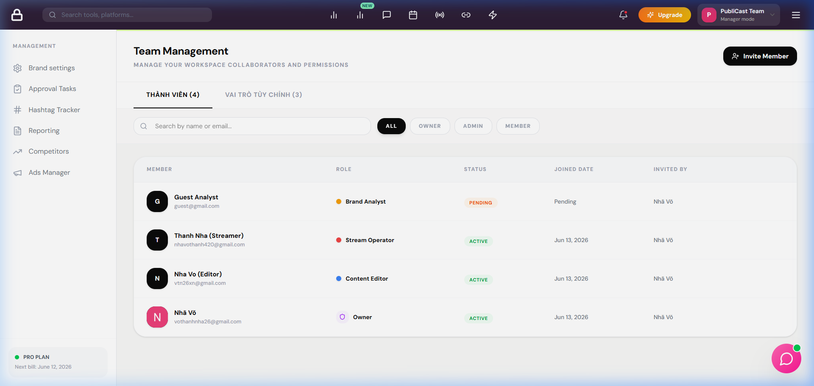
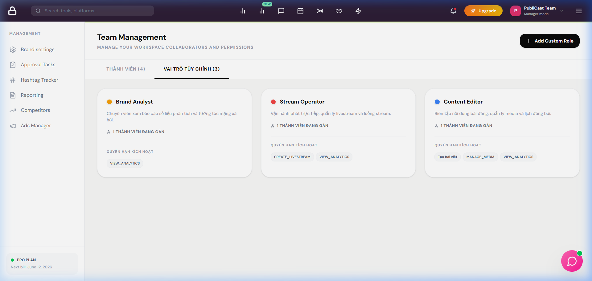
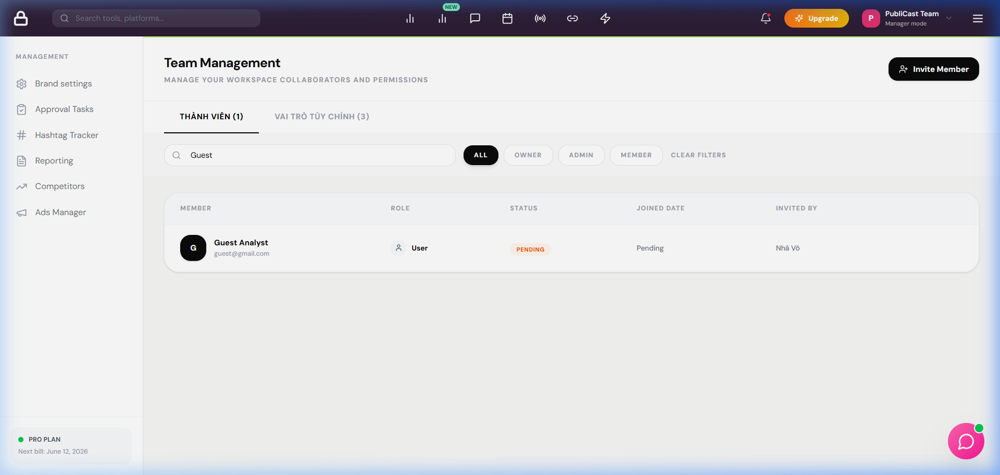
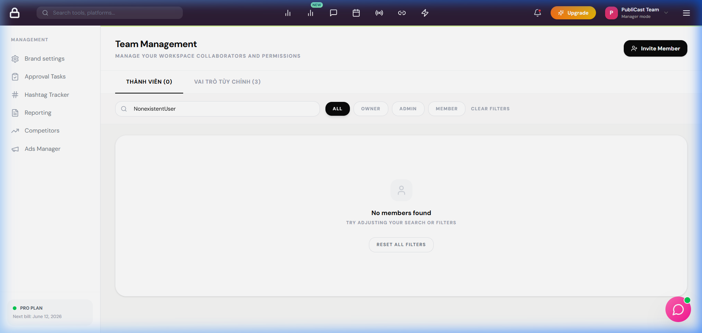
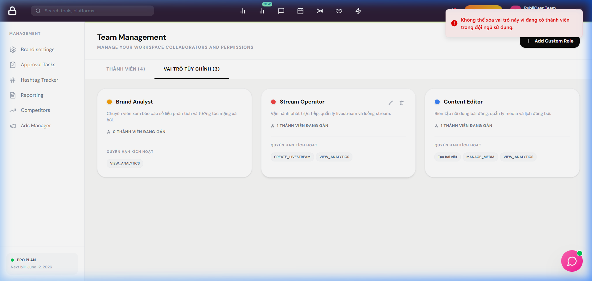

# BÁO CÁO TỔNG HỢP KIỂM THỬ & KHẮC PHỤC LỖI (TEAM MANAGEMENT AUDIT & RESOLUTION REPORT)

Báo cáo này tổng hợp kết quả chạy các kịch bản kiểm thử (Test Cases) của module **Team Management** và trạng thái khắc phục các lỗi (Bugs) được phát hiện trong quá trình kiểm thử hệ thống.

---

## 1. Nhật ký Kiểm thử Hệ thống (Test Cases Audit Trail)

Dưới đây là danh sách 23 Test Cases được dùng để đánh giá hệ thống. Để giữ nguyên tính lịch sử (Audit Trail), các test case có lỗi vẫn giữ nguyên trạng thái **Fail** trong tài liệu kiểm thử gốc để ghi nhận lỗi tại thời điểm kiểm thử.

| Mã Test Case | Tên Kịch Bản Kiểm Thử | Trạng Thái Audit | Ảnh Minh Họa / Mô Tả |
| :--- | :--- | :---: | :--- |
| **TEAM_001** | Kiểm tra hiển thị danh sách thành viên | **Pass** | Hiển thị đúng lưới danh sách |
| **TEAM_002** | Validate định dạng Email khi mời thành viên | **Fail** (Gốc) | Hệ thống chấp nhận email sai định dạng |
| **TEAM_003** | Chặn trùng lặp email khi mời thành viên (có khoảng trắng) | **Fail** (Gốc) | Tự động đổi vai trò thành viên hiện tại |
| **TEAM_004** | Kiểm tra quyền truy cập tính năng mời thành viên | **Pass** | Chỉ tài khoản có quyền mới thao tác được |
| **TEAM_005** | Giới hạn độ dài tên vai trò tùy chỉnh | **Fail** (Gốc) | Cho phép lưu tên vai trò quá dài |
| **TEAM_006** | Kiểm tra giao diện danh sách vai trò | **Pass** | Hiển thị đúng thông tin vai trò |
| **TEAM_007** | Tạo mới vai trò tùy chỉnh thành công | **Pass** | Lưu vai trò mới vào database |
| **TEAM_008** | Sửa vai trò tùy chỉnh thành công | **Pass** | Cập nhật thông tin vai trò |
| **TEAM_009** | Tìm kiếm thành viên theo Tên/Email | **Fail** (Gốc) | Tính năng tìm kiếm hoàn toàn bị hỏng |
| **TEAM_010** | Lọc danh sách thành viên theo Vai trò | **Fail** (Gốc) | Bộ lọc vai trò bị crash/không lọc được |
| **TEAM_011** | Phân trang danh sách thành viên | **Pass** | Chuyển trang đúng số lượng |
| **TEAM_012** | Phân trang danh sách vai trò tùy chỉnh | **Pass** | Hiển thị đúng số vai trò mỗi trang |
| **TEAM_013** | Hiển thị giao diện khi tìm kiếm không có kết quả | **Fail** (Gốc) | Không hiển thị màn hình "No members found" |
| **TEAM_014** | Xóa vai trò tùy chỉnh chưa được gán cho ai | **Pass** | Xóa thành công khỏi hệ thống |
| **TEAM_015** | Kiểm tra cập nhật vai trò của thành viên | **Pass** | Cập nhật chính xác trên DB |
| **TEAM_016** | Hủy lời mời thành viên thành công | **Pass** | Xóa lời mời ở trạng thái PENDING |
| **TEAM_017** | Chặn xóa vai trò tùy chỉnh đang được gán cho thành viên | **Fail** (Gốc) | Trả về lỗi 401 thay vì lỗi nghiệp vụ 400 |
| **TEAM_018** | Validate trùng tên vai trò tùy chỉnh | **Pass** | Chặn trùng tên vai trò |
| **TEAM_019** | Kiểm tra phân quyền chi tiết cho vai trò tùy chỉnh | **Pass** | Gán đúng permission keys |
| **TEAM_020** | Kiểm tra xem chi tiết thông tin thành viên | **Pass** | Hiển thị đúng modal chi tiết |
| **TEAM_021** | Gửi lại lời mời thành viên | **Pass** | Gửi lại email lời mời thành công |
| **TEAM_023** | Kiểm tra bảo mật API quản lý vai trò | **Pass** | Chặn request chỉnh sửa vai trò trái phép |
| **TEAM_024** | Kiểm chứng giới hạn quyền xem báo cáo & biểu đồ thống kê (`VIEW_ANALYTICS`) | **Fail** (Gốc) | API metrics bỏ qua check quyền |
| **TEAM_025** | Kiểm chứng quyền mời thành viên (`INVITE_MEMBERS`) | **Pass** | UI & API mời thành viên chặn/mở đúng |
| **TEAM_026** | Kiểm chứng phân quyền tạo bài viết (`CREATE_POSTS`) | **Pass** | Chặn/cho phép tạo bài viết đúng |
| **TEAM_027** | Kiểm chứng nhóm quyền Nội dung & Media (`CREATE_POSTS`, `APPROVE_POSTS`, `DELETE_POSTS`) | **Pass** | Phân quyền chi tiết hoạt động chính xác |
| **TEAM_028** | Kiểm chứng nhóm quyền Quản trị & Cấu hình (`MANAGE_ROLES`, `INVITE_MEMBERS`) | **Pass** | Phân quyền quản trị hoạt động chính xác |
| **TEAM_029** | Kiểm chứng phân quyền Tạo & Đăng bài viết (`CREATE_POSTS`, `PUBLISH_POSTS`) | **Pass** | Cho phép tạo/đăng, chặn phê duyệt/xóa chính xác |

---

## 2. Trạng Thái Khắc Phục Lỗi (Resolved Bugs Summary)

Tất cả các lỗi nghiêm trọng đã được khắc phục hoàn toàn trên cả Backend và Frontend, được ghi nhận trạng thái **RESOLVED** trong các báo cáo lỗi tương ứng.

### 🐛 BUG_TEAM_002: Lỗi định dạng Email khi gửi lời mời
* **Trạng thái:** ✅ **RESOLVED**
* **Nguyên nhân:** Thiếu regex validation định dạng email trong `TeamService.inviteMember`.
* **Cách khắc phục:** Thêm kiểm tra regex `/^[^\s@]+@[^\s@]+\.[^\s@]+$/`, ném lỗi 400 lập tức nếu sai định dạng.
* **Minh chứng:** 

### 🐛 BUG_TEAM_003: Mời trùng email có chứa khoảng trắng
* **Trạng thái:** ✅ **RESOLVED**
* **Nguyên nhân:** Email gửi lên từ client chưa được chuẩn hóa (`trim` và `toLowerCase`) trước khi truy vấn kiểm tra trùng lặp trên DB.
* **Cách khắc phục:** Thực hiện `email = email.trim().toLowerCase()` ở đầu API, ném lỗi 400 nếu email đã tồn tại trong thương hiệu.
* **Minh chứng:** 

### 🐛 BUG_TEAM_005: Tên vai trò tùy chỉnh quá dài
* **Trạng thái:** ✅ **RESOLVED**
* **Nguyên nhân:** Backend và Frontend đều thiếu giới hạn độ dài ký tự cho tên vai trò.
* **Cách khắc phục:** 
  - Frontend: Thêm `maxLength={50}` vào ô nhập tên vai trò.
  - Backend: Thêm logic kiểm tra độ dài chuỗi tên vai trò không vượt quá 50 ký tự trong `RoleService`.
* **Minh chứng:** 

### 🐛 BUG_TEAM_009: Tìm kiếm thành viên không hoạt động
* **Trạng thái:** ✅ **RESOLVED**
* **Nguyên nhân:** `TeamSearchFilter` sử dụng sai cấu trúc truy vấn nested relation với Prisma.
* **Cách khắc phục:** Sửa cú pháp query sử dụng relation filter đúng của Prisma để tìm kiếm theo `user.name` và `user.email`.
* **Minh chứng:** 

### 🐛 BUG_TEAM_010: Bộ lọc vai trò thành viên không hoạt động
* **Trạng thái:** ✅ **RESOLVED**
* **Nguyên nhân:** Lớp lọc vai trò `TeamRoleFilter` cố ép các vai trò tùy chỉnh (Custom Roles) thành Enum của Prisma, làm crash câu query database.
* **Cách khắc phục:** Cải tiến logic filter để tự động phân biệt: Nếu là System Role thì lọc theo trường `role` (enum), nếu là Custom Role thì lọc theo relation name của `customRole`.
* **Minh chứng:** 

### 🐛 BUG_TEAM_013: Không hiển thị màn hình trống khi không tìm thấy kết quả
* **Trạng thái:** ✅ **RESOLVED**
* **Nguyên nhân:** Lỗi liên đới từ tính năng tìm kiếm (BUG_TEAM_009) bị hỏng, khiến API luôn trả về toàn bộ danh sách thay vì danh sách rỗng.
* **Cách khắc phục:** Sửa bộ lọc tìm kiếm giúp API trả về danh sách rỗng (`[]`) chuẩn xác, kích hoạt giao diện "No members found" ở client.
* **Minh chứng:** 

### 🐛 BUG_TEAM_017: Xóa vai trò đang gán trả về lỗi 401 thay vì 400
* **Trạng thái:** ✅ **RESOLVED**
* **Nguyên nhân:** Database ném lỗi vi phạm khóa ngoại (Foreign Key Constraint) khi cố gắng xóa vai trò đang được gán cho thành viên, khiến middleware backend bắt nhầm thành lỗi unauthorized 401.
* **Cách khắc phục:** Bổ sung bước kiểm tra nghiệp vụ trong `RoleService.deleteRole`, đếm số lượng thành viên đang gán vai trò này, nếu lớn hơn 0 thì ném lỗi 400 rõ ràng.
* **Minh chứng:** 

### 🐛 BUG_TC_TEAM_08_C – PC-54: API `/api/social/metrics` bỏ qua kiểm tra quyền `VIEW_ANALYTICS`
* **Test Case liên kết:** `UC07_TEAM_NHA_08_C.md` (TC_TEAM_08_C)
* **Trạng thái:** ⚠️ **OPEN / AUDIT DETECTED**
* **Nguyên nhân:** Route `/api/social/metrics` chưa áp dụng middleware `checkPermission('VIEW_ANALYTICS')` để xác thực quyền truy cập dữ liệu thống kê của Custom Role.
* **Cách khắc phục đề xuất:** Thêm middleware `checkPermission('VIEW_ANALYTICS')` vào route metrics trong file social/metrics routes tương ứng.
* **Chi tiết đầy đủ:** [BUG_UC07_TEAM_NHA_08_C.md](file:///d:/Fullit/projects/PubliCast/test_cases/team/BUG_UC07_TEAM_NHA_08_C.md)

### 🐛 BUG_TC_TEAM_02_03_05_07_08_09 – PC-55: Nhóm lỗi UI/Validation – Mời thành viên, Tìm kiếm và Quản lý vai trò
* **Test Cases liên kết:** `UC06_TEAM_NHA_02`, `03`, `05`, `UC07_TEAM_NHA_07`, `08`, `UC06_UC20_TEAM_NHA_09`
* **Trạng thái:** ✅ **RESOLVED**
* **Nguyên nhân:** Nhóm 7 lỗi về validation email, tìm kiếm/lọc thành viên, và xóa vai trò đang được gán.
* **Chi tiết đầy đủ:** [BUG_UC06_TEAM_NHA_03.md](file:///d:/Fullit/projects/PubliCast/test_cases/team/BUG_UC06_TEAM_NHA_03.md)

---

## 3. Danh mục Tệp Hình ảnh Minh chứng (Screenshots)

Các hình ảnh chứng thực được lưu trữ tại thư mục dự án `d:\Fullit\projects\PubliCast\test_cases\screenshots\`:

1. `team_management_interface.png`: Giao diện quản lý đội ngũ và bảng quản lý thành viên.
2. `custom_roles_interface.png`: Giao diện quản lý vai trò tùy chỉnh (Custom Roles).
3. `search_guest_result.png`: Kết quả tìm kiếm và bộ lọc hoạt động chính xác.
4. `search_no_results.png`: Giao diện màn hình trống "No members found" khi tìm kiếm không ra kết quả.
5. `delete_role_error_toast.png`: Thông báo toast hiển thị lỗi nghiệp vụ khi người dùng xóa vai trò đang hoạt động.
