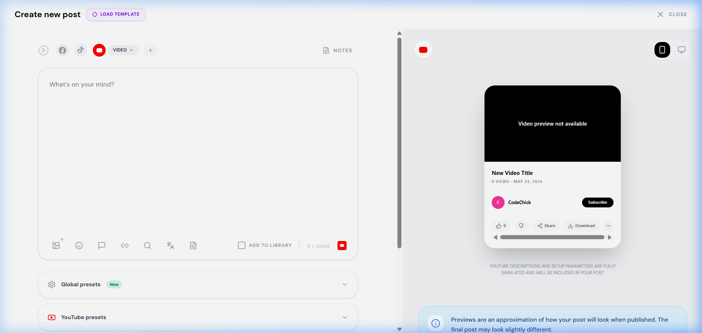

# BUG REPORT - MEDIA_022

| ID number        | BUG_MEDIA_022                                                                                                 |
| ---------------- | ------------------------------------------------------------------------------------------------------------- |
| Name             | MEDIA - Menu dropdown chọn nguồn phương tiện bị che khuất và tràn khỏi viewport khi modal được cuộn xuống     |
| Reporter         | Antigravity                                                                                                   |
| Submit Date      | 17/06/2026                                                                                                    |
| Summary          | Khi cuộn modal 'Create new post' xuống dưới cùng, click nút chèn Media (icon bức ảnh) sẽ mở ra menu dropdown. Do menu này dùng class `bottom-full` mở hướng lên và thiếu cơ chế định vị linh hoạt (flip), các tùy chọn đầu tiên của menu (Add image, Add video, From Media Library) bị đẩy vượt khỏi đỉnh viewport (tọa độ Y âm) và không hiển thị, khiến người dùng không thể tải lên hình ảnh/video khi cuộn modal. |
| URL              | http://localhost:5173/planner/calendar                                                                        |
| Screenshot       |                                               |
| Platform         | Windows                                                                                                       |
| Operating System | Windows 11                                                                                                    |
| Browser          | Chrome / Edge / Firefox                                                                                       |
| Severity         | Major                                                                                                         |
| Assigned to      | Antigravity                                                                                                   |
| Priority         | High                                                                                                          |

**Description**

Khi thực hiện tạo bài đăng tại trang Lịch biểu, nếu người dùng cuộn modal soạn thảo xuống phía dưới để xem phần Presets hoặc cài đặt Date-picker, nút Media di chuyển lên phía trên cùng của viewport. Nhấp vào nút Media để tải ảnh/video, menu dropdown mở hướng lên trên (`bottom-full`). Vì không có logic tính toán tự động đổi hướng hoặc điều chỉnh lại vị trí khi chạm biên viewport (flip/auto-positioning), các tùy chọn ở nửa trên của menu bị tràn khỏi phần trên của màn hình trình duyệt (phần Y âm), dẫn đến việc người dùng không thể nhấp vào "Add image" hay "Add video" khi ở trạng thái cuộn này.

**Steps to reproduce**

1. Mở trình duyệt, truy cập `http://localhost:5173/planner/calendar`.
2. Click chọn nút "Create post" trên lịch biểu để hiển thị modal tạo bài đăng.
3. Cuộn modal soạn thảo (Left Panel) xuống phía dưới cùng (vùng presets hoặc date-picker).
4. Nhấp vào biểu tượng bức ảnh (icon chèn Media) nằm ở thanh toolbar dưới khung soạn thảo text.
5. Quan sát menu dropdown xuất hiện.

**Expected result**

Menu dropdown phải tự động phát hiện biên màn hình và mở hướng xuống dưới (`top-full mt-2`) hoặc điều chỉnh tọa độ Y để hiển thị trọn vẹn 100% trong khung nhìn, đảm bảo người dùng có thể nhấp vào tất cả các tùy chọn.

**Actual result**

Menu dropdown mở hướng lên trên và bị khuất nửa trên nằm ngoài viewport, không thể nhìn thấy và không thể nhấp vào các tùy chọn "Add image", "Add video", "From Media Library".

**Notes**

Lỗi do sử dụng CSS tĩnh `absolute bottom-full left-0 mb-2` trong file `frontend/src/pages/workspace/PostCreator.jsx` cho popover Media mà không sử dụng các giải pháp định vị động (ví dụ: Popper.js, Floating UI hoặc check điều kiện bounds của viewport để flip class CSS).

---

## ⏳ PENDING RESOLUTION

| Status | Open / Pending |
|---|---|
| Assigned To | Developer Team |

*Lưu ý: Test case bị đánh giá là FAIL trong quá trình kiểm thử hộp đen. Chưa tiến hành vá mã nguồn để phục vụ việc lưu trữ lịch sử báo lỗi theo yêu cầu.*
